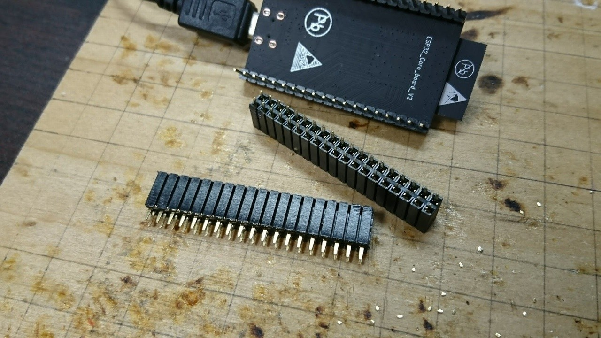
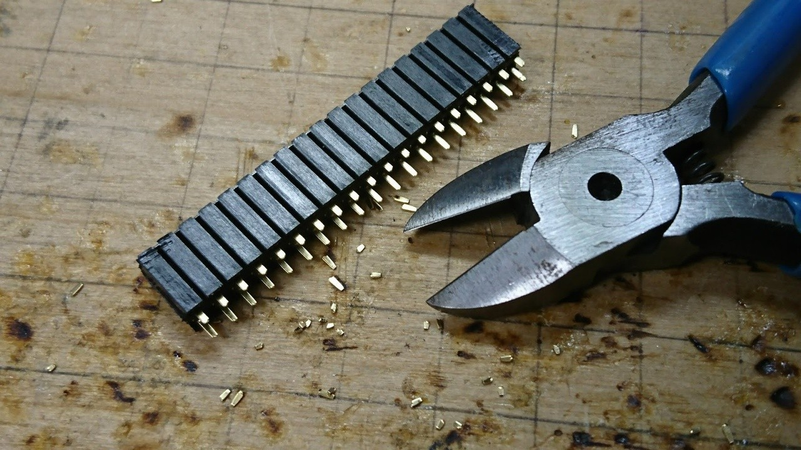
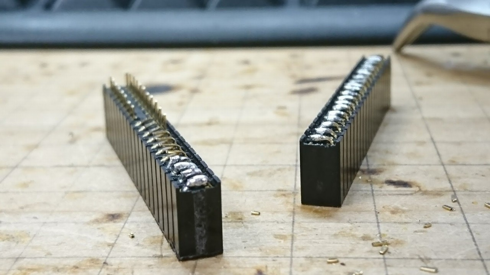
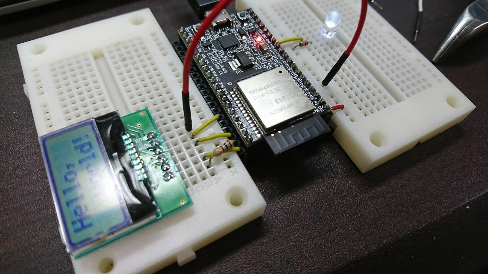

# ESP32 DevKitCをブレッドボードで扱いやすくする

ESP32 DevKitCはボードそのものは使いやすいが、幅が広く、ピンヘッダが太いため
ブレッドボードでのプロトタイピングには向かないようだ。
そこで、2列のピンソケットを使ってブレッドボードと簡単に接続できるようにしてみた。
手順は以下の通り。

1. 2列のピンソケットをESP32 DevKitCのピンヘッダと同じ長さだけ切り出す。

    

2. ピンを短く切る。

    

3. 内側に折り曲げてはんだ付けし、2列の隣り合うピンをショートさせる。

    

4. ESP32 DevKitCのピンヘッダに取り付ける。

    

ブレッドボードとジャンパ線を使って繋げられるようになった。
ブレッドボードに直接挿した場合と違い、必要なポートのみ引き出せるため、
配線自由度が高い。