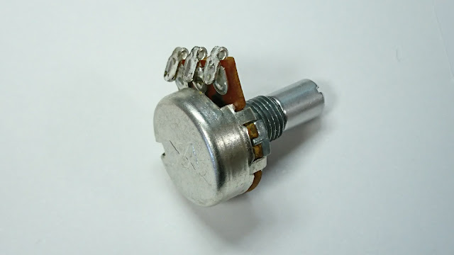

# ボリュームの端子を曲げてはならない

ボリュームを狭い空間に押し込むために端子をこのように内側に曲げたところ、真ん中の端子が接触不良を起こして壊れてしまった。2個試したが、全く同じ壊れ方をした。端子の根元に力がかからないように、端子だけをつまんで曲げてみたつもりだったがダメだった。全てのボリュームに該当するのかは分からないが、端子は曲げてはいけないようなので注意されたい。

曲げて壊してからこの記事を読むことになる人のほうが多そうな気がするが…。
