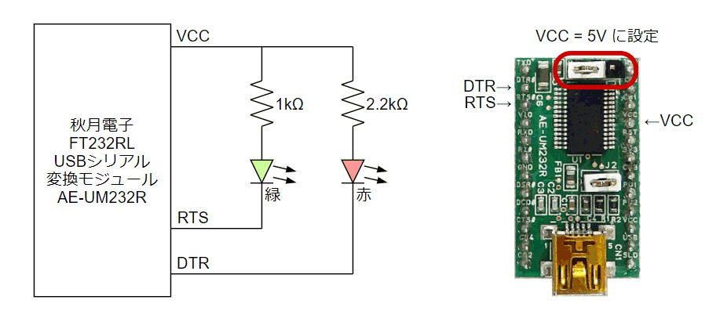
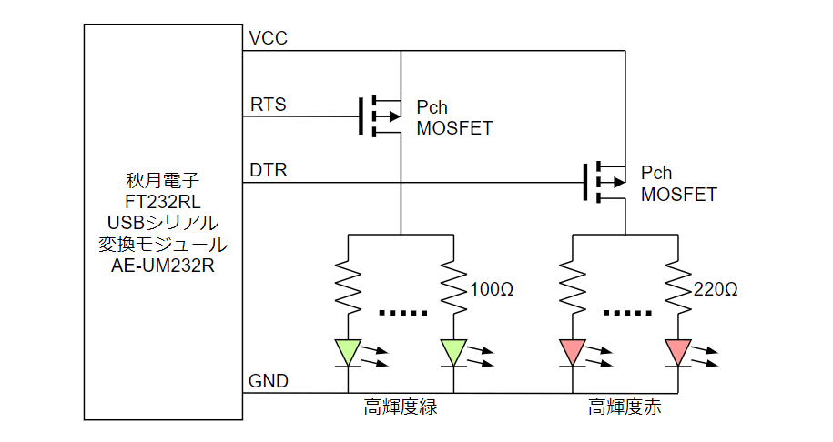
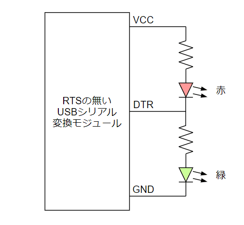
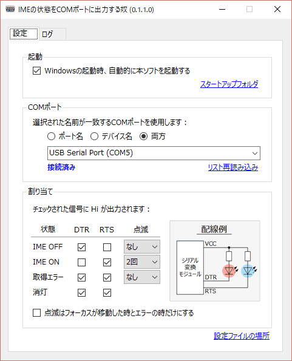
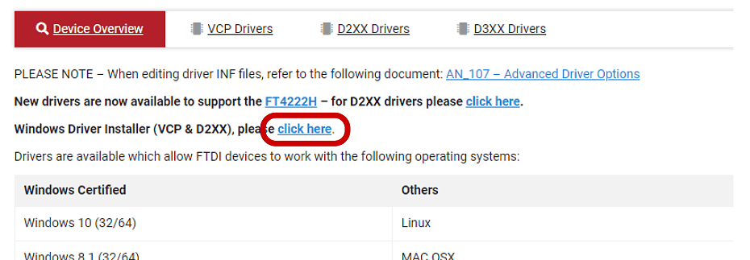

# WindowsのIMEの状態をLEDで表示するガジェット

## 動機

WindowsのIMEは半角/全角キーを押すたびにOn/Offがトグルするようになっており、今どちらの状態なのかが分かりにくくなっています。特定のキーでOn/Offする設定にしたり、カーソルの近くにマークを表示してくれるツールを試したりしましたが、どの方法もしっくり来ませんでした。

## LEDに表示してみる

モニタのそばにLEDを置いてその色で状態を表せば、画面を注視していても視界の端にうつるLEDの光で認識できて分かりやすいのではと考えて、試してみることにしました。LEDを点灯/消灯するだけなので今回はRS232CのDTR/RTS信号で制御することにしました。

## ハードウェア

小さなLEDを1個ずつ駆動するだけなら、シリアルモジュール、LED、抵抗を用意して👇のように接続すれば制御できます。ただし、シリアルモジュールはDTRとRTS信号が引き出せるものを用意する必要があります。今回は [秋月電子さんのFT232RL搭載のモジュール AE-UM232R](http://akizukidenshi.com/catalog/g/gK-01977/) を使用しました。

### 明るさが必要な場合

今回はちょっとシャレオツな感じにしたくてモニタの裏側から広い範囲を照らすことにしたので、高輝度なLEDを5個並列にしてパワーMOS-FETで駆動する👇のような回路を構成しました。パワーMOS-FETは部品箱に余っていたものから適当に選びました。

### RTS信号が使えない場合

シリアルモジュールには、DTR信号しか引き出せないものが多いです。一応、👇のような接続でも似たような動きはできると思いますが、この場合は常にどちらか一方のLEDが点灯した状態になります。サスペンド状態などでUSBの電源供給が止まらない場合でも点きっぱなしになってしまうので、そういう場面でちょっと格好悪くなります。

## ソフトウェア

IMEの状態を読み取りDTS/RTS端子に反映するWindows用の常駐アプリを組みました。上記以外の接続以外にも対応できるよう、割り当てを変更できるようにしました。

> [!NOTE]
> - 2018/9/23 : LEDの点滅機能を追加しました。

ダウンロード : [Releases · shapoco/ImeTo232C](https://github.com/shapoco/ImeTo232C/releases)

AE-UM232R を使用する場合は必要に応じて [VCPドライバ](https://ftdichip.com/drivers/) をインストールしてください。

## 完成

👇のような動作風景になりました。慣れればなかなか使えるのではないでしょうか。シリアルモジュールとLEDと抵抗があればすぐに作れるので試してみてはどうでしょう。

<blockquote class="twitter-tweet" data-media-max-width="560">
IMEの状態をLEDに表示するやつ、色が変わるだけだと目が慣れてしまって注視しないと識別できないので、点滅で状態を表せるよう機能をアプリに追加した。画面を注視してても分かりやすい。 <a href="https://twitter.com/hashtag/%E3%81%97%E3%82%83%E3%81%BD%E3%82%89%E3%81%BC?src=hash&amp;ref_src=twsrc%5Etfw">#しゃぽらぼ</a> <a href="https://t.co/MmF04LrOwM">pic.twitter.com/MmF04LrOwM</a>
&mdash; シャポコ🌵 (@shapoco) <a href="https://twitter.com/shapoco/status/1043778380657618944?ref_src=twsrc%5Etfw">September 23, 2018</a></blockquote> 