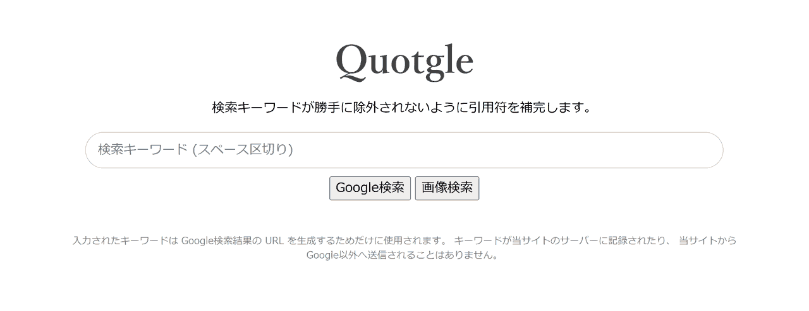

# Quotgle

Google 検索の際、キーワードが勝手に除外されないように引用符を補完して検索を実行するためのページです。

最近の Google は入力された検索キーワードを無視して期待外れの結果を出すことがあります。キーワードを二重引用符 ("～") で囲うことで防ぐことができますが、二度手間なので最初から引用符が付加された状態で検索結果を表示するページを作成しました。

👉 [Quotgle](https://www.shapoco.net/quotgle/)

