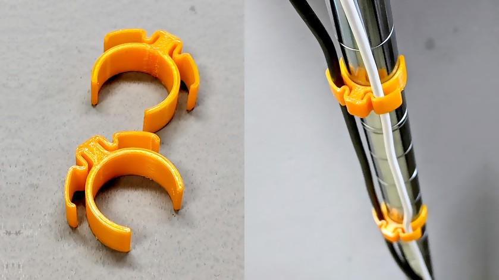

# メタルラック用ケーブル固定器具

メタルラック (スチールラック) のポールにケーブルを固定する器具の STL です。19mm 用ですが、1.33倍にスケーリングして印刷すれば 25mm にも適合します。

ダウンロード: [Cable Holder for Metal Rack (19mm) by shapoco - Thingiverse](https://www.thingiverse.com/thing:4771835)

## 関連リンク

- [メタルラック (スチールラック) のポールにケーブルを固定する器具の STL](https://x.com/shapoco/status/1863803749388656733)
- [メタルラック (スチールラック) のポールにケーブルを固定する器具の STL](https://misskey.io/notes/a1bj3kwc1gqf0444)
- [メタルラック (スチールラック) のポールにケーブルを固定する器具の STL](https://bsky.app/profile/shapoco.net/post/3lcesqr6clc2a)
