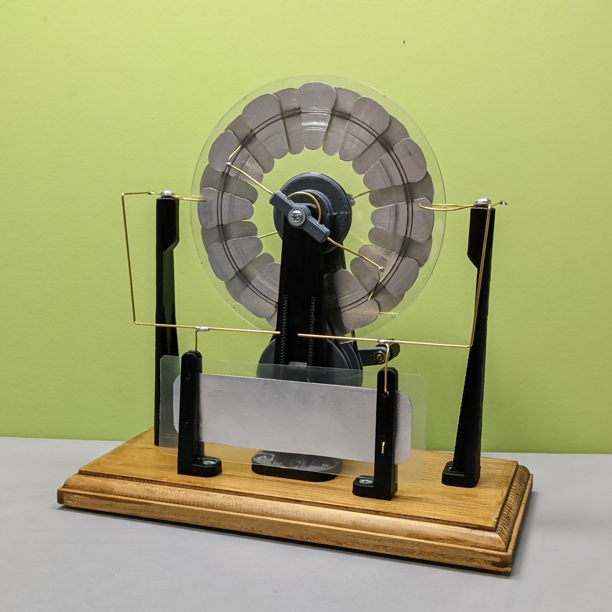

# いらない CD とアルミテープと3Dプリンタでウィムズハースト起電機作ってみた

回転する 2 枚の円盤と電極を使って、初期状態の僅かな電荷の偏りを静電誘導によって増幅し蓄積する装置です。乾燥する時期になるとよく放電します。

CD のラベルはモノによってはガムテープで剥がせるそうなんですが、うちにあったのは剥がれなかったので電撃で吹き飛ばしました。

電荷を溜める部分は典型的にはライデン瓶が用いられますが、今回はクリアファイルから切り出したシートの両面にアルミテープを貼ってコンデンサを構成しました。

<blockquote class="twitter-tweet" data-media-max-width="560">
いらないCDとアルミテープと3Dプリンタでウィムズハースト起電機できた🍣 <a href="https://twitter.com/hashtag/shapolab?src=hash&amp;ref_src=twsrc%5Etfw">#shapolab</a> <a href="https://t.co/mwuRKoYA1K">pic.twitter.com/mwuRKoYA1K</a>
&mdash; シャポコ🌵 (@shapoco) <a href="https://twitter.com/shapoco/status/1528374480925560833?ref_src=twsrc%5Etfw">May 22, 2022</a></blockquote> 

### フランクリンのベル

<blockquote class="twitter-tweet" data-media-max-width="560">
フランクリンのベル。 <a href="https://twitter.com/hashtag/shapolab?src=hash&amp;ref_src=twsrc%5Etfw">#shapolab</a> <a href="https://t.co/9qjD9pXsCj">pic.twitter.com/9qjD9pXsCj</a>
&mdash; シャポコ🌵 (@shapoco) <a href="https://twitter.com/shapoco/status/1528402727080198145?ref_src=twsrc%5Etfw">May 22, 2022</a></blockquote> 

### 泳ぐ砂鉄

シャーレのフチにアルミテープを貼り、油を張って、砂鉄をちらし、上から電極を近づけている。

<blockquote class="twitter-tweet" data-media-max-width="560">
一度やってみたかったやつ <a href="https://twitter.com/hashtag/shapolab?src=hash&amp;ref_src=twsrc%5Etfw">#shapolab</a> <a href="https://t.co/vLRbeuu029">pic.twitter.com/vLRbeuu029</a>
&mdash; シャポコ🌵 (@shapoco) <a href="https://twitter.com/shapoco/status/1528750518059036672?ref_src=twsrc%5Etfw">May 23, 2022</a></blockquote> 

## 関連記事 / 関連ポスト

- [イチケンさん](https://x.com/ichiken_make/status/1532987749162225664) が [デカいの](https://www.youtube.com/watch?v=GnFA0IF3VKg) を作っています
