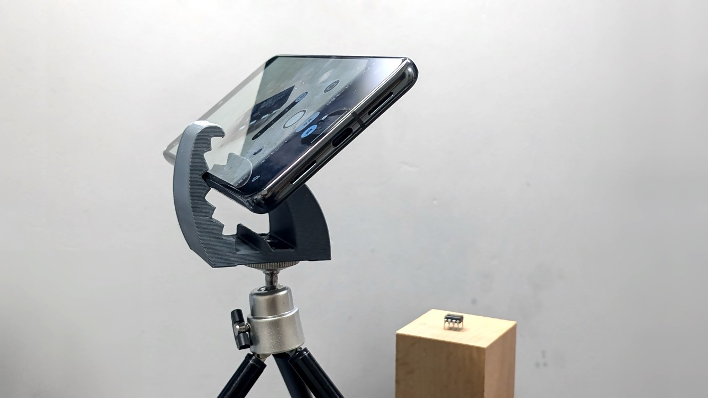

# 作業自撮り用スマホスタンド

「小物とか手元の作業とか撮りたいけど三脚出すほどでもねーな」っていう時にサクッと使えるスマホスタンドを作りました。

ダウンロード: [作業自撮り用スマホスタンド](https://github.com/shapoco/jigs/tree/main/stand/smartphone-stand-for-pic)

> [!NOTE]
> 2025/02/12: 安定性の向上、雲台への取り付けに対応した r2 を公開しました。

## 関連リンク

- [小物とか手元の作業とか撮りたいけど三脚出すほどでもねーなって時にサクッと使えるスマホスタンド](https://x.com/shapoco/status/1863800768740106680)
- [小物とか手元の作業とか撮りたいけど三脚出すほどでもねーなって時にサクッと使えるスマホスタンド](https://misskey.io/notes/a1bimwemphqj06be)
- [小物とか手元の作業とか撮りたいけど三脚出すほどでもねーなって時にサクッと使えるスマホスタンド](https://bsky.app/profile/shapoco.net/post/3lcesafdejc2a)
