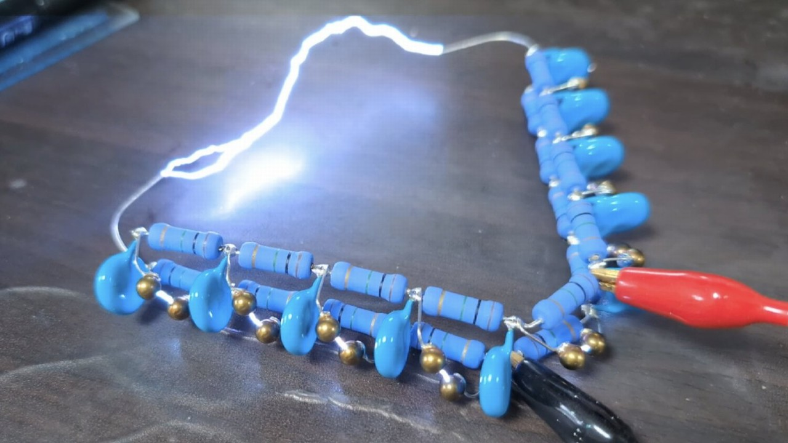

# マルクスジェネレータ

マルクスジェネレータです。改造した点火用小型トランスを Mazilli の ZVS インバータで駆動し、3 段のコッククロフト・ウォルトン回路で昇圧した後、9 段のマルクスジェネレータの中央に入力することによって正負の高電圧を同時に生成します。

なかなかガッツのある音がします。PC の前で放電すると一時的に USB ハブの認識が外れます。

<blockquote class="twitter-tweet" data-media-max-width="560">
なかなかガッツのある音がする <a href="https://twitter.com/hashtag/shapolab?src=hash&amp;ref_src=twsrc%5Etfw">#shapolab</a> <a href="https://t.co/RtdAwY6N8d">pic.twitter.com/RtdAwY6N8d</a>
&mdash; シャポコ🌵 (@shapoco) <a href="https://twitter.com/shapoco/status/1741139010440073328?ref_src=twsrc%5Etfw">December 30, 2023</a></blockquote> 

