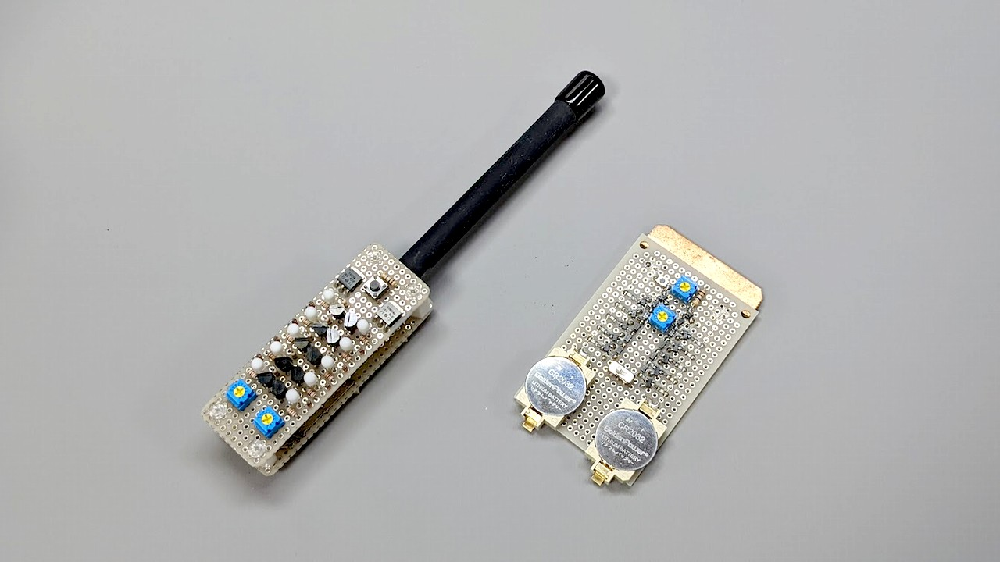
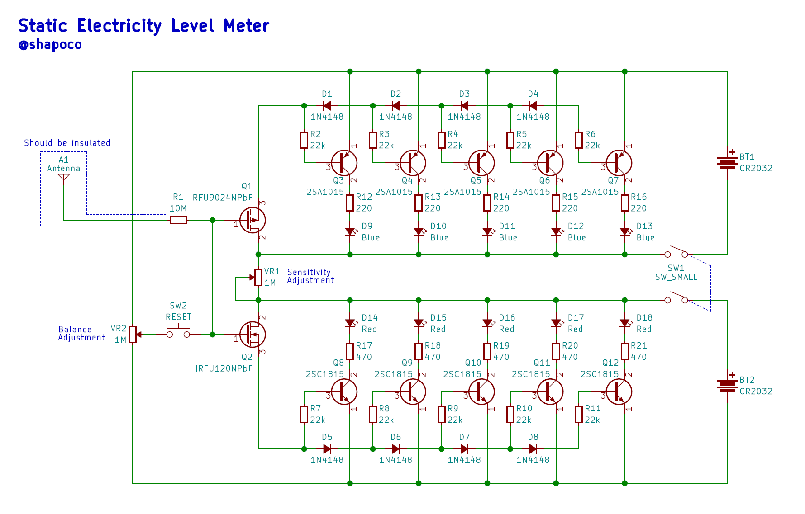
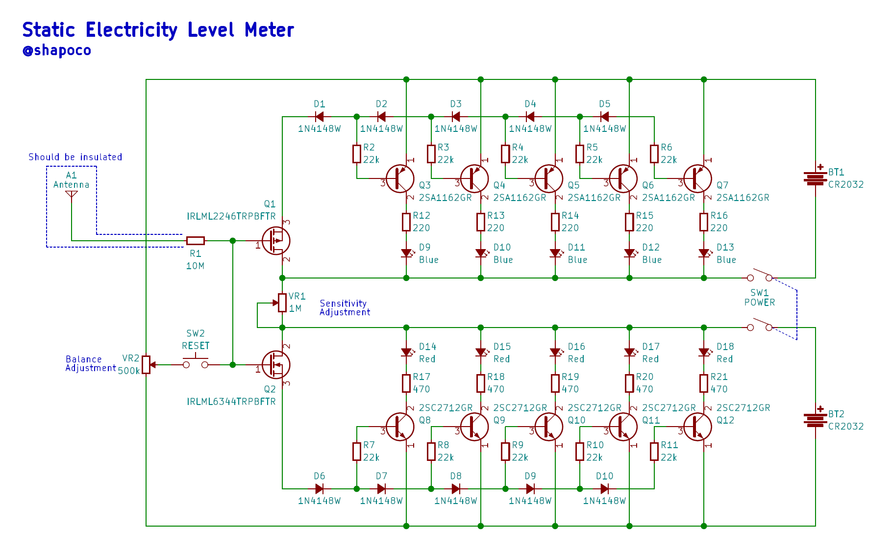

# 簡易静電気メーター

> [!NOTE]
> - 2023/2/13 : SMD版回路図の VR1 と VR2 の定数が逆だったのを修正しました。

## 概要

静電気の極性とレベルを正負それぞれ5段階で表示できる簡易式の「静電気メーター」を作りました。

秋月にあるディスクリート部品だけで作ることができ、静電気の実験や教育に使うことができます。

## 動作の様子

ウィムズハースト起電機の近くに置いて動かした様子です。

<iframe width="560" height="315" src="https://www.youtube.com/embed/ZZIkuuMb_II?si=R-Kpk1I24lkyIgr1" title="YouTube video player" frameborder="0" allow="accelerometer; autoplay; clipboard-write; encrypted-media; gyroscope; picture-in-picture; web-share" referrerpolicy="strict-origin-when-cross-origin" allowfullscreen></iframe>

## 回路

スルーホール版と表面実装版をそれぞれ作ってみました。動作原理はどちらも同じです。

1. アンテナが帯電することで MOS-FET のゲートに電荷が流入し、ドレイン-ソース間が導通する。
2. 直列接続されたダイオードの順方向電圧降下により、耐電のレベルに応じてトランジスタがオンになり、LED が光る。

重要なのは MOS-FET の選定で、ゲート漏れ電流が十分小さく、ゲートON電圧などの特性が近いペアを使用する必要があります。漏れ電流が大きいものを使用すると表示が不安定になったり、感度が弱くなったりします。

### スルーホール版

### SMD版

## 作例

SMD版はアンテナが裸の銅板になってますが、丸い形状の導体を使用し表面を絶縁した方がいいと思います。

## 使い方

### 調整

1. リセットスイッチを押したまま以下の操作を行う
2. 感度を最大にする
3. 正負のバランスを合わせる
4. 両方が消えるか消えないかくらいまで感度を下げる
5. リセットスイッチを離す

### 測定

帯電した物体にアンテナを近づけます。

> [!WARNING]
> アンテナを物体に直接当てないでください。MOS-FET が壊れる可能性があります。

## PCB 版

プリント基板化したものを BOOTH で販売し、多くの方に購入頂きました。

[shapoco/staticmeter: Electrostatic Level Meter](https://github.com/shapoco/staticmeter)

## 関連リンク

- [簡易静電気メーター rev0.1 - シャポコ (shapoco) - BOOTH](https://shapoco.booth.pm/items/4537598) **完売しました**
- [簡易静電気メーター rev0.2 - シャポコ (shapoco) - BOOTH](https://shapoco.booth.pm/items/4573943) **完売しました**
- [簡易静電気メーター rev0.3 - シャポコ (shapoco) - BOOTH](https://shapoco.booth.pm/items/5291534) **完売しました**
- [静電気メーター 、外部電源でも動いた🍣](https://x.com/shapoco/status/1626569698732298240)
- [静電気検知瓶](../../2024/1130-electrostatic-detector-bottle/article.md)
