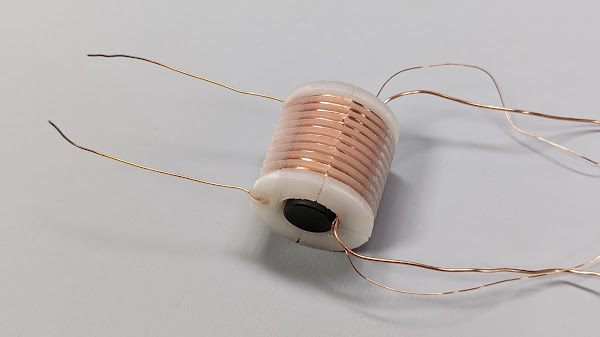
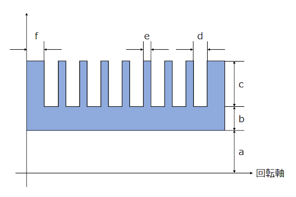
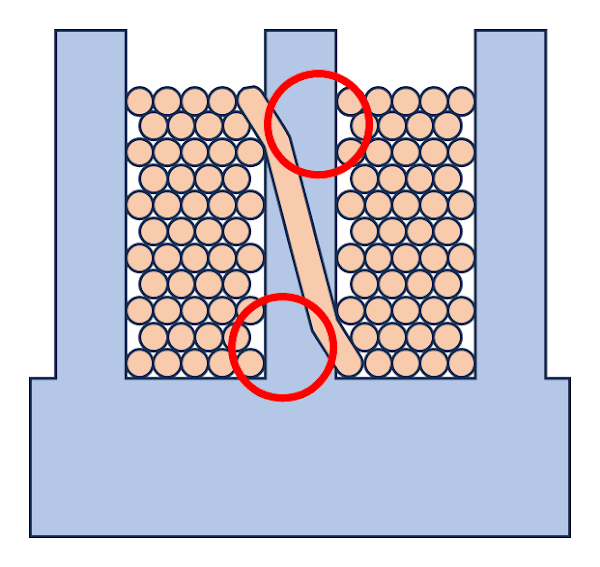
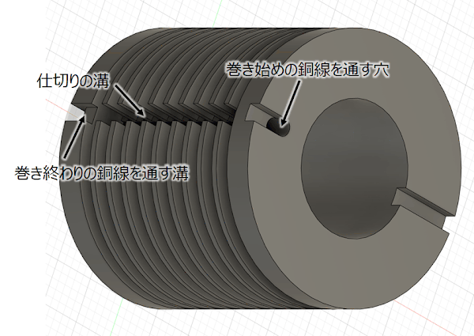
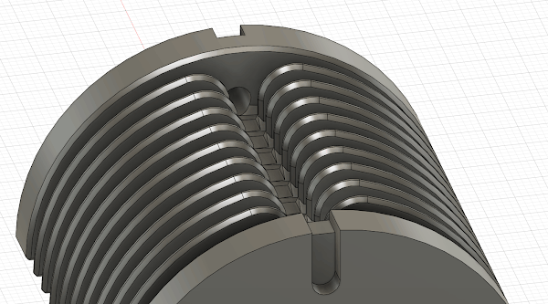
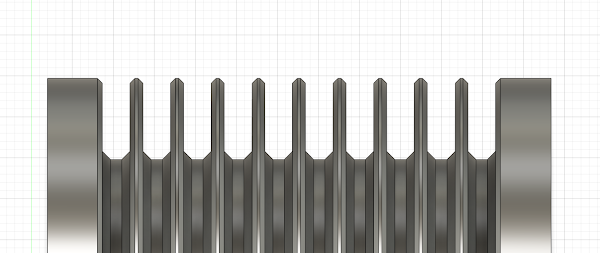
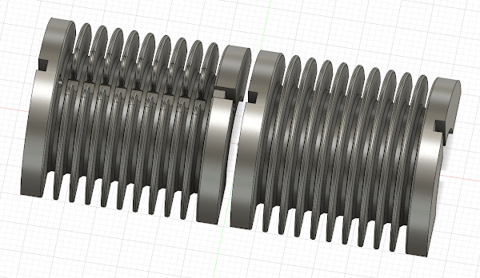
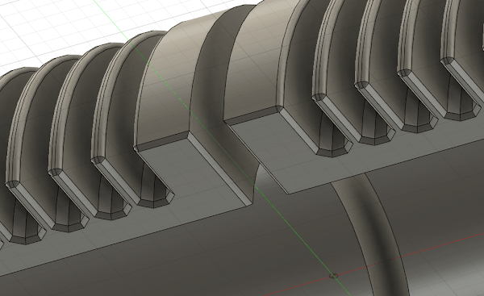
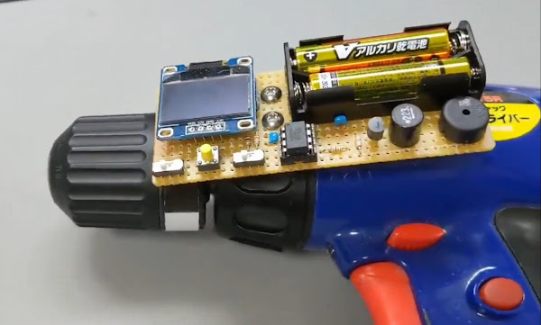
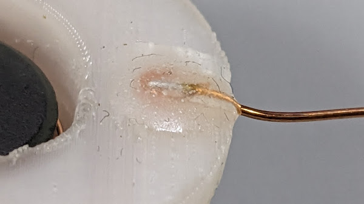

# FDM式3Dプリンタで高圧トランスのボビンを作る

## はじめに

高圧トランスを自作する場合、フェライトコアは Digikey などで入手できますが、それに合ったボビンを手に入れるのは困難です。

個人で 3Dプリンタを使えるようになった昨今であればそれを使って自作しようとなるわけですが、モノがモノだけに多少工夫が必要だったので備忘録がてら書いておこうと思います。

**なお、筆者はトランス設計については素人であるためその点を理解した上でお読みください。**

ここでは 10kV 程度の電圧を出力するトランスを作ることを考えます。記事中の寸法は出力する電圧に応じて調整してください。

## 使用する 3Dプリンタの種類

3Dプリンタとしては、光造形式のものをお勧めします。内部に隙間が生じないため絶縁性に優れることと、巻線を難しくする糸引きが生じないためです。

しかし筆者は光造形式がまだ一般的でない時期に FDM式を購入したため、この記事では FDM式を使用する場合のポイントを記載します。

## ボビンの寸法

ボビンは回転体様の形状なので、回転体をベースに作るのが簡単です。ただしいくつか注意点があります。

### 溝の数

溝の数は出力する電圧から決定します。感覚的には溝と溝の間にかかる電圧 = 出力電圧を溝の数で割った値が 1kV以下になるようにしたいところです。

### 穴の半径 (a)

穴の半径はフェライトコアの直径の半分ですが、3Dプリント時にモデルがやや太って穴が細くなるため、余裕をもって挿入できるよう少し大きめに設計します。分割してプリントする場合は重力によって穴が細くなる分も考慮します。

感覚的には、穴の直径換算で 1～2mm 太くするのが良いと思います。

### 内壁の厚み (b)

フェライトコアは導体であるため、巻線とコアを隔てる内壁は十分厚くする必要があります。

3Dプリンタの機種やプリントの条件にもよりますが、感覚的には 3mm 程度の厚みは欲しいところです。

### 溝の深さ (c) と幅 (d)

溝の形状は、巻線の太さと1つの溝のに巻く回数から計算して決定します。ただし、3Dプリント時にモデルがやや太って溝が狭くなるため、その分溝をやや広く設計します。

### 仕切りの厚み (e)

仕切りの厚みも重要です。巻線が溝の巻き終わりから隣の溝の巻き始めへ渡るとき、下図のように斜めに渡るわけですが、仕切りが薄すぎると丸印の箇所が高電界になり絶縁破壊を起こす場合があります。

感覚的には 1mm程度の厚みが欲しいところですが、3Dプリント時にモデルが太ることも考慮します。

### 両端の壁の厚み (f)

ボビンの両端の壁は、巻線の両端とフェライトコアの間が最も高電界となる部分なので、特に厚くします。

感覚的には 3mm程度は欲しいところです。

### 仕切りの溝、銅線を通す穴

回転体が出来上がったら、溝と溝の間で銅線を橋渡すための溝を作ります。また、巻き始め、巻き終わりの銅線を通すための穴や溝も彫ります。このあたりは巻線の作業性も考慮して設計します。

## 巻線を容易にするための形状の工夫

FDM式の場合、モデルの表面に細かい凹凸が発生します。巻線に使用する銅線は細いため、小さな突起でも容易に引っかかり巻線の作業を困難にします。自動巻線機を使用する場合はこの問題が特に顕著になります。したがって引っかかりが生じやすい箇所は丸みを持たせる必要があります。

具体的には仕切りの溝の尖った部分を丸くします。また、仕切りそのものも面取りして角を無くします。

## モデルの分割

モデルが出来上がったら、プリントできるようにモデルを分割します。うまくサポートを付ければ分割せずに一体のままプリントすることもできますが、面倒臭いのであまりお勧めしません。

プリント後にこれらを貼り合わせるわけですが、貼り合わせた箇所にも突起が生じやすいので、断面を面取りしておきます。

## プリント

ラフトは無しで、**充填率は 100% にします。**折角厚くしても中身がスカスカでは意味がありません。

筆者はいつも PLA を使用しています。他の材質との比較はしていないので分かりません。

プリントが完了したら分割した面を接着剤で貼り合わせます。筆者はいつも2液系エポキシ接着剤の「ボンド エポクリヤー」を使用しています。**十分な絶縁耐圧を得るため、貼り合わせる面全体十分に接着剤を塗ります。**

## プリント後の処理

この時点ではまだ溝の間に糸が引いて巻線に適しません。またこの糸引きを雑に除去しただけでは細かい突起が残るためこれに巻線が引っかかって上手く巻けない場合があります。

手っ取り早く処理するにはガスコンロなどで炙るのが簡単です。コンロの炎の中を2～3往復させるといい感じに樹脂が溶けて細かい凹凸が無くなります。**炙りすぎるとボビン全体が歪むのでやりすぎに注意してください。**

## 巻線

根気があれば手巻きでもいけますが、筆者は [電動ドリルに自作の巻数カウンタを付けたもの](https://x.com/shapoco/status/1284463984981143552) を使用します。巻線機を自作する方もいます。

巻き終わったら、巻き始め・巻き終わりの銅線を接着剤で固定します。これには絶縁の意味もあります。

せっかく両端の壁を厚くしてもその壁に穴を開けて銅線を通したら厚みの意味が無いのでは…というのはその通りです。このあたりはボビンの形状の工夫のしどころだと思います。

## さらに絶縁耐圧を得るには

クリアカラーのフィラメントで印刷するとよく分かりますが、印刷されたモデルの内部には細かい空隙があります。印刷の条件や運が悪いと空隙が繋がって絶縁が失われるということもあるかもしれません。

少しハードルが高くなりますが、出来上がったトランス全体を油（機械油など）やレジンに沈めて真空脱泡するのが確実です。

<iframe width="560" height="315" src="https://www.youtube.com/embed/2JgutgDD-hA" title="YouTube video player" frameborder="0" allow="accelerometer; autoplay; clipboard-write; encrypted-media; gyroscope; picture-in-picture; web-share" allowfullscreen></iframe>
