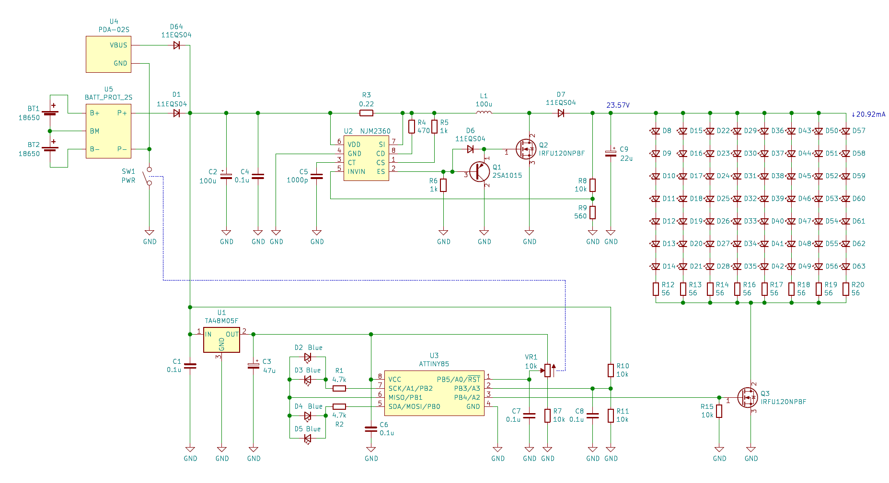
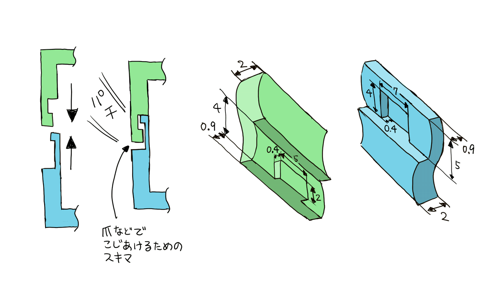

# 18650 2セル駆動の LEDランタンを作った

「[眩しすぎるX看板のLEDランタンを作った](../../2023/0805-x-sign-lantern/)」で買った白色LED が 50個以上余ったのでちゃんとした(?) LEDランタンを作ってみました。

## 動画

<iframe width="560" height="315" src="https://www.youtube.com/embed/ZpbXncW4yrE?si=R0i240itAevQu_FE" title="YouTube video player" frameborder="0" allow="accelerometer; autoplay; clipboard-write; encrypted-media; gyroscope; picture-in-picture; web-share" allowfullscreen></iframe>

## 仕様

- 3mm の砲弾型白色LED OSW54K3131A を 56個使用
- 18650 2セル、または USB PD (9V) で駆動
- 調光機能
- バッテリ残量表示
- 安全対策
    - 2セルの電圧が 6.2V を下回ったら明るさを抑える
    - 2セルの電圧が 6.0V を下回ったら消灯する
- 実用になるよう、3Dプリンタでしっかりした筐体を作る

## 回路

電流制限抵抗を介して直接 LED を駆動することもできますが、電源の状態に関わらず明るさを一定に保つことと、電流制限抵抗の数を抑えたかったので、NJM2360AD を使って DC/DC を構成して昇圧し、直列接続した LED を 20mA で駆動します。

調光はボリュームの値を ATtiny85 の ADC で読み取り、PWM で LED の明るさを制御します。電圧は RESETピンの ADC で読み取るので、ボリュームを下げてもリセットがかからないよう電圧範囲が 2.5～5V の間になるようにしています。人間の目の明るさの感じ方は光量に対してリニアではなく対数的なので、ボリュームには Aカーブのものを使用します。

バッテリーの電圧を ADC で読み取り、残量を計算して 4個の LED にレベル表示します。ダイナミック点灯により 3つのポートで 4つの LED を制御します。

バッテリーは直列で使用するので、[AliExpress で買った 2セル用の保護モジュール](https://ja.aliexpress.com/item/32835055863.html) で保護します。

USB-PD のトリガにはスイッチサイエンスで買った [べーたさん](https://twitter.com/betaEncoder) の [USB-PD_Adapter PDA-02S](https://www.switch-science.com/products/7237) を使用しました。

## プログラム

Arduino ATtiny Core を使用しました。

### 調光

デフォルトでは PWM周波数が低すぎてカメラで撮るとカメラのフレームレートと干渉してしまうため、TCCR1レジスタを変更して Timer1 のプリスケーラを無効化しています。

volume_to_pwm関数でボリュームの状態を読み取り、PWM に反映します。光量に対する明るさの感じ方は Aカーブのボリュームを使用することで考慮済みなので、ADC値をリニアに PWM の Duty比に反映します。バッテリー状態を考慮し、電池切れが近い場合は PWM値を 1/4に、電池切れ状態の場合は 0 にします。

### バッテリー監視・レベル表示

battery_to_level関数でバッテリー状態を読み取ります。電流によって入力ダイオード 11EQS04 の電圧降下が変わってしまうため、これを何となく考慮して生のバッテリー電圧を推定します。

読み取った電圧からバッテリー状態を 5段階のレベル値にします。ノイズ対策のため ±100mV のヒステリシスを持たせています。

電池切れが近くなるとレベル表示を 1秒周期で点滅させます。電池切れ状態になると 0.5秒周期で点滅させます。

drive_level_meter関数でダイナミック点灯により電圧レベルを LED に表示します。

USB接続時は VBUS の電圧が ADC に入ってくるのでレベル表示はフルになります。

## 筐体

Fusion 360 で設計し、FlashForge Adventurer3 でプリントしました。

簡単に電池を交換できるよう、リモコンなどの電池の蓋を参考にして開けられるようにしました。

フロントパネルはスナップフィットになっており、簡単に開けてメンテナンスできるようにしました。

## 組み上げ・完成

## 動作時間

3500mAh のバッテリー 2本で、明るさ最大時で 5時間程度の動作時間と推定しました。

実際に試したところ、バッテリ切れ判定で消灯するまで 5.5時間ほど点灯し続けたので、概ねスペック通りになりました。

本記事執筆時点でボリューム 50%時の動作時間を確認中ですが、20時間くらいは点灯し続けそうです。

## 関連リンク

- [眩しすぎるX看板のLEDランタンを作った](../../2023/0805-x-sign-lantern/)
- [余ってた白色LEDでLEDランタンできた🌵](https://x.com/shapoco/status/1691641095703122400)
