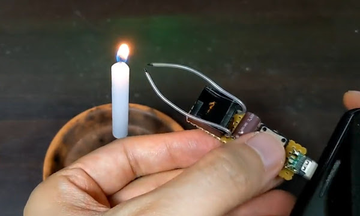
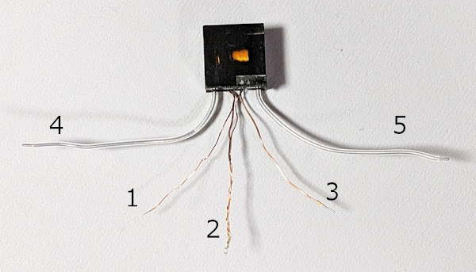
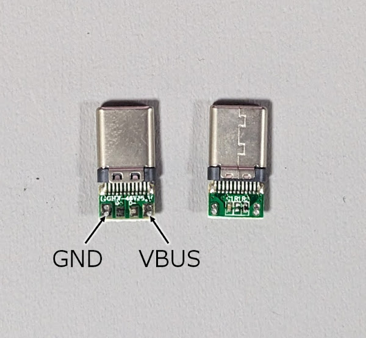
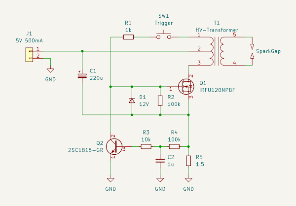
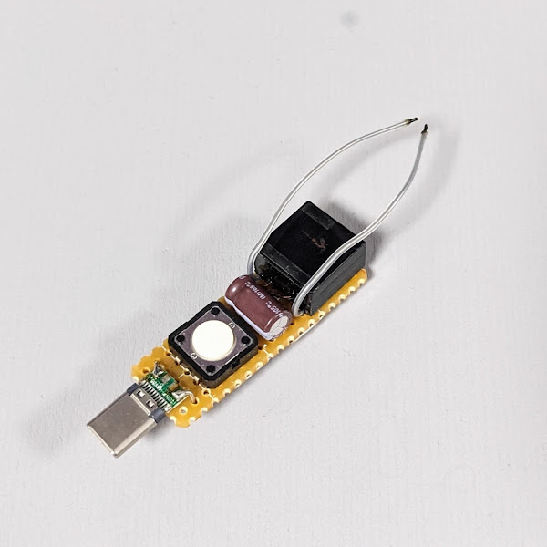
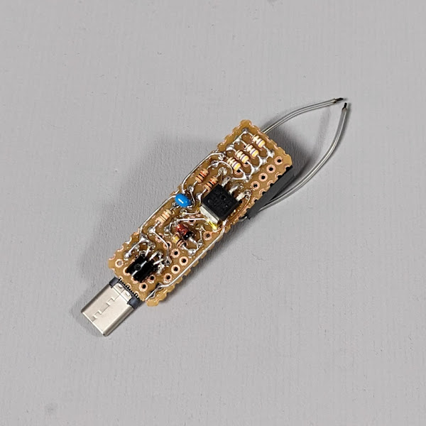
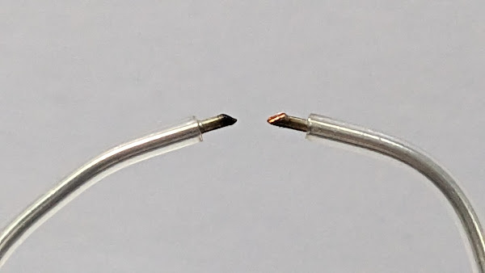

# スマホ (USB) で動くプラズマアークライター

## 概要

スマホの USBポートからの電力供給 (OTG) で動くプラズマアークライターを
作ってみました。

実用性があるのかというと微妙ですが…普通の着火器具には燃料切れや電池切れが
ありますが、毎日充電するスマホの電池を切らすことは滅多にないので、
そういう意味では「持ってればいつでも使える」と言えるかもしれません（強引）。

## トランス

プラズマアークライターには点火用のトランスが必要ですが、小型のものが
AliExpress や Amazon で手に入ります。

- [55.0￥ 42% OFF|アーク発生器15kv,高電圧インバーター,ブースター,変圧器,パルス点火1.4x1.4x0.7cm,ライターアクセサリー|回路| - AliExpress](https://ja.aliexpress.com/item/32940793737.html)
- [Amazon.co.jp: Hbaebdoo 3-5V DIYキット 高電圧発生器 アークイグナイターライターキット DIY電子生産用スイート: DIY・工具・ガーデン](https://www.amazon.co.jp/dp/B09XR2P1WK)

勝手にピン番号をつけましたが後の回路図と対応づけるためで、正式なものではありません。

1. (細い線) フィードバック出力
2. (細い線 + 太い線) 電源
3. (太い線) 駆動入力
4. 高圧出力
5. 高圧出力

## OTGコネクタ

スマホから OTG で DC 5V の供給を受けるには Type-Cコネクタの CC ラインに
5.1kΩのプルダウン抵抗が必要です。

自分で実装してもいいですが、Amazon に OTGケーブル自作用のキット？が
売られているので、それを使うのが簡単です。

[Amazon.co.jp: Cablecc 5個/ロット DIY 24ピン USB Type C USB-C オス OTG ホストタイプ 5.1k 抵抗器 ブラックハウジングカバー付き : 家電＆カメラ](https://www.amazon.co.jp/dp/B07TCFTNPW/ref=cm_sw_r_tw_dp_rHuOFbE7AP6T7)

## 回路

普通のブロッキング発振回路がベースですが、消費電流を USB の 500mA 以内に
収めるために R5 で電流検出し、Q2 で発振を制御しています。

手元の実験ではこれで 430mA 程度の消費電流になりました。

## 製作

コンパクトにしたかったので、ちょっと無理矢理ですがユニバーサル基板に
両面実装しました。トランスと Type-Cコネクタは後でエポキシ樹脂で固定しました。

電極の先端はニッパーで斜めに切って尖らせておくと放電しやすくなります。
放電距離は非常に短い（1～2mm？）ので、ギリギリまで近づけておく必要があります。

## 動作の様子

電流制限しているので市販のプラズマアークライターに比べると非力ですが、
ロウソクや紙に火を付けることはできます。

<blockquote class="twitter-tweet" data-media-max-width="560">
スマホの充電端子から電気取って火起こしできるプラズマアークライター 2023/08/24 <a href="https://twitter.com/hashtag/shapolab?src=hash&amp;ref_src=twsrc%5Etfw">#shapolab</a> <a href="https://t.co/UCiRiAOr07">pic.twitter.com/UCiRiAOr07</a>
&mdash; シャポコ🌵 (@shapoco) <a href="https://twitter.com/shapoco/status/1803431941233860956?ref_src=twsrc%5Etfw">June 19, 2024</a></blockquote>  
