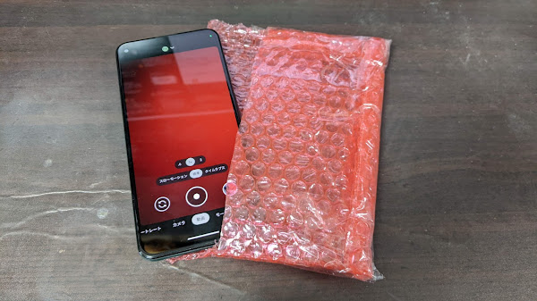
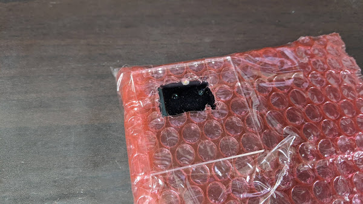

# スマホで火花放電を撮るときのブツブツ音対策

## ブツブツ音とは何なのか

スマホで火花放電を撮ると、ブツブツ、ブリブリ、という音が入って耳障りに
なってしまいます。

これが何の音なのか調べたところ、スマホをアルミホイルで覆っても効果が
限定的なのに対して、ダンボール箱やガラス瓶に入れるとブツブツ音が消えたことから、
（少なくとも筆者の Pixel5a の場合は）放電による電磁ノイズではなく衝撃波が
原因のようでした。

<iframe width="560" height="315" src="https://www.youtube.com/embed/1nLC-ONY7z0?si=wymrKW6s4_KPeFkn" title="YouTube video player" frameborder="0" allow="accelerometer; autoplay; clipboard-write; encrypted-media; gyroscope; picture-in-picture; web-share" allowfullscreen></iframe>

## スマホ用プチプチ袋を作ってみる

衝撃波を防ぐのが効果がありそうなので、スマホ用のプチプチ袋を作ってみました。

使用するプチプチ（エアパッキン）は、3層構造になっている厚手のしっかりしたものを
使います。2層のペラペラのプチプチでは効果がイマイチでした。

適当なサイズに切り出したプチプチを折ってテープでとめ、ちょうどスマホが
入るサイズの袋にします。

スマホのカメラが来る位置に小さな穴をあけ、アクリル板を貼り付けて窓を作ります。
アクリル板なしでは効果がありませんでした。

既製品のプチプチ付きの封筒を使った方が簡単に作れますが、
透明でないと撮影時に画面が見えないのでアングル調整が難しくなります。

## 効果

プチプチ袋にスマホを入れて放電を撮ると、ブツブツ音が解消されました。

<iframe width="560" height="315" src="https://www.youtube.com/embed/XaJvszl5ILo?si=VHIsFm_zsc5pwlFZ" title="YouTube video player" frameborder="0" allow="accelerometer; autoplay; clipboard-write; encrypted-media; gyroscope; picture-in-picture; web-share" allowfullscreen></iframe>
