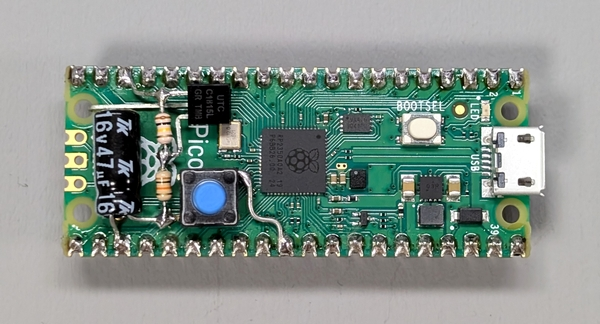
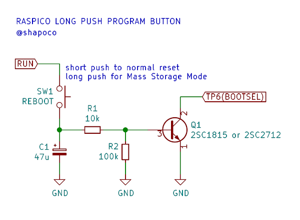
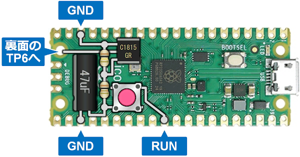
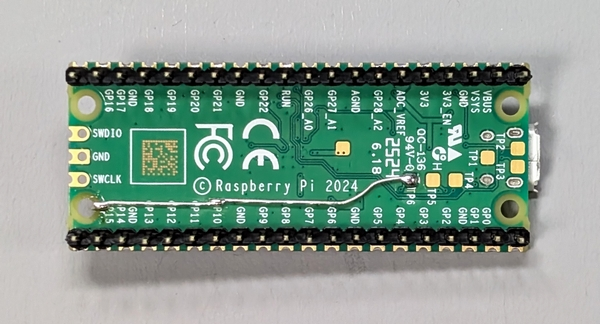
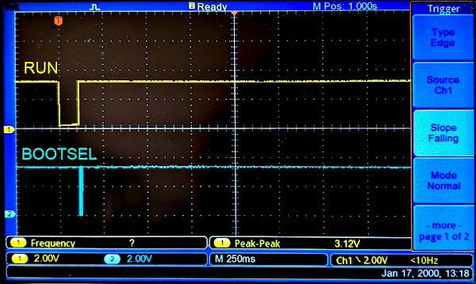
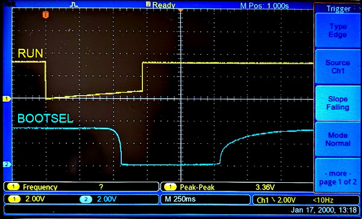

# ラズピコに「長押し書き込みボタン」を追加する (pico2対応)

> [!NOTE]
> - 2024/09/29 : Raspberry Pi Pico2 でも同じ回路で動作することを確認しました。

## 概要

Raspberry Pi Pico のデバッグには picoprobe が便利ですが、作る物や環境によっては
繋いだままにできない場合もあります。しかしプログラムを書き込むたびに
BOOTSELボタンを押しながら USBケーブルを差し込むのはちょっと面倒です。

RUNピンにリセットスイッチを追加し、BOOTSELボタンと同時押しすることで
スイッチ操作のみで行うこともできますが、もうひと工夫してスイッチひとつだけで
操作できるようにしてみました。

ボタンをクリックすると通常再起動、0.5秒ほど長押しすると Mass Storage Mode に
入るようになります。押しやすい大きなボタンを乗せれば指一本で操作できて
ちょっとした作業効率化になります。

## 動作の様子

## 回路

下図のような回路をラズピコに追加します。リード部品でも SMD でも OK です。 Raspberry Pi Pico でも Pico2 でも回路は同じです。

SW1 を押すと C1 を通して RUNピンがプルダウンされてリセットがかかります。
そのまま長押しし続けると C1 が充電されて Q1 のベース電圧が上昇していき、
Q1 がオンになると BOOTSELピンがプルダウンされます。
この状態で SW1 を解放するとリセットが解除され、Mass Storage Mode に
入るという仕組みです。

Q1 がオンになる前に SW1 を解放すれば通常のリセット (再起動) となります。

BOOTSELピンは Pico でも Pico2 でも裏面の TP6 に出ています。
少々不格好ですがここから引き出すのが簡単です。

## 実装例

Raspberry Pi Pico でも Pico2 でも接続方法は同じです。

## 動作波形

### クリック時

RUN の立ち上がり時に BOOTSEL がバタついていますが、これはチャタリング等ではなく、ラズピコ自身によるドライブのようです。

### 長押し時

BOOTSEL はだいぶ鈍っていますが、RUN の立ち上がりではしっかり GND に落ちていて、ちゃんと Mass Storage Mode に入れます。

## 関連リンク

- [クリックでリセット、長押しで書き込みモードになるボタン、ラズピコ2 でも動いた](https://x.com/shapoco/status/1835247604898345384)
- [クリックでリセット、長押しで書き込みモードになるボタン、ラズピコ2 でも動いた](https://misskey.io/notes/9y6xyluv70rf0cd7)
- [クリックでリセット、長押しで書き込みモードになるボタン、ラズピコ2 でも動いた](https://bsky.app/profile/shapoco.net/post/3l46olsaoyt2e)
