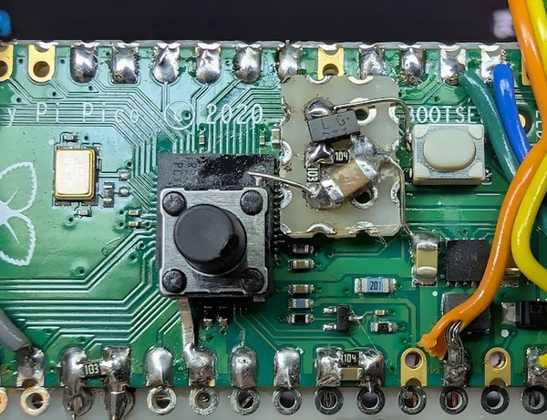

# ラズピコに「長押し書き込みボタン」を追加する (pico2対応)

> [!NOTE]
> - 2024/09/29 : Raspberry Pi Pico2 でも同じ回路で動作することを確認しました。
> - 2025/07/16 : SMD を使用した場合のレイアウトを追記しました。
> - 2025/09/25 : 既にリセットボタンが搭載されているボードに追加する場合の回路を追記しました。

## 概要

Raspberry Pi Pico のデバッグには picoprobe が便利ですが、作る物や環境によっては
繋いだままにできない場合もあります。しかしプログラムを書き込むたびに
BOOTSELボタンを押しながら USBケーブルを差し込むのはちょっと面倒です。

RUNピンにリセットスイッチを追加し、BOOTSELボタンと同時押しすることで
スイッチ操作のみで行うこともできますが、もうひと工夫してスイッチひとつだけで
操作できるようにしてみました。

ボタンをクリックすると通常再起動、0.5秒ほど長押しすると Mass Storage Mode に
入るようになります。押しやすい大きなボタンを乗せれば指一本で操作できて
ちょっとした作業効率化になります。

## 動作の様子

## 回路

下図のような回路をラズピコに追加します。リード部品でも SMD でも OK です。 Raspberry Pi Pico でも Pico2 でも回路は同じです。

SW1 を押すと C1 を通して RUNピンがプルダウンされてリセットがかかります。
そのまま長押しし続けると C1 が充電されて Q1 のベース電圧が上昇していき、
Q1 がオンになると BOOTSELピンがプルダウンされます。
この状態で SW1 を解放するとリセットが解除され、Mass Storage Mode に
入るという仕組みです。

Q1 がオンになる前に SW1 を解放すれば通常のリセット (再起動) となります。

BOOTSEL は BOOTSEL スイッチに接続してもよいですが、Pico でも Pico2 でも裏面の TP6 に繋ぐ方がはんだ付けが簡単です。

## 実装例 (スルーホール部品)

Raspberry Pi Pico でも Pico2 でも接続方法は同じです。

## 実装例 (SMD)

表面実装部品を使用する場合は、例えば次のように実装できます。

## 動作波形

### クリック時

RUN の立ち上がり時に BOOTSEL がバタついていますが、これはチャタリング等ではなく、ラズピコ自身によるドライブのようです。

### 長押し時

BOOTSEL はだいぶ鈍っていますが、RUN の立ち上がりではしっかり GND に落ちていて、ちゃんと Mass Storage Mode に入れます。

## 既にリセットボタンが搭載されたボードに追加する場合

RUN 端子に既にリセットボタンが接続されていて前記の回路を接続できない場合は、以下のような回路を外付けすることにより、リセットボタンを「長押し書き込みボタン化」することができます。まあただの遅延回路です。

## 関連リンク

- [クリックでリセット、長押しで書き込みモードになるボタン、ラズピコ2 でも動いた](https://x.com/shapoco/status/1835247604898345384)
- [クリックでリセット、長押しで書き込みモードになるボタン、ラズピコ2 でも動いた](https://misskey.io/notes/9y6xyluv70rf0cd7)
- [クリックでリセット、長押しで書き込みモードになるボタン、ラズピコ2 でも動いた](https://bsky.app/profile/shapoco.net/post/3l46olsaoyt2e)
