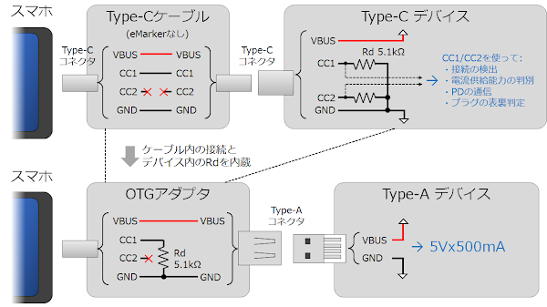

# スマホの USB でウズラのゆで卵をつくる

## 概要

スマートフォンのUSBポートはOTGアダプタを使用するとUSB電源として
使用することができます。この電力を使用してゆで卵を作れないか実験してみました。

景気よく鶏卵でといきたいところですが、乾電池ゆで卵 の例などから難しそうと判断し、
ウズラの卵で挑戦することにしました。

## 動画

<iframe width="560" height="315" src="https://www.youtube.com/embed/XoHzk0J2f0c?si=W5COjgVICNYyLxdS" title="YouTube video player" frameborder="0" allow="accelerometer; autoplay; clipboard-write; encrypted-media; gyroscope; picture-in-picture; web-share" allowfullscreen></iframe>

## スマホから得られる電力

OTGでどの程度の電力が得られるかはスマホによって異なります。より大きな電力を得るには規格に沿って適切なモードを実装する必要があります。

参考: [Microchip Application Note：AN1953](http://ww1.microchip.com/downloads/en/appnotes/00001953a.pdf)

私の所有している Pixel3 と Pixel5a では規格上は USB2.0 の 5Vx500mA までの
ようです。ただ、Pixel3 は実際に電流を引くと 1.5A程度まで引くことができました。
Pixel5a ではより厳格な実装となっているようで、500mA を大きく超える電流を引くと
保護機能が働いて供給を遮断されてしまいました。

スマホによってはより大きな電流の規格に公式に対応しているものもあるそうです。

今回はどのスマホでも再現できるように最小構成 (USB2.0: 5Vx500mA) で使用することに
しました。

## OTGアダプタの仕組み

充電端子でもあるスマホのUSBポートから電力供給を得るには、ポートを OTGモードで
動作させる必要があります。5Vx500mA を得るのであれば OTGアダプタを使用する方法が
簡単です。OTGアダプタにはホスト側から 5V を出力させるための回路
(5.1kΩのプルダウン抵抗) が内蔵されているので、デバイス側は何も考えずに
5V を得ることができます。

OTGアダプタを使用せずに Type-Cコネクタを自前で実装する場合は、
アダプタと同様に CC1 を 5.1kΩでプルダウンすることにより、
アダプタ使用時と同様に 5Vx500mA の供給を受けることができます。

より大きな電流の供給を受けるには、CC1/CC2 ピンの電圧を監視したり、
PD (Power Delivery) 通信を行う必要があります。

## ヒーターの作成

熱源には 0.2mm, 34.3Ω/m のニクロム線を使用しました。これに 500mA の電流が
流れるようにするには、オームの法則より、5V÷500mA＝10Ω になるようにカットします。

カットする長さはニクロム線の抵抗値から算出することもできますが
(10Ω÷34.3Ω/m≒29.2cm)、抵抗値は温度により変動するため、実際に5Vをかけながら
電流値が実測で500mAになるようにカットした方がいいと思います。
今回は約25cmでカットしました。

熱源を卵に密着させる必要があるのと、細いニクロム線で卵全体を加熱するために
次のようにしました。

1. ニクロム線を熱収縮チューブで絶縁する
2. 絶縁したニクロム線を5cmx25cm程度に切ったアルミホイルに斜めに固定する
3. 上記を卵に巻き付けて固定する
4. 上記の上からさらにアルミホイルを巻いて全体を固定する
5. 全体をタオル等でくるんで断熱する

## 通電

USB Type-Aコネクタの VBUS と GND をニクロム線に接続し、
OTGアダプタを介してスマホ (Pixel3) に接続します。

今回は温度センサ LM35DZ を Arduino に接続して温度をロギングしてみました。

30分あまりで温度は100℃に達し、ゆで卵の香りが漂ってきました。

卵の白身は 80℃前後、黄身は 70℃前後で完全に固まるそうです。
上のグラフでは 80℃以上で 15分以上加熱されてますので、少し長すぎかもしれません。

## できあがり

卵を取り出してカットしてみたのが下の写真です。しっかり固ゆでとなりました。

Pixel3 のバッテリーは 100%→71% になりました。長く使ったスマホなので、
新しいスマホならもっと少ない消費でできるかもしれません。

## 関連リンク

- [スマホでポップコーン作った](../../2020/0525-smart-popcorn/article.md)
- [スマホでウズラのゆで卵つくってみた](https://x.com/shapoco/status/1622114717354573824)
