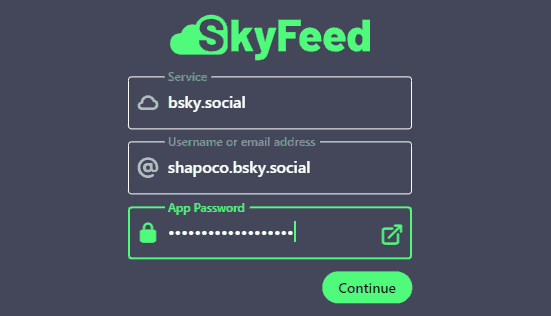
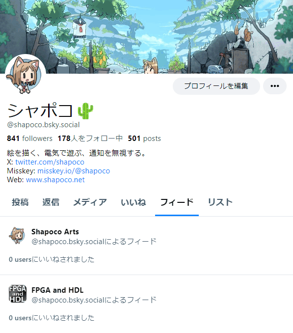

# SkyFeed を使って Bluesky で自作品のフィードを公開する

> [!NOTE]
> ※1) 2024年2月 にハッシュタグが使えるようになりました。

## はじめに

イラストや写真等を公開するアカウントの場合、それしか投稿してなければ
「メディア欄を見て」でいいかと思いますが、それ以外の日常の写真や
ゲームのスクリーンショットなども投稿する場合、自作品だけを
まとめたページが欲しくなります。~~Bluesky にはいわゆるハッシュタグは
ありませんが~~(※1)、「カスタムフィード」を使えば、特定のキーワードを
含むポストをまとめることができます。

ここでは Bluesky のサードパーティアプリ「SkyFeed」を使って自作品を
フィードにまとめる手順を説明します。

この記事執筆にあたり、下記の記事を参考にさせて頂きました。
本記事では「自作品をまとめたフィード」に的を絞っていますが、
より高度な使い方を知りたければ下記の記事を参考にしてみてください。

- [SkyFeedのFeed Builderを使ってカスタムフィードをつくる - Bluesky](https://scrapbox.io/Bluesky/SkyFeed%E3%81%AEFeed_Builder%E3%82%92%E4%BD%BF%E3%81%A3%E3%81%A6%E3%82%AB%E3%82%B9%E3%82%BF%E3%83%A0%E3%83%95%E3%82%A3%E3%83%BC%E3%83%89%E3%82%92%E3%81%A4%E3%81%8F%E3%82%8B)

なお、Bluesky は発展途上のサービスのため、今後短期間のうちに UI が
変わる可能性があります。 また SkyFeed という外部サービスに依存するため、
SkyFeed のサービス提供が終了するなどして使えなくなってしまう可能性もあります。
ご了承ください。

## 1. SkyFeed にログインする

外部サービスである SkyFeed から自分の Blueskyアカウントに接続するために、
そのキーとなるアプリパスワードを取得してログインします。

1. [SkyFeed](https://skyfeed.app/) を開きます。
2. App Password の横にあるボタンを押すと Bluesky のアプリパスワードの作成画面に
    飛びますので、[アプリパスワードを追加] をクリックします。

    

3. アプリパスワードの名前を指定します。何でもいいですが、
    SkyFeed に与えるパスワードと分かるようにしておくとよいでしょう。

    

4. アプリパスワードが表示されるので、控えておきます。
    下の説明にあるように**この画面以降二度と表示されませんので、
    無くさないようにメモしておいてください。**また、他の人には見せないでください。

    

5. SkyFeed のログイン画面に戻り、ユーザ名と先ほど作成したアプリパスワードを
    入力してログインします。

    

## 2. SkyFeed でカスタムフィードを作成する

SkyFeed では複数の「ブロック」を組み合わせることによってフィードに
表示するポストの条件を指定します。

ここでは自分 (シャポコ) の投稿のうち、`#shapoart` というキーワードを
含むものを表示するフィードを作成することにします。

1. 左側のメニューから `Feed Builder` → `Create your first feed` をクリックして
    フィードを作成します。
2. `Feed Name` にフィードの名前を指定します。これが Bluesky上で表示される
    フィードの名前になります。日本語でもかまいません。
3. Inputブロックは検索対象となるポストを指定します。
    デフォルト(`Entire Network`)だと、自分以外の人のポストも含まれます。
    ここでは自分のポストだけに絞りたいので `Single User` を指定します。
    ユーザを識別するための「User DID」が必要となりますが、`Select Yourself` を
    クリックすれば自分の DID が自動的に入力されます。`Include` の横のボタンで、
    リプライやリポストまで含めるかどうかを指定できます。この時点で条件に
    ヒットするポストが存在しない場合右のプレビューにエラーメッセージが
    表示されますが、とりあえず無視します。

    

4. Remove ifブロックは除外するポストを指定します。このブロックは
    今回は必要無いので `×` をクリックして削除します。
5. RegExブロックは絞り込みの条件を「正規表現」で指定します。
    正規表現とは、文字列のパターンマッチをするための式です。
    今回は `#shapoart` を指定します。複数指定したい場合は `|` で区切って、
    例えば `#shapoart|#illustration` のようにします。
    より複雑な条件を指定したい場合は「正規表現」でググってみてください。
    
    

6. `＋Add Block` をクリックして、Regexブロックの次に Remember Postsブロックを
    追加します。これは過去の検索結果を記憶してくれるものです。
    Inputブロックで Single User を指定した場合は過去の投稿も全て対象になるので
    不要かもしれませんが、もしかすると仕様が変わるかもしれないと思って
    一応追加しておきました。
7. タグ付けされていない作品をフィードに入れたい場合は `＋Add Block` で
    Inputブロックを追加し、`Single Post` を選んでポストの URL を入力することで、
    個別のポストをフィードに追加することができます。
8. Sort byブロックは表示するポストの順序を指定します。
    デフォルトで日付(Creation Date)の新しい順(descending)になっますので、
    そのままにしておきます。

最終的に次のようになりました。

この時点で既に条件にヒットするポストがあれば右にプレビュー表示されますが、
無ければエラーメッセージが表示されます。

まだ投稿が無い場合は試しにタグ付けしたポストを投稿してみて、
右側に反映されるか試してみるとよいでしょう。
プレビューは条件を編集するたびに更新されます。
反映には少し時間がかかる場合があります。

## 3. フィードを公開する

1. `Publish Feed` をクリックします。
2. `Upload avatar image` をクリックするとフィードのアイコンを指定できます。
3. `Description` にフィードの説明を入力します。
4. `License` はフィードのライセンスを指定します。
    フィードを編集したり改善したりする Remix機能のためだそうです。
    特にこだわりが無ければデフォルトでよいでしょう。
5. `Publish` をクリックしてフィードを公開します。

    

作成したフィードは自分のプロフィールページに表示されます。

フィードを開き、URL をコピペして共有することもできます。

フィードの検索条件は SkyFeed でいつでも編集でき、
`Update Feed` ボタンで更新することができます。

## 関連リンク

- [自分のイラスト作品等を「フィード」にまとめる手順を記事にしました](https://bsky.app/profile/shapoco.net/post/3kl27gafjdk2d)
