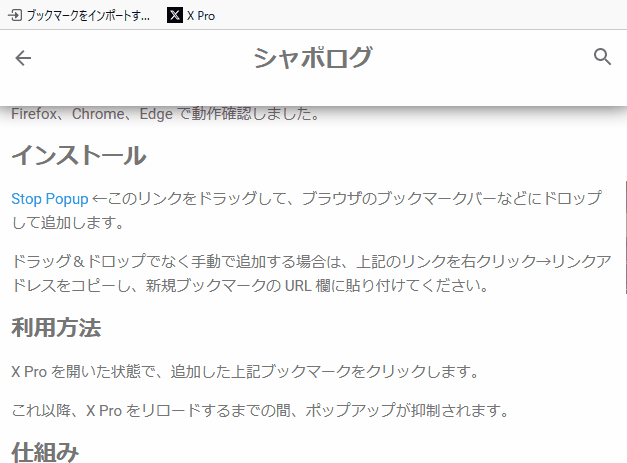
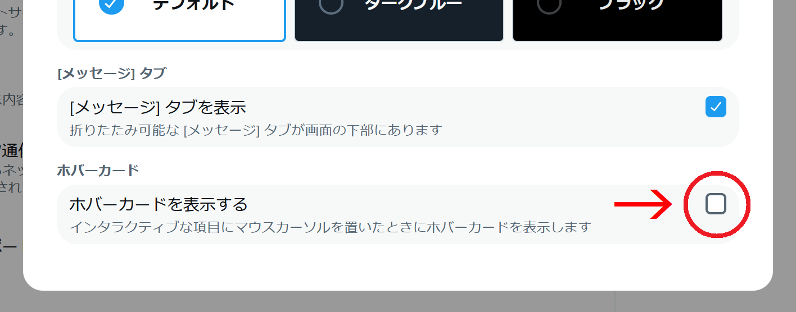

# X Pro（旧 TweetDeck）でプロフィールなどがポップアップされたまま消えない問題の応急処置 (追記あり)

> [!NOTE]
> - 2024/6/06追記 : 本問題は修正されたようです。
> - 2024/5/29追記 : X Pro に細工をせずに設定でポップアップを非表示にする方法を教えてもらったので末尾に追記しました。

## 概要

2024年5月頃から X Pro（旧 TweetDeck）において「プロフィールカードなどの
ポップアップ（ホバーカード）やツールチップが表示されたまま消えない」という
問題が発生しています。

X Pro を利用する上で非常に障害となるため、公式に改修されるまでの応急処置として
ポップアップやツールチップの表示そのものを抑制する「ブックマークレット」を
作成しました。

Firefox、Chrome、Edge で動作確認しました。

## インストール手順

<a href="javascript:(function(){document.getElementsByTagName('body')[0].addEventListener('mouseover',function(e){e.stopPropagation();},true);})();">Stop Popup</a> ←このリンクをドラッグして、
ブラウザのブックマークバーなどにドロップして追加します。

ブックマークの名前は動作に影響しませんので、好きなように変えて大丈夫です。

ドラッグ＆ドロップでなく手動で追加する場合は、上記のリンクを
右クリック→リンクアドレスをコピーし、新規ブックマークの URL 欄に
貼り付けてください。

## 利用方法

X Pro を開いた状態で、追加した上記ブックマークをクリックします。

これ以降、X Pro をリロードするまでの間、ポップアップとツールチップの表示が
抑制されます。

## 仕組み

body 要素にダミーのイベントリスナーを設定して、mouseover イベントを子要素に
伝搬させないことで、ポップアップを表示する処理が起動しないようにしています。

mouseover イベントをトリガーとする機能は全て使用不能になりますが、
ポップアップが出なくなる以外に特に大きな問題は無いと思います。

----

## 【追記】ホバーカードの無効化設定

[風柳さん](https://x.com/furyutei) より引用 RP にて
[X Pro の設定でポップアップを止める方法](https://x.com/furyutei/status/1795783402534449245)
を教えて頂きました。ありがとうございます。

左下の「･･･」
→「設定とプライバシー」
→「アクセシビリティ、表示、言語」
→「表示」
→「ホバーカードを表示する」のチェックを外します。

この方法ではツールチップが表示され続けて消えない問題は残りますが、
変な細工をすることなく恒久的にポップアップ（ホバーカード）を無効化できます。
