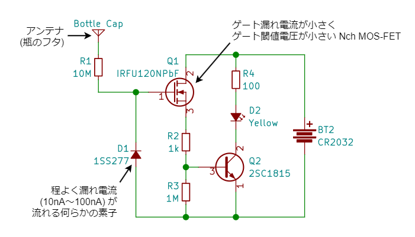

# 静電気検知瓶

[2019 年の秋に制作](https://x.com/shapoco/status/1189239542043332609) した、人間の静電気を検知して LED が光る瓶です。MOS-FET のゲートが静電気に晒されるとドレイン-ソース間が導通することを利用します。

## 動作の様子

椅子に座り、靴下を履いた足でカーペットを勢いよくこすり、そのまま足を床から浮かせて体に静電気を溜めた状態で手を瓶にかざしています。

## 仕組み

静電気は異なる材質の物体同士をこすり合わせたり、くっつけて引き剥がしたりするときに発生します。プラス、マイナスどちらに耐電しやすいかは 「[帯電列](https://www.google.co.jp/search?q=%E5%B8%AF%E9%9B%BB%E5%88%97&udm=2)」という図で示されます。人体や体毛はプラスに帯電しやすいため、日常生活で人体に溜まる静電気はほとんどの場合プラスです。

静電気検知瓶は「静電誘導」と呼ばれる現象を利用して人体に溜まったプラスの静電気を検出します。検知部はアンテナと N チャネル MOS-FET で構成されます。MOS-FET は本来は電気信号のスイッチや増幅のために使われる半導体素子です。

1. プラスに帯電した物体（人体）がアンテナに近づくと、静電誘導によりアンテナにはマイナスの電気が集まります。
2. 反対に、アンテナに繋がった MOS-FET のゲート入力端子にはプラスの電気が集まります。
3. これにより MOS-FET のドレイン-ソース間が導通し電流が流れます。
4. この電流を NPN トランジスタで増幅し、LED を点灯させます。

## 回路

MOS-FET は型番により特性が異なり、それにより感度も変わります。重要なのは「ゲート漏れ電流」で、これが大きすぎると静電気による電荷がすぐに逃げてしまうため感度が悪くなります。秋月電子で手に入る部品をいくつか試した結果、ここでは [IRFU120NPbF](https://akizukidenshi.com/catalog/g/g106050/) を採用しました。

また、「仕組み」で示した回路にいくつかの素子を追加しています。

- `R1`: MOS-FET は静電気で発生するような高電圧に対して弱い素子のため、アンテナとの間に大きな値の抵抗を挿入して電荷が一気に流れ込むのを防止しています (気休め)。
- `D1`: MOS-FET のゲートに電荷が溜まったままだと、いつまでも LED が点きっぱなしになり無駄に電力を消費してしまいます。ごく僅かに電流を通す素子を介してゲートの電荷を少しずつ GND (電池のマイナス側) に逃がします。ここではごく小さな漏れ電流 (10nA) のあるスイッチングダイオード [1SS277](https://akizukidenshi.com/catalog/g/g110623/) を入れました。100MΩ～1GΩ の抵抗でもいいかもしれません。
- `R3`: トランジスタ `Q2` の入力を GND へ弱く引っ張ります。静電気を検出していないときに確実に LED を消灯させて待機時の消費電力を抑えます。

LED が点灯していない間の消費電力はほぼゼロなので、電源スイッチは不要です。

## 部品リスト

瓶はフタが金属でできたダイソーの瓶や薬瓶（『ルル』の大きい方）などを使用します。

<iframe src="https://aki.prioris.jp/emb/525e0280-46c9-4ac4-82ac-725917959f12/" width=600 height=400 sandbox="allow-popups allow-scripts allow-same-origin allow-forms" frameborder=0></iframe>

## 作りかた

実体配線図を示します。この通りにレイアウトする必要はありませんし、基板を起こしてもかまいません。綺麗に空中配線すると瓶に入れたときの見栄えが良くなります。

半導体素子（MOS-FET、トランジスタ、ダイオード、LED）と電池は極性があります。違う型番のものを使用する場合はイラストと異なる場合もありますのでデータシート等でよく確認してください。

アンテナをフタにネジ止めして瓶に入れたら完成です。フタとの接触はあまり気にしなくてもアンテナとしては機能します。

## 使い方

机などに置いた状態で使用します。ドアノブなどで「パチッ」と放電が起こるくらい帯電しているときであれば、手をかざしただけで光ります。

> [!WARNING]
> 強い静電気を帯びているときは瓶のフタに直接触れないでください。MOS-FET やダイオードが壊れる可能性があります。

静電気を繰り返し検出すると瓶自体が帯電して一時的に感度が悪くなります。しばらく待つか、片手で瓶のフタに触れた状態でもう片方の手でグラウンド（金属製のドアノブや蛇口などの静電気の逃げ道）に触れてみてください。瓶に溜まった静電気が体を経由して逃げると思います。

> [!WARNING]
> 瓶が強く帯電している状態で瓶からグラウンドへ直接放電すると MOS-FET やダイオードが壊れるかもしれません。

## 応用

これと同じ原理でマイナスの静電気にも対応し、静電気の強さをレベル表示できるようにしたのが [簡易静電気メーター](https://blog.shapoco.net/2023/0223-electrostatic-meter/)<!-- todo: サイト内リンク --> です。

## 関連ポスト

- [自分が静電気帯びてるか教えてくれる魔法の小瓶みたいなのできた (動作は結構不安定だけど…)](https://x.com/shapoco/status/1200458200031432705)
- [静電気検知瓶、作ってから3年経ったけど電池は3.1Vを保ってた](https://x.com/shapoco/status/1603376017162194944)
- [5 年前に作った静電気検知瓶、一度も電池換えてないけどまだ動く。電池は 2.97V だった](https://x.com/shapoco/status/1862758463975334273)
