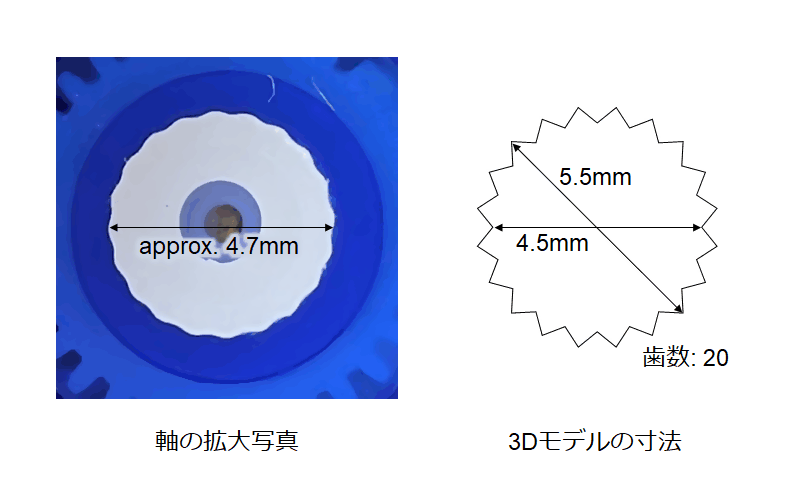

# [メモ] RCサーボSG-90の軸と噛み合う3Dモデルの寸法

秋月で売っている [マイクロサーボ SG-90](https://akizukidenshi.com/catalog/g/g108761/) に取り付けるアームを 3D プリンタで作ろうと思いましたが、データシートを見ても軸の寸法が分からず、暗黙的な共通の寸法が存在するのかどうかもよく分からなかったので現物合わせしました。

Fusion360 で図の右のような寸法でモデリングしてプリントしたところ、ちょっとキツかったですが一応ハマりました。モデルの内径が軸径の実測より小さいですが、実際にプリントすると角が丸くなるので、モデルよりやや大きくなると思います。

> [!WARNING]
> パラメータは使用するプリンタやコンフィギュレーションに応じて調整が必要です。
