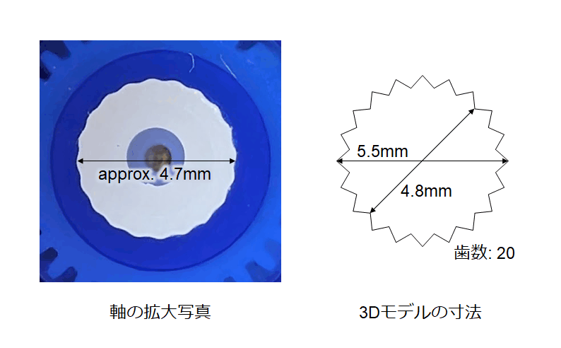

# [メモ] RCサーボSG-90のホーンを3Dプリンタで自作する

秋月で売っている [マイクロサーボ SG-90](https://akizukidenshi.com/catalog/g/g108761/) に取り付けるアームを 3D プリンタで作ろうと思いましたが、データシートを見ても軸の寸法が分からず、暗黙的な共通の寸法が存在するのかどうかもよく分からなかったので現物合わせしました。

> [!NOTE]
> - 2025/01/08: 寸法を若干修正 (内径 4.5mm → 4.8mm)

## 寸法

> [!CAUTION]
> SG-90 は軸径・歯数・ギヤ比などの仕様が異なるものが同じ名前で流通しているそうです。
> 
> - [Web回路Coder: 格安サーボSG90にバージョンがあった話](https://aoica.blogspot.com/2017/03/sg90.html)
> - [サーボホーンの歯を3Dプリンタで再現出来るってすごいですね！](https://burariweb.info/gadget/3d-printer/sg90-servo-horn-modeling.html)
> 
> 筆者は近所の部品屋で購入しましたが、軸の歯数は 20 枚でした。恐らく秋月電子のものと同じだと思います。

Fusion360 で図の右のような寸法でモデリングしてプリントしたところ、いい感じにハマりました。モデルの内径が軸径の実測より小さいですが、実際にプリントすると角が丸くなるので、モデルよりやや大きくなると思います。

> [!CAUTION]
> 上記パラメータは使用するプリンタやコンフィギュレーションに応じて調整が必要です。筆者は内径 4.5～5.0mm まで 0.1mm 刻みでモデルを作ってプリントして試しました。

軸の長さは今回購入した個体では 3mm でした。

## Fusion360 でのモデリング方法

歯形は以下の手順でできました。正攻法かどうかは分かりません。

1. スケッチを作成し「内接ポリゴン」で半径 2.75mm (直径 5.5mm) の円に内接する正 40 角形を作ります (歯数が 21 枚の場合は正 42 角形)。

    

2. 頂点をひとつ飛びに選択し「スケッチの尺度」で図形の中央を中心にスケーリングします。例えば内径を 4.8mm にするには 48/55 倍します (5.5mm × 48 / 55 = 4.8mm)。

    

3. この図形をプロファイルとして押し出しにより穴を開けます。

## 関連リンク

- [X の投稿](https://x.com/shapoco/status/1865586153002590515)
- [Misskey.io の投稿](https://misskey.io/notes/a1ik7qeki43501nd)
- [Bluesky の投稿](https://bsky.app/profile/shapoco.net/post/3lcr6owk37s2y)
