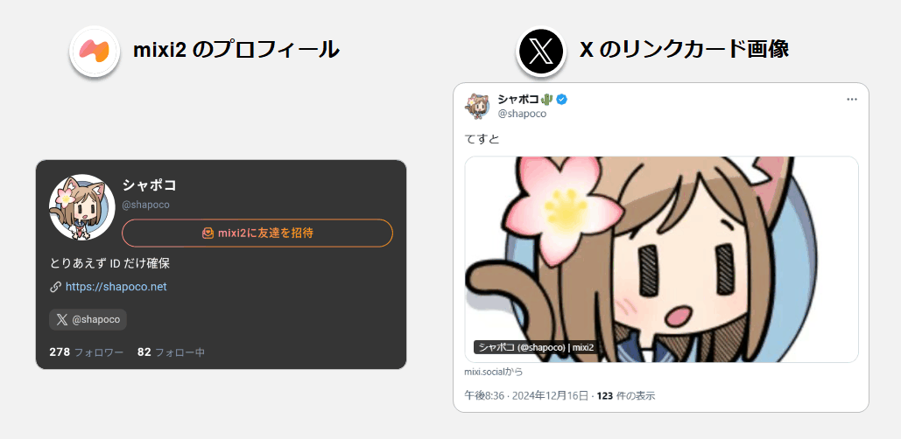
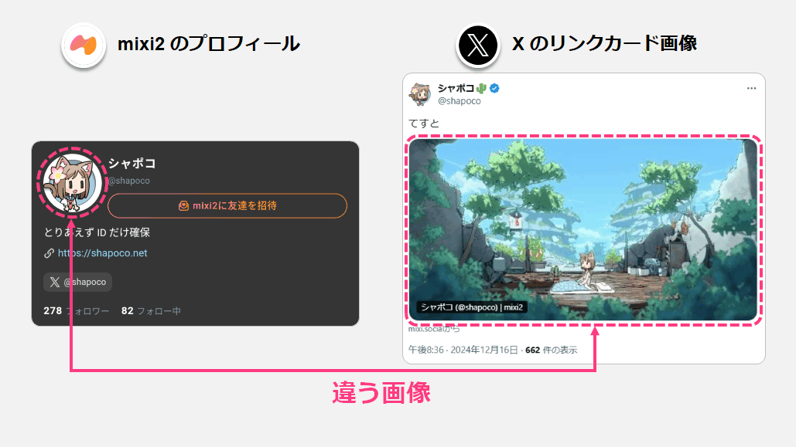
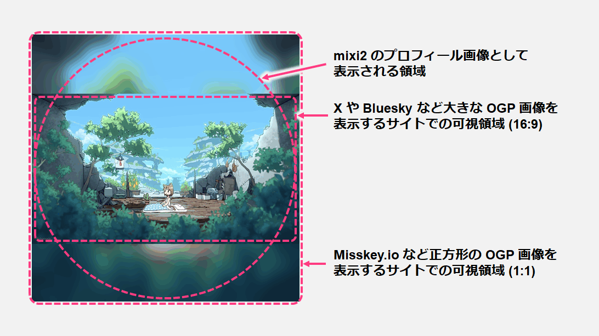
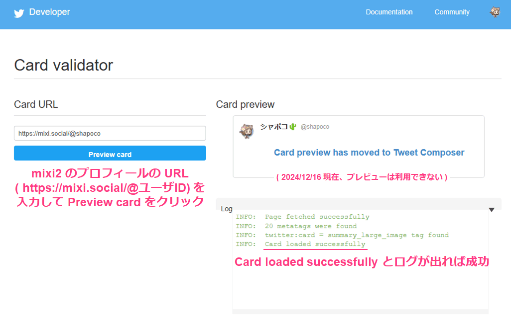

# X に mixi2 プロフィールを共有した時のリンクカードを任意の画像にする

mixi2 のプロフィールのリンクを X など他の SNS で投稿したときに表示されるリンクカード画像 (OGP 画像) をカスタマイズする方法です。

## mixi2 のプロフィールを共有したときに表示される画像

2024/12/16 現在、mixi2 のプロフィールの URL (`https://mixi.social/@ユーザーID`) を X で投稿すると、下図のようにプロフィール画像の中央付近を拡大したものが OGP 画像として使用されます。

この OGP 画像は一度 X にリンクを投稿すると X 側のサーバーにキャッシュされる (※) ので、投稿した後に mixi2 のプロフィール画像を変更しても、リンクカードの画像は元のままになります。

これを利用すれば、リンクカード画像とプロフィールアイコンを (見かけ上) 別の画像にすることができます。

> [!WARNING]
> ※ OGP 画像がいつまでキャッシュされるかは投稿先のサービス次第です。経験的に X や Bluesky では長期間キャッシュされますが、Misskey.io では比較的短時間でキャッシュの期限が切れて最新の画像に更新されます。リンクが表示される頻度にも影響されるかもしれません。

## OGP 画像として表示される領域

mixi2 のプロフィール画像として正方形の画像を設定した場合の、OGP 画像として表示される領域を示します。

- X や Bluesky: 中央の 16:9 の領域が切り抜かれて表示されます。
- Misskey.io: 正方形の画像全体が小さく表示されます。

16:9 の画像は拡張して正方形にする必要がありますが、X や Bluesky 以外のサイトでは正方形の画像全体が表示されるので、それも意識した画像にすると良いと思います (単なる黒帯で埋めるのではなく上図のようにぼかした画像で埋めるなど)。

## 既に X に投稿されたリンクカード画像を更新するには

既に過去に X でリンクを投稿していた場合、OGP 画像は X 側のサーバーにキャッシュされており、ポストを削除したり投稿し直しても更新されることはありません。

最新の OGP 画像 ( = 最新の mixi2 のプロフィールアイコン) を使用するには、[Twitter Card Validator](https://cards-dev.x.com/validator) でプロフィールの URL を入力し Preview card をクリックします。

経験的に、実際に新しい画像が表示されるまでには数分かかります。しばらく待ってください (**反映されないからといって Card Validator のボタンを連打しないように！**)

2024/12/16 現在、Twitter Card Validator ではリンクカードのプレビューは利用できませんが、Card Validator を使用する前に [OGP確認ツール](https://ogp.buta3.net/) などの外部サイトを利用して事前に確認することができます。

> [!WARNING]
> Twitter Card Validator で OGP 画像を更新すると、過去に同じ URL を使用して投稿されたポストのリンクカード画像も更新されますので注意してください。

> [!WARNING]
> X のリンクカード画像は上記の方法で更新できますが、Bluesky の画像の更新方法は分かりませんでした。更新できないのかもしれません。

## 実際のポスト

もしかするとあなたがこの記事を読んでいる時点ではキャッシュの期限が切れて mixi2 のプロフィールアイコンと同じ画像になっているかもしれません。

<blockquote class="twitter-tweet" data-media-max-width="560">
mixi2 アカウント<a href="https://t.co/gSrimJFgab">https://t.co/gSrimJFgab</a>
&mdash; シャポコ🌵 (@shapoco) <a href="https://twitter.com/shapoco/status/1868654948403327275?ref_src=twsrc%5Etfw">December 16, 2024</a></blockquote> 