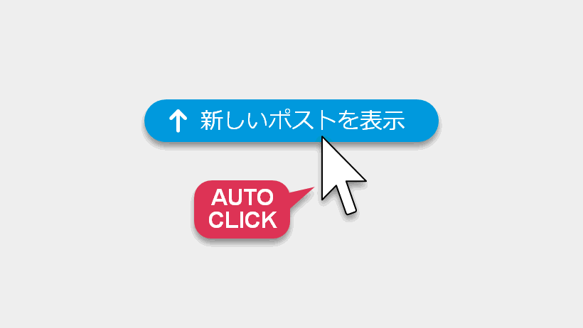

# XProAutoTop:「新しいポストを表示」を自動的にクリックする UserScript

XPro (旧TweetDeck) でことある毎に現れて TL の読み込みを止めてしまう「新しいポストを表示」のボタンを自動的にクリックする Greasemonkey UserScript を書きました。

Firefox/Chrome + Violentmonkey/Tampermonkey で動作確認しました。

ダウンロード/インストール: [XProAutoTop](https://github.com/shapoco/xpro-auto-top) (GitHub)
