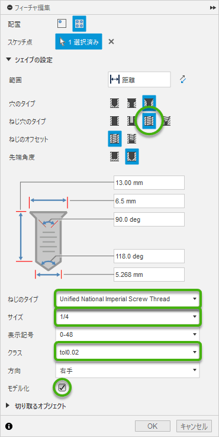

# [メモ] Fusion360 備忘録

Fusion360 関連の雑多なメモ。随時追加する

## 三脚・雲台用のネジとネジ穴

[Fusion360で三脚・雲台用のインチネジ(W1/4)の設定 #3Dプリンタ - Qiita](https://qiita.com/2019Shun/items/ccba3b541a2798bcdf82)

上記記事に記載された XML でネジ穴を作ろうとしたものの、我が家の Adventurer3 + FlashPrint のデフォルト設定ではキツすぎたので、寸法をカスタマイズしていくつか試した。

### 設定ファイルのインストール

1. [unified-national-imperial-screw-thread-r1.zip](./unified-national-imperial-screw-thread-r1.zip) をダウンロードして展開する。
2. XML ファイルを `%LOCALAPPDATA%\Autodesk\webdeploy\production\(長い16進数)\Fusion\Server\Fusion\Configuration\ThreadData\` に配置する。

    - `%LOCALAPPDATA%` はエクスプローラのアドレスバーに貼り付けると `C:\Users\(ユーザ名)\AppData\Local` に勝手に置換される。
    - `(長い16進数)` のとこはバージョンアップ時に新しく作られるっぽくて、そのたびに XML ファイルを移動させる必要があるかも。

### 使用方法 (穴)

穴を開けるときにネジ穴を設定する

- ねじ穴のタイプ: `ねじ穴`
- ねじのタイプ: `Unified National Imperial Screw Thread`
- サイズ: `1/4`
- クラス:

    |表示名|規格 (寸法)|
    |:--:|:--|
    |`2B`|1/4-20 UNC 2B|
    |`1B`|1/4-20 UNC 1B|
    |`tol0.02`|規格外 (直径のトレランス=0.02inch)|
    |`tol0.03`|規格外 (直径のトレランス=0.03inch)|
    |`tol0.04`|規格外 (直径のトレランス=0.04inch)|

    - 垂直方向の穴については `1B` が良い感じだった。
    - 水平方向や傾いた穴については `tol0.02` ～ `tol0.03` あたりが良い感じだった。

- STL や STEP へのエクスポートでネジ山を反映するには `モデル化` にチェックする

----

## 三面図

[Fusion 360で3Dデータから2D図面を作成する方法 | モデログ](https://3d-modely.com/blog/3d-software/fusion-360-drawing/)

- 左上の `デザイン` → `図面` → `デザインから` → `OK` で作成開始する
- 投影面の追加

    1. 左上の `図面` → `投影ビュー` 
    2. 最初に作成された投影ビューを上下左右にドラッグする

        - 斜めにドラッグすると等角投影になる

----

## モデリング時のパースをきつくする

[解決済み: モデリング中のカメラ設定（パース）につきまして - Autodesk Community](https://forums.autodesk.com/t5/fusion-ri-ben-yu/moderingu-zhongnokamera-she-ding-pasu-nitsukimashite/m-p/10366840)

### インストール

上記回答に添付された `SetCameraAoV.zip` の中身を `%APPDATA%\Autodesk\Autodesk Fusion 360\API\Scripts\` に展開する

### 使用方法

1. パースビューに切り替える
2. `ユーティリティ` → `アドイン` → `スクリプトとアドイン`
3. `SetCameraAoV` をダブルクリック → `はい`
4. 画角を入力

----

## 細々したの

### 操作方法

- 面と面をくっつけたり面を接地させる: `修正` → `位置合わせ`
