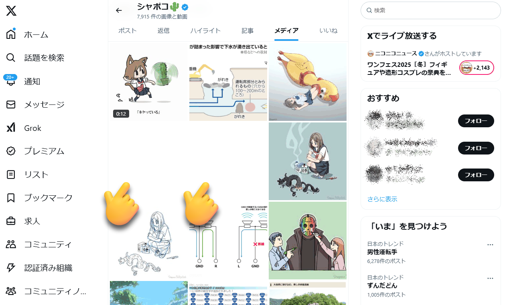

# [メモ] X (旧Twitter) 備忘録

X 関連の雑多なメモ。随時追加する

## 検索クエリ (検索コマンド)

### 演算式

|式|説明|例|
|:--|:--|:--|
|`hoge piyo`|`hoge` と `piyo` を両方含む|[カレー うどん](https://x.com/search?q=%E3%82%AB%E3%83%AC%E3%83%BC+%E3%81%86%E3%81%A9%E3%82%93)|
|`hoge OR piyo`|`hoge` または `piyo` を含む|[ラーメン OR うどん](https://x.com/search?q=%E3%83%A9%E3%83%BC%E3%83%A1%E3%83%B3+OR+%E3%81%86%E3%81%A9%E3%82%93)|
|`"hogepiyo"`|`hogepiyo` に完全一致|["カレーうどん"](https://x.com/search?q=%22%E3%82%AB%E3%83%AC%E3%83%BC%E3%81%86%E3%81%A9%E3%82%93%22)<br>(`カレーうどん` のみにヒットし `カレーとうどん` などにはヒットしない)|
|`-hoge`|`hoge` を含まない|[カレー うどん -"カレーうどん"](https://x.com/search?q=%E3%82%AB%E3%83%AC%E3%83%BC+%E3%81%86%E3%81%A9%E3%82%93+-%22%E3%82%AB%E3%83%AC%E3%83%BC%E3%81%86%E3%81%A9%E3%82%93%22)<br>(`カレー` と `うどん` を両方含むが `カレーうどん` は含まない)|

### オプション

|オプション|説明|例|
|:--|:--|:--|
|`from:ID`|`@ID` による投稿|[from:shapoco](https://x.com/search?q=from%3Ashapoco)|
|`to:ID`|`@ID` への返信|[to:shapoco](https://x.com/search?q=to%3Ashapoco)|
|`filter:media`|メディア付き (※1)|[from:shapoco filter:media](https://x.com/search?q=from%3Ashapoco+filter%3Amedia)|
|`filter:images`|画像付き|[from:shapoco filter:images](https://x.com/search?q=from%3Ashapoco+filter%3Aimages)|
|`filter:videos`|動画付き (※1)|[from:shapoco filter:videos](https://x.com/search?q=from%3Ashapoco+filter%3Avideos)|
|`filter:links`|メディア (※1) またはリンク付き|[from:shapoco filter:links](https://x.com/search?q=from%3Ashapoco+filter%3Alinks)|
|`lang:言語コード`|[言語コード](https://so-zou.jp/web-app/tech/data/code/language.htm) による言語指定|[lang:ja](https://x.com/search?q=lang%3Aja), [lang:en](https://x.com/search?q=lang%3Aen)|
|`since:YYYY-MM-DD`|投稿日が `YYYY-MM-DD` 以降|[from:shapoco since:2025-1-1](https://x.com/search?q=from%3Ashapoco+since%3A2025-1-1)|
|`until:YYYY-MM-DD`|投稿日が `YYYY-MM-DD` 以前|[from:shapoco until:2024-12-31](https://x.com/search?q=from%3Ashapoco+until%3A2024-12-31)|
|`min_retweets:N`|リポスト数が `N` 以上|[from:shapoco min_retweets:1000](https://x.com/search?q=from%3Ashapoco+min_retweets%3A1000)|
|`min_faces:N`|いいね数が `N` 以上|[from:shapoco min_faves:1000](https://x.com/search?q=from%3Ashapoco+min_faves%3A1000)|
|`near:場所 within:距離km`|`場所` から `距離` km 以内|(2025/2/9: 機能してない？)|
|`geocode:緯度,経度,距離km`|[ジオコード](https://www.geosense.co.jp/map/tool/geoconverter.php) の場所から `距離` km 以内|[geocode:45.522192,141.936642,1km filter:media](https://x.com/search?q=geocode%3A45.522192%2C141.936642%2C1km%20filter%3Amedia&f=live)<br>(「最新」タブでないと機能しない？)|

※1 「メディア」や「動画」には YouTube リンクも含まれる

## ユーザー ID

- アカウントを識別する数字。ID (screen name) を変えてもユーザー ID が変わることはない。
- 例えば [@shapoco](https://x.com/shapoco) のユーザー ID は `858142314849378304`。
- `https://x.com/i/user/ユーザー ID` はそのユーザーのプロフィールページへ転送される ([例](https://x.com/i/user/858142314849378304))。

### ユーザー ID を取得する方法

- 外部サービス

    - [X(Twitter) IDチェッカー](https://develop.tools/x-idcheck/)<br>※ なぜか取得できない場合もある

- ブックマークレット (PC用)

    1. 以下のコードを URL としてブックマークレットを作成する

        ```js
        javascript:(function(){try{const s=Array.from(document.querySelectorAll('script')).filter(elem=>elem.dataset&&elem.dataset.testid&&elem.dataset.testid=='UserProfileSchema-test');const j=JSON.parse(s[0].innerText);const url=`https://x.com/i/user/${j.mainEntity.identifier}#${j.mainEntity.additionalName}`;console.log(`URL: '${url}'`);navigator.clipboard.writeText(url).then(function(){window.alert(`URL copied to clipboard:\n${url}`);},function(){window.alert(`URL: '${url}'\n(Failed to copy to clipboard)`);});}catch(e){window.alert(`Failed to obtain User ID (${e})`);}})()
        ```

    2. 対象ユーザのプロフィールページを開く
    3. 作成したブックマークレットを開く<br>( `https://x.com/i/user/<user ID>#<screen name>` の形式でクリップボードにコピーされる)

## 細々したの

### メディア欄の空白は YouTube のリンク

メディア欄にところどころある空白は YouTube のリンクの投稿。



`from:自分のID filter:media` で検索すると、メディア欄で空白だったところに YouTube のリンクが貼られた投稿があるのが分かる。

### 「自分がメンバーとなっているリスト」が数件しか表示されない (PC)

どれかのリストを開いたあとブラウザバックすると続きが表示される
