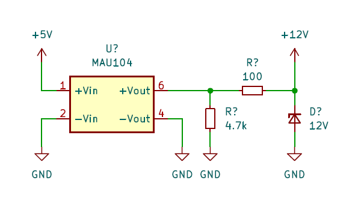

# UPDI HVP のための 12V を得る方法いろいろ

ATtiny402 への高電圧プログラミング (HVP) を行う必要が出ましたが、HVP 対応のプログラマをすぐには用意できなかったので、それまで使っていた AE-CH340E に HVP 用の回路を追加することにしました。

## 先行事例

- [Technoblogy - Tiny UPDI-HV Programmer](http://www.technoblogy.com/show?48MP)
- [AVR-Programmer/SerialUPDI_HV_Programmer at master · wagiminator/AVR-Programmer](https://github.com/wagiminator/AVR-Programmer/tree/master/SerialUPDI_HV_Programmer)
- [\[Part1\] HVP対応のUPDI プログラマーを作成中です | トドお父さん通信](https://ameblo.jp/powpher/entry-12851215518.html)

## 高電圧パルスの仕様

詳しい仕様は [データシート](https://www.microchip.com/en-us/search?searchQuery=attiny402&category=Product%20Documents|Data%20Sheets&fq=start%3D0%26rows%3D10) を参照してください。

HVP を実施するには RESET ピンに 12V のパルスを 100us ～ 1ms 入力する必要があります。

> The duration of the pulse is recommended in the range from 100 μs to 1 ms before tri-stating.

パルスを入力するタイミングとしてはリセットの直後が推奨されています。RESET ピンを GPIO として使用する場合に MCU からの出力との衝突を避けるためでしょう。

またパルスの電圧が RESET ピンの最大入力電圧 13V を超えないように注意する必要があります。過電圧が加わると ESD 保護回路が働き、そのまま電圧が加わり続けると大きな電流が流れてピンが破損する可能性があります。

> VRSTMAX = 13V 
> Care should be taken to avoid overshoot (overvoltage) when connecting the RESET pin to a 12V source. Exposing the pin to a voltage above the rated absolute maximum can activate the pin’s ESD protection circuitry, which will remain activated until the voltage has been brought below approximately 10V. A 12V driver can keep the ESD protection in an activated state (if activated by an overvoltage condition) while driving currents through it, potentially causing permanent damage to the part.

## パルスの生成方法

先行事例のように CR 回路を使ってパルスを生成する方法が簡単そうなのでこれを採用することにしました。先述のように MCU からの出力と衝突しないようにすることが望ましいですが、~~面倒臭いので~~ GPIO として使用する場合はタイミングを保証するのが難しいので、RESET ピンは入力ピンとしてのみ使用する前提としました。

## 12V の生成方法

### DC/DC コンバータ

チャージポンプ IC を使用する例が多いようですが、手元に無かったのでまずはその辺に転がっていた DC/DC コンバータ [MAU104](https://akizukidenshi.com/catalog/g/g104132/) を試してみました。

MAU104 を使用する場合は二次側にブリーダ抵抗が必要なことに注意が必要です。MAU104 では二次側の最小電流が 1.5mA と定められており、出力電圧は 12V なので、8kΩ 以下のブリーダ抵抗が必要です。二次側が開放状態の場合、出力電圧は 12V を遙かに超える値になります。手元の個体では 25V くらいの電圧が出力されていました。

ブリーダ抵抗の必要性自体は認識していたのですが、ブレッドボード上であれこれ試しているうちに高電圧が RESET ピンに流れ込んでしまったのか、ATtiny402 を 1 個壊してしまいました。しばらくは気休めとして二次側に電流制限抵抗とツェナを追加して運用していました。

### ブロッキング発振回路 + ツェナーダイオード

他に雑に 12V を得る方法が無いか考え、しばしばジュールシーフ回路として紹介されるブロッキング発振回路も試してみました。マイクロインダクタを 2 個並べて磁気結合させてトランスにします。詳しくはググってみてください。

12V を得ること自体はできましたが、なんとなく不安定そうなので HVP に使えるかどうかは試していません。

### オペアンプ + 倍電圧整流 + ツェナーダイオード

オペアンプで発振器を構成する方法も試してみました。2 回路入りのオペアンプで差動出力の発振器を構成し、それを倍電圧整流後、ツェナーダイオードでクランプしています。十分な電圧を得るにはフルスイングタイプのオペアンプを使用する必要がありました。12V が入力側に逆流すると CH340E が壊れてしまう可能性があるため、VCC-GND 間にも 5.1V のツェナを入れて保護します。

この回路をユニバーサル基板に実装して波形を確認しました。

12V 電源としては出力インピーダンスが高いですが、HVP のパルスの電流は小さいので問題無いでしょう。

ATtiny402 への書き込みも問題無く行えました。

