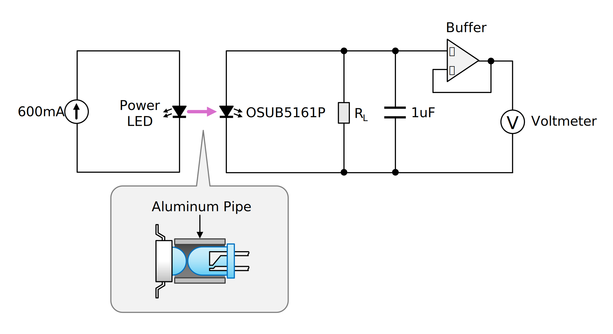
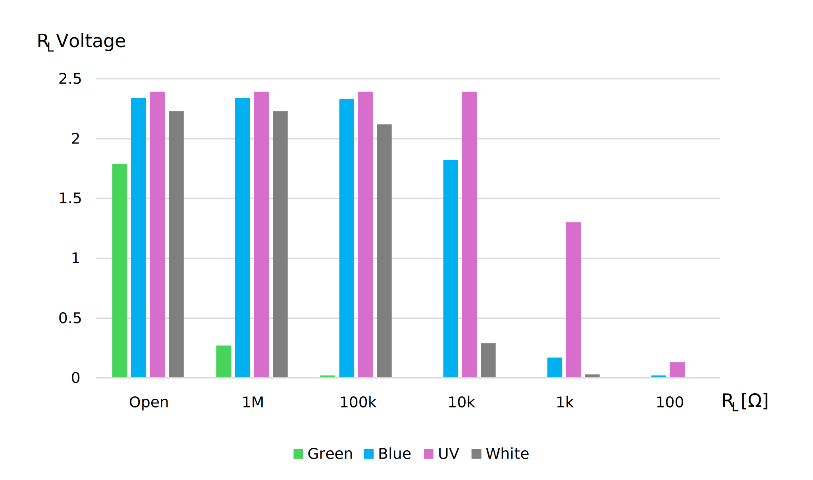
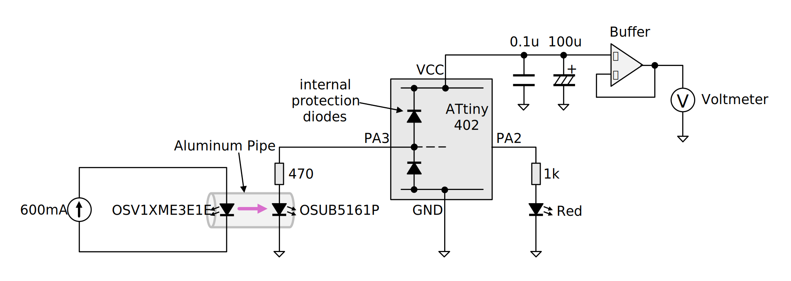
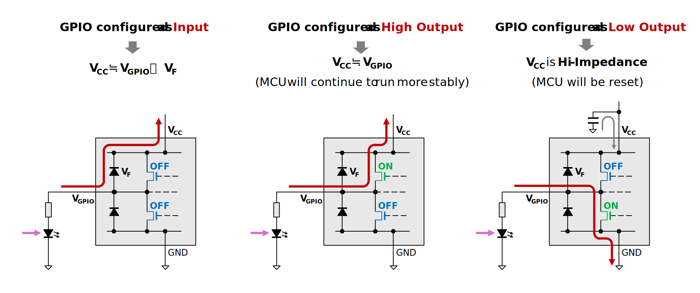
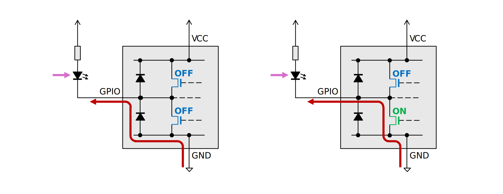
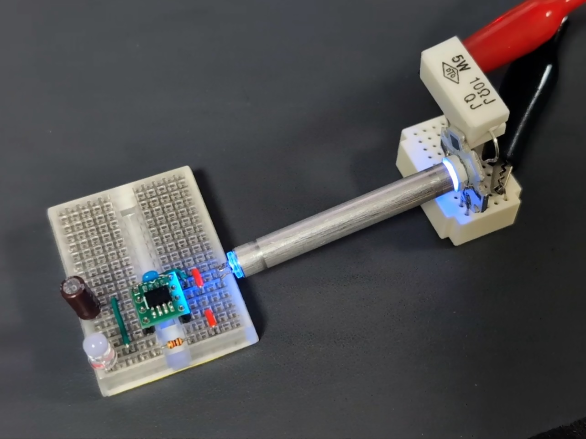
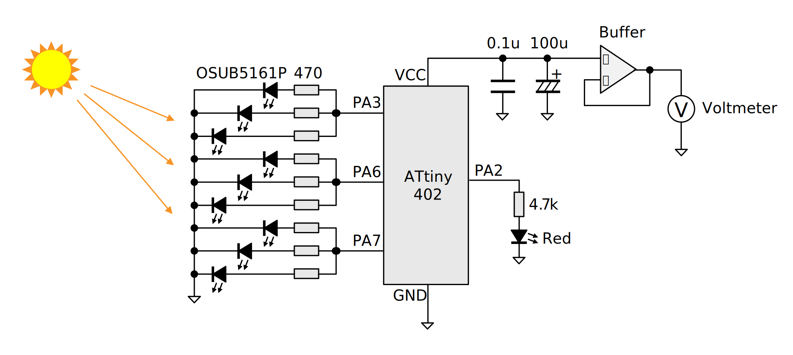

# [執筆中] GPIO に繋がった LED に爆光を浴びせると MCU が起動することがある

> [!CAUTION]
> これは書きかけの記事です。内容は正確でない可能性があります。

MCU の入力保護ダイオードについて調べている過程で LED の光起電力について思い出し、
もしかして GPIO に繋がった LED に強烈な光を浴びせれば MCU が起動してしてしまうのでは、と思って試してみました。

「やってみたらこうなった」というレベルのもので、危険性や対策の必要性を煽る意図はありません。

> [!WARNING]
> この実験では強い紫外線を発するパワー UV-LED を使用していますが、
> もし再現を行う場合は UV カットに対応した遮光メガネ等を使用して目を保護してください。

## 結論から書くと

限られた条件のもとで、MCU の GPIO に接続された LED に強烈な光や紫外線が当たると、
LED の光起電力が保護ダイオードを通じて MCU の電源ラインに電圧を与え、MCU が起動することがあります。

ただし、MCU の GPIO に接続されるような小容量の LED の光起電力は非常に小さいため、
それによって何か重大な問題が起こるケースは少なそうです。

## LED の光起電力とは

半導体である LED は、フォトダイオードや太陽電池といった他の半導体素子と同様、光を浴びると電圧を出力する「光起電力」という性質を持っています。LED の光起電力は微弱ですが、意図しない光起電力は回路の誤動作の原因になるため注意すべきこととされます。

- [LED の光起電力について - 日亜化学工業](https://led-ld.nichia.co.jp/api/data/spec/tech/SP-QR-C2-220237-J_LED%20Photovoltaic%20Effect.pdf)

一般的に LED は発光素子として知られているため「逆に光を浴びせると電気を生む」というのは多くの人にとって意外性があり、たびたび電子工作ネタにもなっています。センサとして使うことで例えばマトリクス LED に絵を描いたり、簡易的なイメージセンサにしたりできます。

- [LED光センサアレイ: なひたふJTAG日記](https://nahitafu.cocolog-nifty.com/nahitafu/2009/10/led-0fa5.html)

光起電力は素子によって大きく異なります。光起電力が発生するには素子のエネルギーギャップよりも大きなエネルギーの、つまり波長の短い光が必要です。光源のスペクトルだけでなくレンズの吸収スペクトルも影響するでしょうから、光起電力を評価するのは簡単ではなさそうです。なんとなく順方向電圧 (V<sub>F</sub>) が高い LED の方が発生する電圧も高い傾向があるような気はします。

手元の 5mm の砲弾型青色 LED [OSUB5161P](https://akizukidenshi.com/catalog/g/g101004/) に対して、至近距離からパワー LED の光を浴びせて電圧を測ってみました。全て 600mA で駆動しています。



パワーLED:

|色|型番|V<sub>F</sub> \[V\]|ピーク波長 \[nm\]|
|:--:|:--:|:--:|:--:|
|緑|[OSG5XNE3C1E](https://akizukidenshi.com/catalog/g/g106772/)|3.3|525|
|青|[OSB5XNE3C1E](https://akizukidenshi.com/catalog/g/g107458/)|3.8|470|
|紫外|[OSV1XME3E1E](https://akizukidenshi.com/catalog/g/g113883/)|4.0|365|
|白|[OSW4XNE3C1S](https://akizukidenshi.com/catalog/g/g108956/)|3.8|-|

測定結果 \[V\]:

|色|R<sub>L</sub>=開放|R<sub>L</sub>=1MΩ|R<sub>L</sub>=100kΩ|R<sub>L</sub>=10kΩ|R<sub>L</sub>=1kΩ|R<sub>L</sub>=100Ω|
|:--:|:--:|:--:|:--:|:--:|:--:|:--:|
|緑|1.79|0.27|0.02|0.00|0.00|0.00|
|青|2.34|2.34|2.33|1.82|0.17|0.02|
|紫外|2.39|2.39|2.39|2.39|1.30|0.13|
|白|2.23|2.23|2.12|0.29|0.03|0.00|



1kΩ 程度の負荷でも電圧が大きく低下していることから、電源としてはインピーダンスが高いことが分かります。
また、受光側 LED のピーク波長よりも長い波長の光に対してはほとんど起電力が無いことが分かります。
白色 LED は青色 LED に蛍光体をかぶせたものであるため、蛍光を経て光量が少なくなるほか、
波長が広い範囲に分散するため、起電力に寄与する光量が少ないことが伺えます。

## GPIO の保護ダイオードとは

一般的に、MCU の GPIO には端子を静電気や過電圧から守るための保護ダイオードが挿入されています。

- [汎用I/Oの構造はどうなっているの？　使い方は？：Q&Aで学ぶマイコン講座（39） - EDN Japan](https://edn.itmedia.co.jp/edn/articles/1712/27/news011.html)

手元にあったマイコン [ATtiny402](https://akizukidenshi.com/catalog/g/g130009/) に対し、テスターのダイオード測定レンジを使って各 GPIO 端子から VCC へ向かう保護ダイオードの順方向電圧 (V<sub>F</sub>) を測ってみました。当然ダイオード以外の回路も入っていますし、保護ダイオードも単なるスイッチングダイオードとは限らないのでこの方法で正確な値は測れません。あくまで参考値です。

|ピン番号|端子機能|V<sub>F</sub> \[V\]|
|:--:|:--|:--:|
|2|PA6|0.50|
|3|PA7|0.51|
|4|PA1|0.51|
|5|PA2|0.51|
|6|PA0 (UPDI)|(open)|
|7|PA3|0.51|

PA0 では V<sub>F</sub> は表示されませんでした。PA0 は高電圧プログラミング (HVP) にも使用されるため、ダイオードによる単純な保護ではないことが分かります。

## LED の光起電力で MCU が起動することの確認

システムが電源から分離されて電源ラインのインピーダンスが高くなっている状態で GPIO に電圧が印加されると、保護ダイオードを通じて電流が電源ラインへ逆流し、電圧によっては MCU のパワーオンリセット (POR) やブラウンアウトリセット (BOR) が解除され、プログラムが走り出す場合があります。

GPIO に接続された電源のインピーダンスが高い場合は MCU の起動により一気に電圧降下して再び POR や BOR がかかりますが、リセットがかかると再び電源電圧が上昇し、何も対策しなければリセットと起動を反復することになります。電源のインピーダンスが十分に低ければ、MCU は動作を続けます。

### パワー UV-LED を使用して起動

次のような構成で「Lチカ」を動作させることができました。受光用の LED は本来は表示用であるという想定で
直列に電流制限抵抗を挿入しています。VCC には 100uF 程度以上の大容量コンデンサを接続しないと、
起動してもリセットを繰り返す状況になりました。



消費電力に関連するヒューズ設定は次の通りです。

|バイト|ビット|説明|値|
|:--|:--|:--|:--|
|BODCFG|LVL|BOD レベル|0x0 (1.8V)|
||SAMPFREQ|BOD サンプリング周波数|0x0 (1kHz)|
||ACTIVE|動作中の BOD|0x1 (有効)|
||SLEEP|スリープ中の BOD|0x1 (有効)|
|OSCCFG|OSCLOCK|キャリブレーションレジスタアクセス|0x0 (許可)|
||FREQSEL|内部クロック周波数選択|0x1 (16MHz)|
|SYSCFG1|SUT|スタートアップ遅延時間|0x7 (64ms)|

プログラムを以下に示します。
単純な L チカプログラムですが、システムクロックのプリスケーラがデフォルトでは
x1/6 に設定されており、そのままでは消費電力が大きすぎるので、
起動してすぐに最も遅い設定 (x1/64, 250kHz) にしています。

```cpp:blink.cpp
#define F_CPU (250000)

#include <avr/io.h>
#include <stdint.h>
#include <util/delay.h>

static constexpr uint8_t PORT_LED = 2;

int main() {
  _PROTECTED_WRITE(CLKCTRL.MCLKCTRLB, CLKCTRL_PDIV_64X_gc | CLKCTRL_PEN_bm);

  PORTA_DIRSET = (1 << PORT_LED);

  while (true) {
    _delay_ms(500);
    PORTA_OUTTGL = (1 << PORT_LED);
  }

  return 0;
}
```

いくつかのクロック周波数で電源 (VCC) の電圧を測ってみました。

|クロック源|プリスケーラ|CPU 周波数 \[Hz\]|VCC 電圧 \[V\]<br>LED 消灯中/点灯中|
|:--:|:--:|:--:|:--:|
|OSC20M (16MHz)|x1/2|8M|(起動せず)|
|OSC20M (16MHz)|x1/8|2M|1.82 / (BOR)|
|OSC20M (16MHz)|x1/64|250k|1.87 / 1.83|
|OSCULP32K|無効|32.768k|1.96 / 1.87|
|OSCULP32K|x1/8|4.096k|1.96 / 1.87|

クロック周波数が遅いほど消費電力が小さくなり、BOR はかかりにくくなりました。
クロックを十分を遅くした場合の LED 消灯時の VCC 電圧は、受光側 LED の開放電圧 (2.39V) から
保護ダイオードの V<sub>F</sub> (0.51V) を差し引いたものと近い値になっています。

なお、前記のプログラムでは受光用の LED を制御していませんが、受光用 LED を点灯させるために GPIO を High にドライブすると、流入する電流は保護ダイオードではなく駆動用の FET を逆流して電源ラインに流れるようになります。FET のオン抵抗分の電圧降下は生じますが、その値は小さいので Vcc 電圧は入力電圧とほぼ同じになります。逆に GPIO を Low にドライブすると、電流は GND に吸い込まれてしまい、やがてパスコンの電圧が低下すると BOR がかかります。



また、LED をローサイドでドライブする場合も、電流の向きは変わりますが同じことが起こります。



動作の様子を示します。この動画ではアルミパイプを外した状態で動かしています。


アルミパイプは数cm 程度まで伸ばすことができました。



クロック周波数を 32.768kHz にするとアルミパイプ無しでも動作しましたが、発光側と受光側の LED はピッタリくっつける必要があり、1cm でも離すと動かなくなりました。

### 集光ミラーを使用した遠距離からの起動

(気が向いたら追記するかも)

<blockquote class="twitter-tweet"><p lang="ja" dir="ltr">3Dプリントした楕円面ミラーでパワーUV-LED の紫外線を 15cm 先の青色LED に集中させて光起電力で Lチカできた <a href="https://twitter.com/hashtag/shapolab?src=hash&amp;ref_src=twsrc%5Etfw">#shapolab</a> <a href="https://t.co/1VX3bNrdwp">pic.twitter.com/1VX3bNrdwp</a></p>&mdash; シャポコ🌵 (@shapoco) <a href="https://twitter.com/shapoco/status/1934612133133812148?ref_src=twsrc%5Etfw">June 16, 2025</a></blockquote> <script async src="https://platform.twitter.com/widgets.js" charset="utf-8"></script>

### 太陽光を利用して起動

受光用 LED を 9 個に増やすと太陽光でも起動できました。
受光用 LED は昼間の直射日光に正確に指向する必要がありました。
また、発光用の LED の電流制限抵抗は 1kΩ では消費電流が多すぎたため、4.7kΩ にしました。




薄雲がかかったり日が傾くと起電力が弱くなり、MCU が起動する電圧に達しませんでした。
集光すれば少ない LED でも起動できそうですが、太陽光を下手に集光すると LED が燃えそうな気がします。
受光用 LED を増やすこともできますが「本来は表示用を想定している」という前提に立つと
闇雲に増やすのはズルいのでやってません (9 個でもかなりズルいですが)。

### 表面実装 LED での受光

集光により 3528 metric の高輝度青色 LED `LK-1BL` 1 個で起動できましたが、2012 metric の `OSB50805` 1 個では電流が足りず起動できませんでした。

(気が向いたら追記するかも)

## これで何ができるのか

先に述べた通り光起電力は微弱なので、アクチュエータなどを直接駆動することはできませんが、
トランジスタ、FET、フォトカプラなどを駆動したり、他のデバイスと通信したりはできます。

(気が向いたら追記するかも)

----
