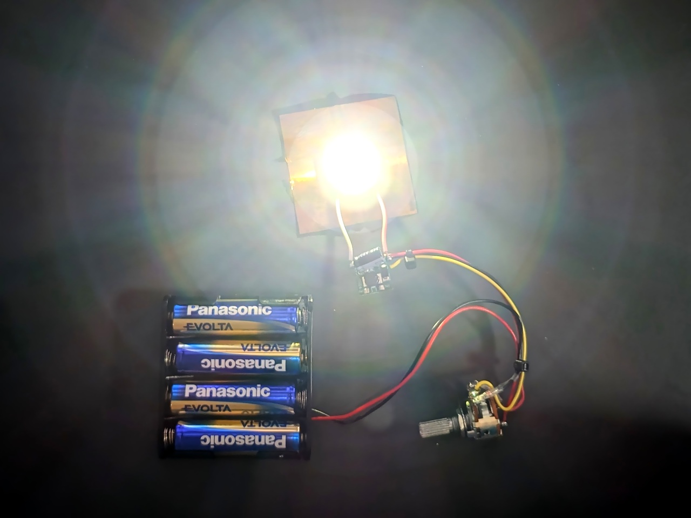
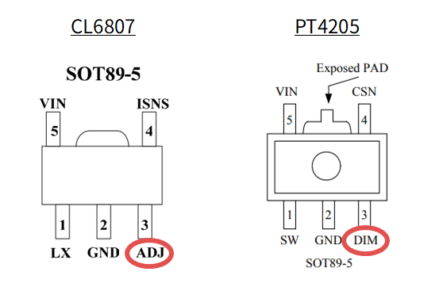
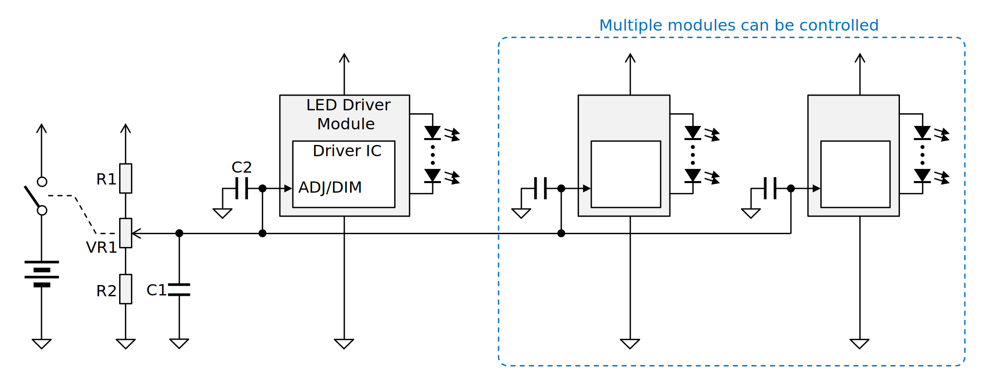
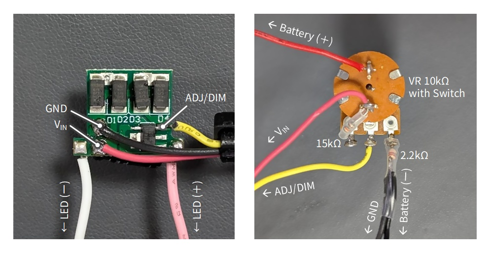
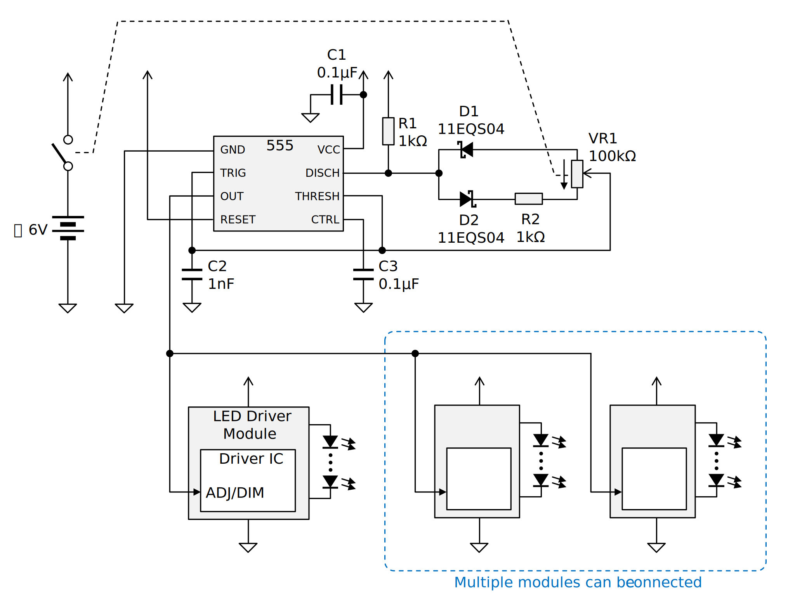

# 秋月で売ってる3WパワーLEDドライバモジュールは調光ができる



秋月電子で販売されている [定電流方式ハイパワーLEDドライバーモジュール OSMR16-W1213](https://akizukidenshi.com/catalog/g/g104790/) に載っている IC には調光機能があり、電圧または PWM で調光することができ、最小構成ではボリュームを 1 個追加するだけで調光機能付きのライトを作ることができます。

> [!WARNING]
> この記事では秋月の 3W パワー LED を使用していますが、
> LED を直視すると危険ですので製作の際は注意してください。

余談ですが、秋月の商品ページには「3WタイプのLEDを1個点灯させるモジュール」とありますが、このモジュールは定電流制御モジュールなので LED は 1 個である必要はなく、電源電圧の許す限り直列接続できます。

## 搭載されている IC と調光機能

[OSMR16-W1213 の商品ページ](https://akizukidenshi.com/catalog/g/g104790/) には参考資料として CL6807 と PT4205 のデータシートが載っていますが、今回実際に購入してみたところ載っていたのは PT4119 という IC でした。いずれもピン配置は同じのようです。

で、OSMR16-W1213 のデータシートには記載がありませんが、これらの IC には DIM または ADJ という名称で調光用の端子が出ていて、このピンを使って電圧制御または PWM にて調光できるようです。



ADJ/DIM ピンの仕様は IC によって微妙に異なる箇所もありますが、概ね同じです。

|||CL6807|PT4205|PT4119|単位|
|:--|:--|:--:|:--:|:--:|:--:|
||ピン名|ADJ|DIM|DIM||
|絶対定格|入力電圧 (min)|-0.3|-0.3|-0.3|V|
||入力電圧 (max)|6|30|6|V|
|電気的仕様|開放電圧 (typ)|(不明)|5|5|V|

## 電圧による制御

ADJ/DIM の電圧で調光を行う場合、2 つの方法があります。

- 外部から ADJ/DIM に 0.5V ～ 2.5V の範囲の電圧を入力する
- ADJ/DIM の電圧が 0.5V ～ 2.5V の範囲になるように抵抗を外付けする **(PT4205/PT4119 のみ)**

後者の場合、ADJ/DIM の電圧はそれらのピンの漏れ電流×抵抗値になります。これが 0.5V ～ 2.5V の範囲になるように抵抗値を計算すればいいわけですが、ボリュームで調光しようとすると欲しい抵抗値のものを手に入れるのが難しい上、載っている IC によって値が異なるのでロバストな方法とは言えません。

||PT4205|PT4119|単位|
|:--|:--:|:--:|:--:|
|漏れ電流|21 (typ)|25 (typ)|μA|
|抵抗の範囲|23.8k～119k|20k～100k|Ω|

外部から電圧を入力する場合は次のような回路でできそうです。この場合は複数のモジュールを同時に調光することができます。



光の強さに対する人間の視覚の応答が線形でないことを考慮すると、ボリュームは A カーブの方がいいかもしれません。スイッチ付きにすると使い勝手がいいですが、スイッチの電流容量には注意が必要です。

R1 は ADJ/DIM 最大電圧を 2.5V に制約するためのものですが、電源電圧が ADJ/DIM の絶対最大定格よりも高い場合は必須となります。R2 は無くても動きますが、適切に算出された値の抵抗を挿入することで ADJ/DIM の最小電圧を 0.5V にオフセットします。

R1 と R2 の値は次のように算出できます。(厳密には ADJ/DIM の漏れ電流も考慮する必要がありますが、まぁ…ええやろ)

```
Vmin = 0.5                              # ADJ/DIM 最小電圧
Vmax = 2.5                              # ADJ/DIM 最大電圧
Vcc = 6                                 # 電源電圧
VR1 = 10k                               # ボリュームの抵抗値
Rtotal = VR1 * Vcc / (Vmax-Vmin) = 30k  # 抵抗値の合計
R2 = Rtotal * Vmin / Vcc = 2.5k         # R2 抵抗値
R1 = Rtotal - VR1 - R2 = 17.5k          # R1 抵抗値
```

C1、C2 も無くても動きますが、特にボリュームとモジュールの距離が長い場合や、モジュールを複数繋ぐ場合には付けておきたくなります。C1 = 1μF、C2 = 0.1μF といったところでしょうか。

Vcc = 6V、VR1 = 10kΩ、R1 = 15kΩ、R2 = 2.2kΩ として実際に試してみました。なおモジュールの電源入力にはダイオードブリッジが実装されていますが、今回はその後段に直接電源ラインを配線しました。



動作の様子を示します。


今回買ったモジュールに載っていたのは PT4119 ですが、見かけ上の調光レンジは 2:1 か 3:2 といったところで、あまり制御レンジは広くないようです。R2 を外してみても、ADJ/DIM の電圧がある閾値を上回るといきなりフルパワーの半分くらいで光る感じです。最も暗いときの消費電流は 100mA、最も明るいときで 680mA 程度でした。

なお、CL6807 のデータシートでは 0～100％ の範囲で電流を制御できると書かれていました。電圧で制御するならそっちの IC の方が良さそうです。

## PWM による制御

PWM で制御する場合は、ADJ/DIM に数百 Hz ～ 20kHz ほどの周波数の PWM 波形を入力します。PWM 周波数が低いほど暗くすることができますが、少なくとも PT4119 では 10kHz くらい以上にしないと動画撮影時にフリッカが出ました。他の IC ではどうだか分かりません。

|||CL6807|PT4205|PT4119|単位|
|:--|:--|:--:|:--:|:--:|:--:|
|コントラスト最大時|PWM 周波数|500|100|100|Hz|
||コントラスト|100:1|(不明)|5000:1||
|コントラスト最小時|PWM 周波数|20k|20k|20k|Hz|
||コントラスト|5:1|(不明)|25:1||

PWM 波形はマイコンで生成することもできますが、単に照明として使うのであればソフトウェア的な保守のいらない方法がいいのではと思い、タイマー IC の 555 で組んでみました。



動作の様子を示します。


電圧制御に比べて遙かに広いレンジで明るさを制御できています。PWM の周期がウニョウニョ変動していますが、調光の用途としては問題無いと思います。最も暗いときの消費電流は 10mA 未満、中くらいで 30mA 程度、最大で 500mA 程度でした。

なんとなく PWM 制御の方が IC の違いを受けにくくて良さそうな気がします。