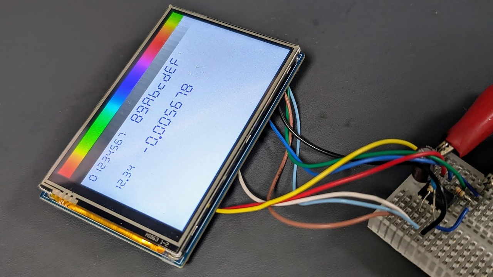

# \[C++\] デバッグ用 7 セグ描画関数



少ない RAM/ROM で 10 進数や 16 進数を 7 セグ LED 風に描画するための関数です。シリアル I/F などの文字出力機能は無いけど長方形は塗りつぶせる、という謎の状況で使えます。

長方形を塗りつぶす関数があらかじめ必要です。

## ソースコード

```c++:seg7.hpp
#pragma once
#include <stdint.h>

#ifdef SEG7_USE_PROGMEM
#include <avr/pgmspace.h>
#endif

#ifndef PROGMEM
#define PROGMEM
#endif

#ifndef pgm_read_byte
#define pgm_read_byte(addr) (*(const uint8_t*)(addr))
#endif

#ifdef SEG7_INCLUDE_AS_STATIC
#define SEG7_FUNC_PREFIX static
#else
#define SEG7_FUNC_PREFIX
#endif

#ifndef SEG7_POS_TYPE
#define SEG7_POS_TYPE int16_t
#endif

#ifndef SEG7_COL_TYPE
#define SEG7_COL_TYPE uint16_t
#endif

namespace seg7 {

using pos_t = SEG7_POS_TYPE;
using col_t = SEG7_COL_TYPE;

static constexpr uint8_t SEG7_NEG_SIGN = 16;
static constexpr uint8_t SEG7_DOT_MASK = 0x80;

SEG7_FUNC_PREFIX void fillRect(pos_t x, pos_t y, uint8_t w, uint8_t h,
                               col_t col);

#ifdef SEG7_INCLUDE_IMPL
static const uint8_t SEG7_LUT[] PROGMEM = {
    0x3F, 0x06, 0x5B, 0x4F, 0x66, 0x6D, 0x7d, 0x07, 0x7f, 0x6f, 0x77, 0x7c,
    0x58, 0x5e, 0x79, 0x71, 0x40, 0x01, 0x1d, 0x5d, 0x81, 0x58, 0x18, 0x41};
#endif

SEG7_FUNC_PREFIX pos_t drawDigit(pos_t x, pos_t y, uint8_t size, col_t col,
                                 uint8_t dig)
#ifdef SEG7_INCLUDE_IMPL
{
  uint8_t seg = pgm_read_byte(&SEG7_LUT[dig & 0x01f]);
  for (uint8_t iseg = 0; iseg < 7; iseg++) {
    if (seg & 1) {
      uint8_t pos = pgm_read_byte(&SEG7_LUT[17 + iseg]);
      pos_t segX = x + size * (pos & 0x07);
      pos_t segY = y + size * ((pos >> 4) & 0x0f);
      bool vertical = 0 != (pos & 0x08);
      uint8_t segW = vertical ? size : size * 4;
      uint8_t segH = vertical ? size * 3 : size;
      fillRect(segX, segY, segW, segH, col);
    }
    seg >>= 1;
  }
  if (dig & SEG7_DOT_MASK) {
    fillRect(x + size * 7, y + 8 * size, size * 2, size * 2, col);
    x += size * 2;
  }
  return x + size * 8;
}
#else
    ;
#endif

SEG7_FUNC_PREFIX pos_t drawString(pos_t x, pos_t y, uint8_t size, col_t col,
                                  const uint8_t* digs, uint8_t len)
#ifdef SEG7_INCLUDE_IMPL
{
  for (uint8_t idig = 0; idig < len; idig++) {
    x = drawDigit(x, y, size, col, digs[idig]);
  }
  return x;
}
#else
    ;
#endif

SEG7_FUNC_PREFIX pos_t drawHex32(pos_t x, pos_t y, uint8_t size, col_t col,
                                 uint32_t num)
#ifdef SEG7_INCLUDE_IMPL

{
  constexpr uint8_t NUM_DIGS = sizeof(num) * 2;
  uint8_t digs[NUM_DIGS];
  for (int8_t i = NUM_DIGS - 1; i >= 0; i--) {
    digs[i] = num & 0x0F;
    num >>= 4;
  }
  return drawString(x, y, size, col, digs, NUM_DIGS);
}
#else
    ;
#endif

SEG7_FUNC_PREFIX pos_t drawDec32(pos_t x, pos_t y, uint8_t size, col_t col,
                                 int32_t num, int8_t dotPos
#ifdef SEG7_INCLUDE_IMPL
) {
  // sizeof(T) * log(256) / log(10) + 1
  constexpr uint8_t NUM_DIGS = (sizeof(num) * 616 + 255) / 256 + 1;
  bool neg = num < 0;
  if (neg) num = -num;
  uint8_t digs[NUM_DIGS];
  uint8_t i = NUM_DIGS;
  do {
    digs[--i] = num % 10;
    num /= 10;
    if (dotPos-- == 0) {
      digs[i] |= SEG7_DOT_MASK;
    }
  } while (num > 0 || dotPos >= 0);
  if (neg) {
    digs[--i] = SEG7_NEG_SIGN;
  }
  return drawString(x, y, size, col, digs + i, NUM_DIGS - i);
}
#else
= -1);
#endif

}  // namespace seg7
```

## プロジェクトへの追加方法

### 単一のモジュールから呼び出す場合

ひとつの C++ ソースコードの中だけで使いたい場合は、次のようにしてインクルードすると、最適化が最大限効くように全ての関数定義が static 関数としてインクルードされます。長方形描画関数 `fillRect()` の実装は含まれませんので、アプリ側で static 関数として適当に定義します。

```c++:main.cpp
#define SEG7_INCLUDE_IMPL
#define SEG7_INCLUDE_AS_STATIC
#include <seg7.hpp>

// 長方形描画関数は自分で定義
static void seg7::fillRect(seg7::pos_t x, seg7::pos_t y, uint8_t w, uint8_t h,
                           seg7::col_t color) {
  display.fillRect(x, y, w, h, color);
}
```

`pos_t` は座標値の型、`col_t` は `fillRect()` に渡される色の型です。

AVR の場合は次のように `SEG7_USE_PROGMEM` を定義してからインクルードすると、7 セグデコーダなどが Flash ROM に配置されることにより ROM/RAM 容量を若干節約できます。

```c++:main.cpp
#define SEG7_INCLUDE_IMPL
#define SEG7_INCLUDE_AS_STATIC
#define SEG7_USE_PROGMEM
#include <seg7.hpp>

// 以下略

```

### 複数のモジュールから呼び出す場合

複数モジュールから参照するために独立したモジュールとしてコンパイルする場合は、次のようなソースコードを追加し、アプリ側のインクルードは何もマクロを付けずに行います。`fillRect()` はアプリ側で非 static な関数として定義します。`SEG7_USE_PROGMEM` は追加した cpp 側で定義します。

```c++:seg7.cpp
#define SEG7_INCLUDE_IMPL
// AVR の場合は SEG7_USE_PROGMEM を追加:
// #define SEG7_USE_PROGMEM
#include "seg7.hpp"

```

```c++:main.cpp
#include <seg7.hpp>

// 長方形描画関数は非 static で定義
void seg7::fillRect(seg7::pos_t x, seg7::pos_t y, uint8_t w, uint8_t h,
                           seg7::col_t color) {
  display.fillRect(x, y, w, h, color);
}

```

### 座標値や色の型を変更する

デフォルトでは `pos_t` は `int16_t` として、`col_t` は `uint16_t` として定義されています。

`seg7.hpp` をインクルードする前に `SEG7_POS_TYPE` や `SEG7_COL_TYPE` を定義することにより、それぞれの型を変更できます。

```c++
#define SEG7_INCLUDE_IMPL
#define SEG7_INCLUDE_AS_STATIC
#define SEG7_POS_TYPE int8_t
#define SEG7_COL_TYPE uint8_t
#include <seg7.hpp>

```

## 使用方法

### 16進描画関数

```c++
pos_t drawHex32(
    pos_t x,
    pos_t y,
    uint8_t size,
    col_t col,
    uint32_t num
);

```

|引数|説明|
|:--|:--|
|`x`, `y`|7 セグ数字列の左上隅の座標|
|`size`|7 セグ数字列の大きさ。1 が最小。高さ 8×`size`px で描画される|
|`col`|`fillRect()` に渡される色|
|`num`|表示する数字|

### 10進描画関数

```c++
pos_t drawDec32(
    pos_t x,
    pos_t y,
    uint8_t size,
    col_t col,
    int32_t num,
    int8_t dotPos
);

```

|引数|説明|
|:--|:--|
|`x`, `y`|`drawHex32` と同じ|
|`size`|`drawHex32` と同じ|
|`col`|`drawHex32` と同じ|
|`num`|`drawHex32` と同じ|
|`dotPos`|省略可。10 進表示に小数点を追加する場合に小数点以下の桁数を指定|

## フットプリント

ATtiny85 + avr-g++ では次のような感じでした

|`INCLUDE_IMPL`|`USE_PROGMEM`|`drawHex32`|`drawDec32`|Flash ROM 使用量 \[Bytes\]|
|:--:|:--:|:--:|:--:|:--:|
|✔|✔|✔||272|
|✔|✔||✔|458|
|✔|✔|✔|✔|488|
|✔||✔|✔|588|
||✔|✔|✔|990|
