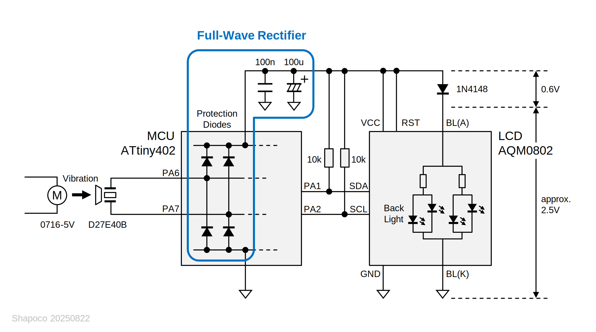
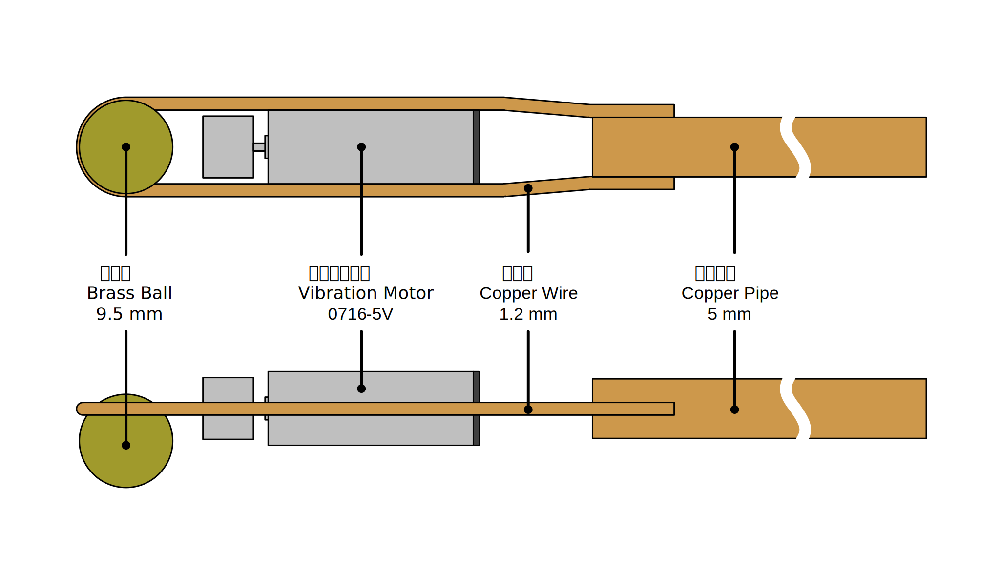
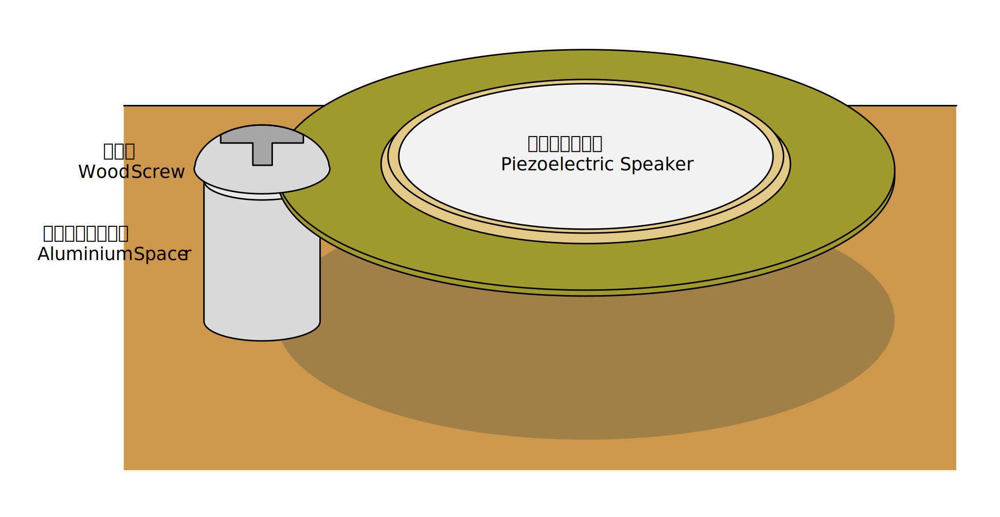

# GPIO に繋がった圧電スピーカーに強い振動を与えると MCU が起動することがある

MCU の GPIO に付属する ESD 保護ダイオードは、トポロジ的にはダイオードブリッジを形成しているため、2 つの GPIO に交流信号が入力されると整流作用とパスコンによる平滑により電源ラインに電圧が供給され、意図せず MCU が起動する可能性があります。

> [!WARNING]
> ESD 保護ダイオードは主に製品製造時の静電気から素子を守るためのもので、定常的に電流を流すことは想定されていません。

## GPIO に交流信号が入力されるケース

今回は GPIO に圧電スピーカーを直結して駆動しているケースを想定してみました。

やりがちですが、圧電スピーカーに衝撃を与えると開放状態では 100V 以上の高電圧が発生します。MCU 内部にも保護ダイオードがありますが、それらは主に製造時の静電気から素子を守るためのもので耐久性は弱いので、GPIO でドライブする場合は圧電スピーカーと並列に TVS 等を接続すべきです。

<blockquote class="twitter-tweet" data-media-max-width="560">
<a href="https://twitter.com/hashtag/%E5%9C%A7%E9%9B%BB%E3%82%B9%E3%83%94%E3%83%BC%E3%82%AB%E3%83%BC%E8%99%90%E5%BE%85%E7%95%8C%E9%9A%88?src=hash&amp;ref_src=twsrc%5Etfw">#圧電スピーカー虐待界隈</a> <a href="https://t.co/h54BoiMBc9">pic.twitter.com/h54BoiMBc9</a>
&mdash; シャポコ🌵 (@shapoco) <a href="https://twitter.com/shapoco/status/1926205554319356168?ref_src=twsrc%5Etfw">May 24, 2025</a></blockquote> 

参考: [圧電サウンダ、圧電振動板 (他励振タイプ) の駆動回路例を教えてください。 | 発音部品に関するよくあるご質問 | 村田製作所](https://www.murata.com/ja-jp/support/faqs/sound/sounder/char/sch0001)

## 検証用回路

「[GPIO に繋がった LED に爆光を浴びせると MCU が起動することがある](../0607-can-leds-photovoltaic-power-mcus)」では発生電圧が低いため L チカが精一杯でしたが、今回は予備実験の結果 3V を超える電圧が得られそうだったので、キャラクタ LCD [AQM0802](https://akizukidenshi.com/catalog/g/g112238/) の駆動に挑戦してみました。

AQM0802 の電源電圧範囲は 3.1V～3.5V と狭く、電圧が低すぎると表示が薄く、高すぎると真っ黒になってしまいます。そこであえて消費電力の大きなバックライトを電源ラインに接続することで電圧クランプとして機能するようにしました。バックライトの定格電圧は 3.3V ですが、2.5V くらいから電流が流れ始めるようなので、直列にスイッチングダイオードを挿入してクランプ電圧に下駄を履かせています。ちなみに VCC に 5V くらいが入力されても（表示は見えないものの）すぐには壊れないようです。

MCU 側が圧電スピーカーをドライブしようとすると全波整流器として機能しなくなるので、少なくとも音を鳴らさない間はポートを入力方向に設定するプログラムであるという想定になります。

## プログラム

プログラムは GitHub に上げました。消費電力を抑えるため起動直後にクロック源を内蔵 32.768 kHz に切り替え、あとはひたすら LCD にアニメーションを表示するプログラムです。

[main.cpp](https://github.com/shapoco/avr-playground/blob/main/tiny0/tiny402_aqm0802_lp/src/main.cpp)

ヒューズビットは次のように設定しました。

|バイト|ビット|説明|値|
|:--|:--|:--|:--|
|BODCFG|LVL|BOD レベル|0x0 (1.8 V)|
||SAMPFREQ|BOD サンプリング周波数|0x1 (125 Hz)|
||ACTIVE|動作中の BOD|0x0 (無効)|
||SLEEP|スリープ中の BOD|0x0 (無効)|
|OSCCFG|OSCLOCK|キャリブレーションレジスタアクセス|0x0 (許可)|
||FREQSEL|内部クロック周波数選択|0x1 (16 MHz)|
|SYSCFG1|SUT|スタートアップ遅延時間|0x7 (64 ms)|

## 振動の与え方

最初は回転するリューターを押し当てたり、割り箸に振動モーターを結束バンドで括り付けた棒を押し当てたりしていましたが、柔らかい素材を使うとそれに振動が吸収されてしまうようなので、最終的に以下のような棒を作りました。固定ははんだ付けで行いました。

圧電スピーカーは次のように固定しました。

これに棒の先端の真鍮球を押し当てます。押し当てる位置・強さ・振動モーターの回転数をうまく調整すると、真鍮球と圧電スピーカーが細かくバウンドを繰り返す状態になり、「ジー」という大きな音が出ます。

## 実験の様子

実験の様子を示します (⚠️音量注意)。

表示の更新と同期してバックライトが明滅していますが、液晶の書き換え動作や I2C バスのプルアップ抵抗が電流を吸い込むためではないかと思われます。MCU を低速で動かす電源としては十分ですが、周辺デバイスを継続的に駆動し続けるには弱すぎることが分かります。

## これで何ができるのか

分かりません。

圧電スピーカーに継続的かつ簡単に振動を与え続けられる方法があれば、電子機器に対するフォールト攻撃に悪用できてしまうかも思いましたが、かなり条件を整えないといけないので難しそうな気がします。

圧電素子の発電作用や、それによる回路誤動作の可能性を示すデモとしては効果的かもしれません。

## 関連情報

- [圧電サウンダ、圧電振動板 (他励振タイプ) の駆動回路例を教えてください。 | 発音部品に関するよくあるご質問 | 村田製作所](https://www.murata.com/ja-jp/support/faqs/sound/sounder/char/sch0001)
- [GPIO に繋がった LED に爆光を浴びせると MCU が起動することがある](../0607-can-leds-photovoltaic-power-mcus)
- SNS 投稿: [X (Twitter)](https://x.com/shapoco/status/1958810613221843335), [Misskey.io](https://misskey.io/notes/abq60k15s161044r), [Bluesky](https://bsky.app/profile/shapoco.net/post/3lwy3mjeiak2w), [mixi2](https://mixi.social/@shapoco/posts/06fc40df-e5a8-4a57-bfd7-2a46dff7b762)
