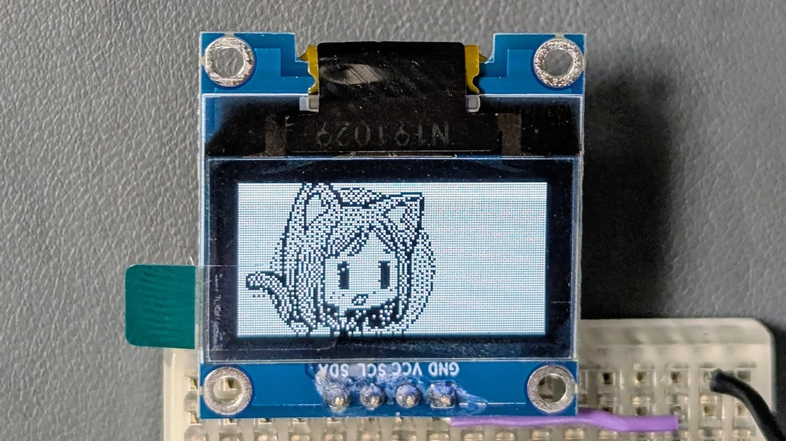

# 画像を配列に変換君 (Arrayfy)

画像データを LCD や OLED 用の C/C++ 配列コードに変換するツールです。Adafruit/Lovyan GFX 等で使用可能な RGB565 形式の画像のほか、SSD1306、SSD1309、Nokia PCD8544 といった縦 8 ピクセルを 1 バイトとする白黒ディスプレイに直接転送可能な形式のデータも作成できます。

> [!NOTE]
> 機能が増えてきたので [こちら](https://shapoco.github.io/arrayfy/) に移動しました。

## 関連情報

- SNS 投稿: [X (Twitter)](https://twitter.com/shapoco/status/1959545672195334379), [Misskey.io](https://misskey.io/notes/abt1kd6k7bz606co), [Bluesky](https://bsky.app/profile/shapoco.net/post/3lx55tzffsk2f), [mixi2](https://mixi.social/@shapoco/posts/d736bb2f-4df6-4f2c-854c-8a9a000839c6)