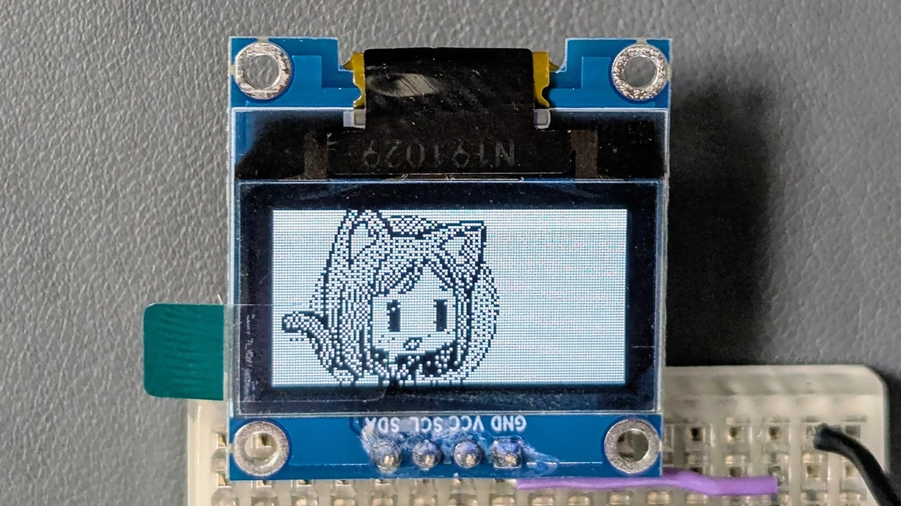

# LCD/OLED用画像→配列コンバータ

画像データを LCD や OLED 用の C/C++ 配列コードに変換するツールです。Adafruit/Lovyan GFX 等で使用可能な RGB565 形式の画像のほか、SSD1306、SSD1309、Nokia PCD8544 といった縦 8 ピクセルを 1 バイトとする白黒ディスプレイに直接転送可能な形式のデータも作成できます。

処理はブラウザ上で行われます。どこかに送信されることはありません。

## 実機確認実績

|形式|確認状況|確認環境|
|:--:|:--:|:--|
|RGB565|✔|Lovyan GFX + GC9A01|
|RGB555|||
|RGB332|✔|Lovyan GFX + GC9A01|
|RGB111|||
|Gray4|||
|Gray2|||
|B/W|✔|自作コード + SSD1306|

## 更新履歴

|バージョン|日付|内容|
|:--:|:--:|:--|
|1.0|2025/08/24|初版 (白黒のみ)|
|1.1|2025/08/25|カラー、グレスケ対応|

## 関連情報

- SNS 投稿: [X (Twitter)](https://twitter.com/shapoco/status/1959545672195334379), [Misskey.io](https://misskey.io/notes/abt1kd6k7bz606co), [Bluesky](https://bsky.app/profile/shapoco.net/post/3lx55tzffsk2f), [mixi2](https://mixi.social/@shapoco/posts/d736bb2f-4df6-4f2c-854c-8a9a000839c6)