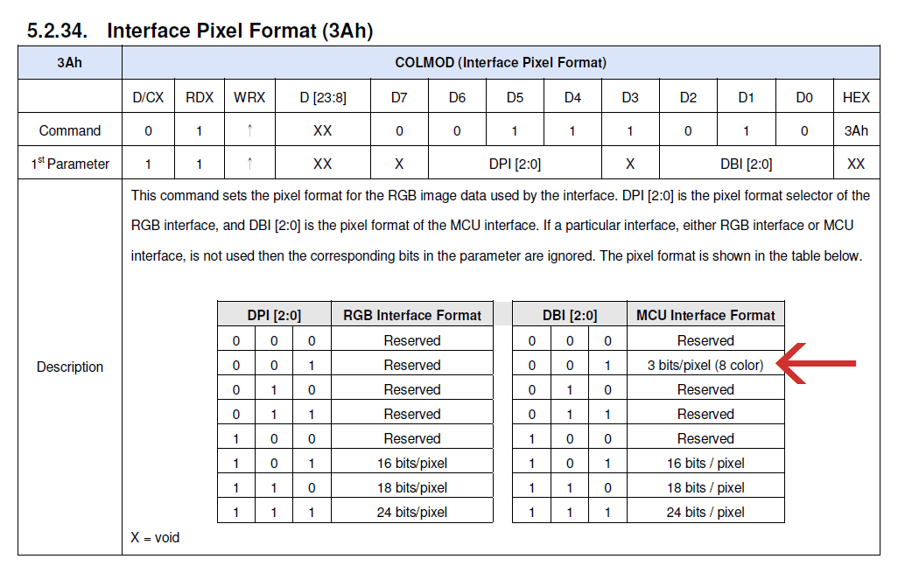
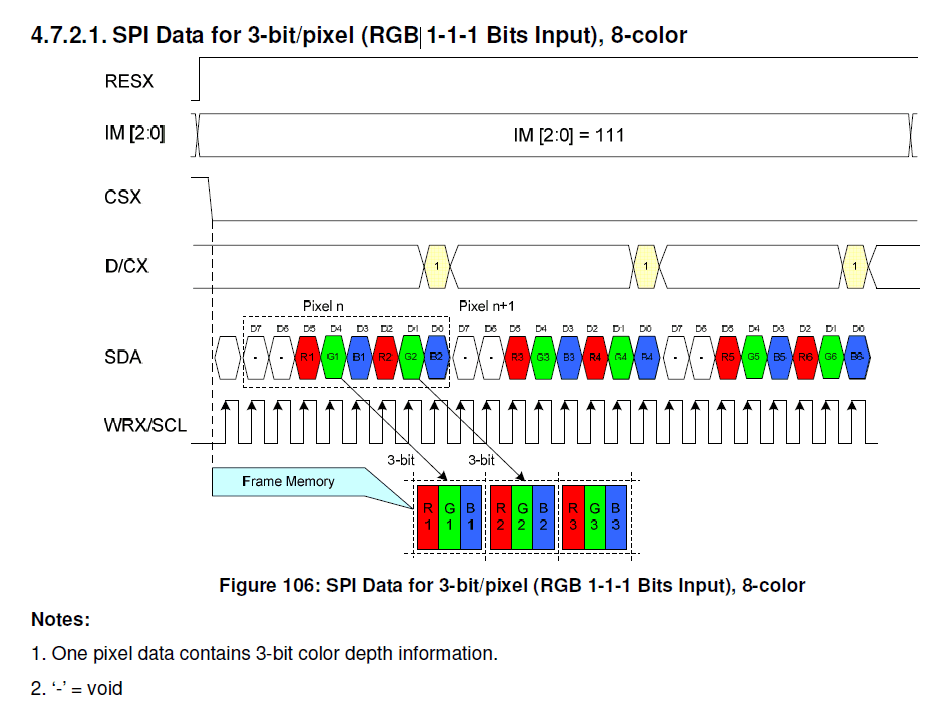

# ILI9488 LCDモジュールの8色モードの謎挙動

AliExpress と Amazon で 480x320px の LCD モジュールを買ったのですが、ILI9488 の 8 色モードを試そうとしたところ謎の挙動に悩まされたので記録として残しておきます。

## ILI9488 の 8 色モード

ILI9488 の SPI インターフェイスには、表示色を 8 色に限定する代わりに 1 バイトに 2 ピクセルを詰めて転送できるモードがあり、RGB666 などと比べると大幅にデータ量を削減できます。

SPI モードにて、Interface Pixel Format コマンドでパラメータの下位 3bit (DBI\[2:0\]) に 0x1 を設定することでこのモードを利用できます。

データシートより:

## 謎挙動

AliExpress と Amazon で買ったタッチパネル付きモジュールでこのモードを試そうとしたのですが、以下のような問題が生じました。

1. 画面に黒いゴミが混じる
2. 同じ SPI バスに接続された他のデバイスにアクセスすると画面が消える or 崩れる

色々試したところ、どうも以下のような挙動が原因のようです。

1. 画面書き換え後に別のコマンドを発行すると、なぜかそのコマンド自体が黒いピクセルとなって前回の書き換え領域の左上に書き込まれる
2. 一度画像を書き込むと、以降 CS ピンを High に戻しても Chip Select された状態が解除されない

なお、これらの問題は RGB666 モードでは発生しませんでした。

## 黒いゴミ

黒いゴミが分かりやすいような簡単なデモを作りました。緑色の長方形を 10 個描画するプログラムです。

詳細な処理内容は以下の通りです。

1. 画面全体を白で塗りつぶす (Column/Page Address Set + Memory Write)
2. (X, Y) = (10, 10)
3. 以下を 10 回繰り返す
4. 1 秒待つ
5. (X, Y) の位置から 32x32px の領域を選択 (Column/Page Address Set)
6. 1 秒待つ
7. 選択された 32x32px の領域を緑色で塗りつぶす (Memory Write)
8. X += 40

動画を観察すると、5 のタイミングで前回塗りつぶした領域の左上に黒い線が現れていることが分かります。5 のタイミングで他のコマンドを発行すると、黒い線はさらに伸びていきます。ゴミは **前回の** 描画領域に現れるため、一番最近更新した領域は期待通りの内容となります。これは単純なデモですが、より複雑な描画処理でも同様の挙動を示します。

このことから、発行したコマンドそのものがなぜか黒いピクセルとなって前回の描画領域に現れているようです。部分書き換えを繰り返すとそのたびに前回の描画領域が汚されていくため、部分書き換えを繰り返すプログラムでは特に問題になります。

常に画面全体を書き換える場合はゴミはすぐに正しい色で塗りつぶされるため実用上の問題はほとんど無くなりますが、画面を頻繁に書き換える場合は注意深く見ていると画面の左上に黒い線の断片がちらつくことがあります。

もしかすると 8 色モードは常に画面全体を書き換えることを前提としているのかもしれません。

## CS 制御が効かなくなる

こちらは同じ SPI バスを他のデバイスと共有する場合には致命的になります。

デモを示します。左の ILI9488 ディスプレイを初期化して画像を表示し、その 3 秒後、同じバスに繋がっている右の ST7789 ディスプレイを初期化して画像を表示します (左のディスプレイが汚いですが、保護フィルムの汚れです)。

ILI9488 ディスプレイは、最初に画像を表示した後は一切アクセスしていません。CS も電気的には High のままであることをオシロで確認しました。にも関わらず、ST7789 を初期化したタイミングで ILI9488 の画面が緑一色になってしまいました。処理の実行順によっては画像はすぐには消えず、徐々に淡くなっていくこともありました。

色々試したところ、どうやら ILI9488 を 8 色モードにすると、Memory Write 以外のコマンドは正常に実行できるものの、Memory Write を一度でも実行すると CS を Low に固定したような状態になり、他のデバイスへ送ったデータをコマンドとして受け付けてしまうようです。

これでは SPI バスを他のデバイスと共有することはできません。

## 製品依存かもしれないし、使い方の問題かもしれない

今回、似た見た目のモジュールを AliExpress で 2 つ、Amazon で 1 つ購入しましたが、どれも同じ挙動でした。ただ、他の製品ではどうだか分かりません。データシートを隅々まで読んだわけではないので、私の使い方が間違っているだけかもしれません (LLM に PDF を投げて質問してみましたがよく分かりませんでした)。

ILI9488 の 8 色モードを使用する場合はご注意ください。