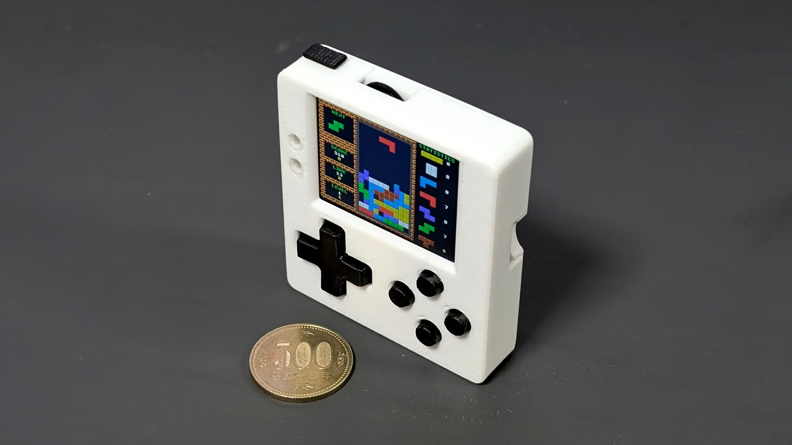
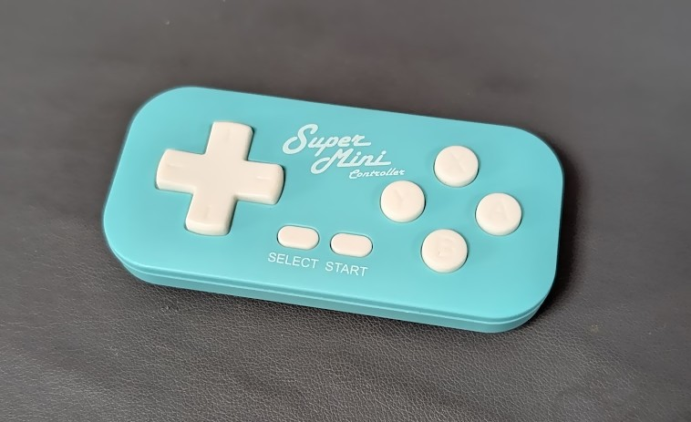
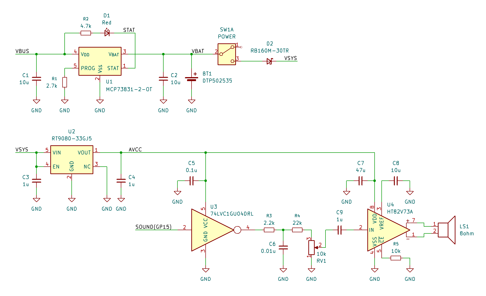
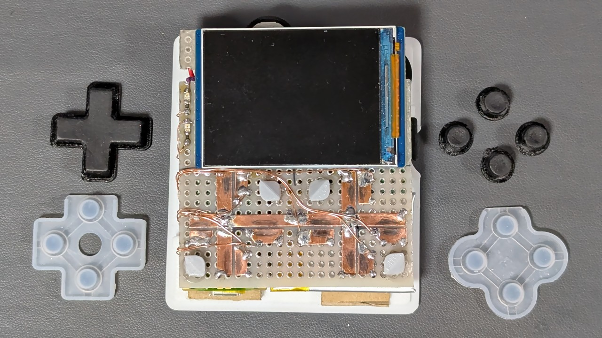
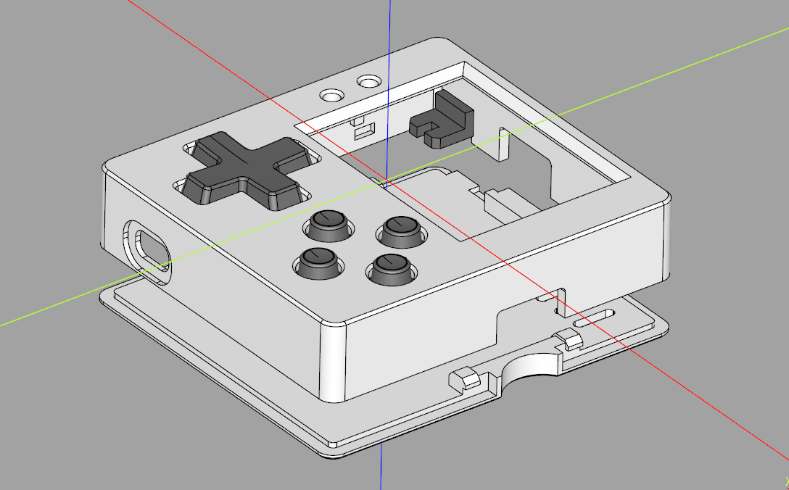

# 通販で部品を集めて「PicoPad」の互換機を作る



オープンソースのゲーミングコンソール「[PicoPad](https://picopad.eu/en/)」の互換機を
通販で手に入る部品で作ってみました。

> [!NOTE]
> 現物合わせで場当たり的に作ったので誰でも再現できるレシピにはなっていません。
> あくまで参考程度にしてください。

## PicoPad とは

PicoPad はチェコの Pájeníčko による Raspberry Pi Pico をベースとした
オープンソース (GPL-3.0) のゲーミングコンソールです。
[完成品や周辺パーツ](https://pajenicko.cz/picopad) が販売されており、
C/C++、Circuit Python、MicroPython でのプログラミング可能で、
公式サイトでは「STEM 教育に最適」であるとされています。

独自のブートローダにより SD カードからバイナリを起動可能なので、
いちいち PC に繋いでプログラムを書き換える必要はありません。
公式の SD カードイメージにはゲームを含む多数の
コンパイル済みサンプルアプリが収録されており、すぐに遊ぶことができます。

TinyJoyPad 向けゲームの PicoPad 移植版や
ゲームボーイやファミコンのエミュレータも公開されており、
シンプルにレトロゲームコンソールとして使うこともできます。

なお、独自ブートローダに対応したバイナリを C/C++ で作成する場合は、基本的に
Raspberry Pi 公式の Pico SDK ではなく Miroslav Nemecek 氏による独自の SDK である
[PicoLibSDK](https://github.com/Panda381/PicoLibSDK)
を用いた開発となる点に注意が必要です。

詳細な回路図は [公式リポジトリ](https://github.com/Pajenicko/Picopad/blob/main/hardware/schematics/) で参照できます。回路図から構成図を起こすと以下のようになります。


色々繋がっていますが、最低限緑色の部分があれば
PC から UF2 を書き込むことで起動は可能です。

## 自作について

今回は通販で手に入るモジュールを組み合わせて互換機を自作してみました。

なお、日本でのより本格的な自作例として下記のようなものがあります。

- [PicopadをベースにRP2350で動かす自作ゲームエミュレータ『PicoPlay2350』の製作 | ぶらり＠web走り書き](https://burariweb.info/electronic-work/game-emulator-picoplay2350.html)


## 主な部品

### Raspberry Pi Pico 2 W

サンプルプログラムや SDK は Pico 用と Pico 2 用の両方が公開されていますので
どちらでも使用できます。今回は将来的に WiFi 対応することも考慮して
Pico 2 W を使用することにしました。

### LCD

LCD は ST7789 コントローラを搭載した QVGA 液晶を使うことになっています。
簡単に組み立てるなら Waveshare の [2inch LCD Display Module](https://www.waveshare.com/2inch-lcd-module.htm) を使うのが良さそうです。
Amazon や Aliexpress でも同じものが手に入ります。

今回はできるだけ小さく作りたかったので、同じ Waveshare でネジ穴の無い
[2inch LCD Display Module for Raspberry Pi Pico](https://www.waveshare.com/product/raspberry-pi/boards-kits/raspberry-pi-pico-cat/pico-lcd-2.htm) を
[せんごくネット通販](https://www.sengoku.co.jp/mod/sgk_cart/detail.php?code=EEHD-6F3F)
で購入し、ピンソケットとスイッチを強引に取り去って使用しました。

### キーパッド

キーパッドについては、汎用のタクトスイッチを使うことができます。

ゲームコンソールとして使うことをを考えるとクリック感が無いボタンの方が
いいと思ったので、手元にあった
[Switch用スーパーミニコントローラー](https://www.amazon.co.jp/dp/B0CK7Y7JXH)
を分解して部品を流用することにしました。

なお、[導電ゴム接点単体で入手](https://www.amazon.co.jp/s?k=%E5%B0%8E%E9%9B%BB+%E3%82%B4%E3%83%A0+%E3%83%91%E3%83%83%E3%83%89) することも可能です。



### バッテリーと充電コントローラ

バッテリーと充電コントローラまわりは以下のものを購入しました。

- 充電コントローラIC: [MCP73831-2ATI/OT](https://akizukidenshi.com/catalog/g/g113288/)
- バッテリー: [DTP502535(PHR) 400mAh](https://www.sengoku.co.jp/mod/sgk_cart/detail.php?code=EEHD-4YZL)
- ショットキーバリアダイオード: [RB160M-30TR](https://akizukidenshi.com/catalog/g/g101398/)

充電コントローラについては出来合いのモジュール (例: [ミニリチウムイオン電池充電器モジュール](ミニリチウムイオン電池充電器モジュール) ) を使うこともできます。

充電時に Raspberry Pico からバッテリーへの逆流を防ぐためのダイオードが必要です。
スイッチングダイオードでは電圧降下が大きすぎて LCD のバックライトが
ちらついたりするので、ショットキーバリアダイオードを使用します。

> [!NOTE]
> バッテリーは無くても外部給電で動きます。
> 工作初心者の場合、裸のリポ電池の取り扱いはリスクも伴うので、
> 乾電池を使ったり、外部給電を前提とするのもアリだと思います。

### スピーカー

公式の回路図は圧電スピーカーを使用する前提の回路になっています。


今回はもう少し力強く鳴らしたかったのでダイナミックスピーカーを使用することにしました。

公式の回路の圧電スピーカーをマグネチックスピーカーに置き換えても鳴るには鳴りますが、
大きな電流が流れてスピーカーとトランジスタが発熱し、もしかすると壊れるかもしれないので
回路の変更が必要です (後述)。

また、ソフトウェアでの音量調節が起動時にしかできないのが少し不便なので
物理ボリュームも追加することにしました。

- スピーカー: [マイクロスピーカー 8 Ω](https://akizukidenshi.com/catalog/g/g112495/)
- パワーアンプ: [HT82V73A](https://akizukidenshi.com/catalog/g/g117849/)
- ボリューム: [10 kΩ Aカーブ](https://akizukidenshi.com/catalog/g/g114734/)
- 3.3V シリーズレギュレータ: [RT9080-33GJ5](https://akizukidenshi.com/catalog/g/g129588/)
- インバータ: [74AHC1G04W5](https://akizukidenshi.com/catalog/g/g117602/)

### microSD カード

SPI モードで使用可能な microSD カードが必要です。
最近のカードだと使えないものがあるかもしれません。

今回は以下のものを使用しました。

- [Transcend microSDHCカード 32GB 3D TLC UHS-I Class10 TS32GUSD300S](https://www.amazon.co.jp/dp/B07CD9QYNM/)

### その他

- microSD スロット: [DIP化キット](https://akizukidenshi.com/catalog/g/g105488/)
- 電源スイッチ: [IS-2235](https://akizukidenshi.com/catalog/g/g102627/)
- ユーザー LED: 手元にあった青色のチップ LED
- 充電状態 LED: 手元にあった赤色のチップ LED
- 抵抗/コンデンサ: 少々
- リセットスイッチ/拡張ポート: ゲームコンソールとして使うだけなら不要

## 回路

概ね [公式の回路図](https://github.com/Pajenicko/Picopad/blob/main/hardware/schematics/)
を踏襲しましたが、バッテリー充電回路とオーディオ出力については
下記のようにアレンジしました。



### バッテリー充電回路

充電回路は充電制御 IC (MCP73831) のデータシートと
スイッチサイエンスのモジュールの回路を参考にしました。

### オーディオ出力

ダイナミックスピーカーを力強く鳴らすためにパワーアンプ (U4) を使用しました。

ボリュームによる音量調節とパワーアンプのアナログ入力のために
Pico からの PWM 出力をローパスフィルタ (R3/C6) で
平滑化してアナログ信号にします。R4 はボリューム最大時に音割れしない程度に調節しました。

Pico の VSYS や 3V3OUT はリプル (変動) が大きく、
そのままオーディオの電源として使うと音声出力にノイズが乗ってしまいますので、
シリーズレギュレーター (U2) を使ってオーディオ用の電源 (AVCC) を作ります。

また、PWM 信号自体にも Pico のノイズが乗っており、
それをそのまま平滑して増幅するとノイズも一緒に増幅されてしまいますので
インバーター (U3) を通して綺麗なデジタル信号にします。

このへんのノイズ対策をしないと、ジャリジャリキーキー鳴ってしまいます。

### その他

上記以外は基本的にオリジナルの回路と同じですが、
拡張ポートについては今回は省略しました。

## 組み立て

### LCD

Waveshare の 2 インチディスプレイから Pico 用のピンソケットとスイッチを除去してディスプレイと LDO だけにしました。ホットエアが無いと綺麗に除去するのは結構難しいです。

### 基板

ユニバーサル基板を適当なサイズに切り、そこに LCD、Pico、MicroSD 基板、バッテリーを貼り付けました。電源スイッチ、ボリューム、LED はユニバーサル基板に実装しました。

パワーアンプの基板を後から追加したので配線がだいぶグチャってしまいました。


### キーパッド

キーパッドはゲームコントローラのゴム接点を流用しました。

基板側の接点は銅箔テープを貼り、ゴムパッドがズレないように
[ガイド](https://github.com/shapoco/jigs/blob/main/special/picopad/r1/stl/pivot.stl)
を貼り付けました。
接点の接触を良くするため、導電ゴムが接触する部分を鉛筆でゴシゴシしておきました。

キートップもゲームパッドから流用するつもりでしたが、
高さが足りなかったので結局 3D プリントしました。

右側のボタンは下右左上の順に ABXY に割り当てます。



### パワーアンプ基板

パワーアンプ基板は後から別基板を追加しました。

パワーアンプ IC (HT82V73A) は裏面にも GND パッドがあるので
[それに対応した変換基板](https://akizukidenshi.com/catalog/g/g115952)
を使用しました。表面のレジストをナイフ等で削って
GND パッドに繋がる銅箔を露出させると良い感じに表面のみで実装できます。


### ケース

ケースは中身が一通り出来上がってからそれに合わせて [CadQuery で設計](https://github.com/shapoco/jigs/tree/main/special/picopad) して、3D プリントしました。

ネジ止めするスペースが無いのでケースは爪で噛み合うようにし、
ダンボールをクッションにして基板を裏から押さえつけるようにしました。



### 組み立ての様子


## 起動

### 初回

一度起動した後は PicoLibSDK の独自ブートローダを使って microSD カードからアプリを起動できますが、一番最初はそのブートローダを含んだ UF2 を PC から書き込む必要があります。

1. [PicoLibSDK のサイト](https://www.breatharian.eu/hw/picolibsdk/index_en.html) に SD カード内のファイルをまとめた zip ファイルがあるので、それをダウンロードして展開しておきます。

    

2. 展開した SD カードデータ一式を microSD カードにコピーし、PicoPad にセットしておきます。
3. BOOTSEL ボタンを押しながら PicoPad を PC に接続します (マスストレージデバイスとして認識されます)。
4. 先ほど展開した SD カードデータの中にある UF2 のどれか (例: `LOADER.UF2`) を PicoPad に書き込みます。

青いブートメニューまたは「Going To Sleep ...」という表示が出たら書き込み完了です。

### microSD カードからの起動

1. USB ケーブル接続時は、どれかのボタンを 2 回押すとブートメニューが表示されます。USB を接続していない状態では、電源投入と同時にブートメニューが表示されます。
2. ブートメニューが表示されたら、↑↓キーでアプリの UF2 を選んで A ボタンで起動します。

内部的には microSD カードから Pico の Flash にアプリを転送し、
Flash からアプリを起動する動きになります。

ブートメニューで Y ボタンを押すと、前回 Flash に転送されたアプリが起動します。

## NES エミュレータのビルド (Linux/WSL2)

PicoLibSDK にはファミコン (NES) エミュレータ含まれています。
特に説明が見当たりませんが [InfoNES](https://github.com/jay-kumogata/InfoNES)
ベースのエミュレータのようです。ROM 毎に UF2 を作成する方式なので、遊ぶには自前でビルドする必要があります。

### Windows

Windows ではビルド環境をセットアップした後で PicoLibSDK のリポジトリ配下の
`EMU/NES/samples/` の配下にNES ファイルを配置して `c_all_samples.bat`
を叩くことでビルドできる…ように見えます (自分では試してません)。

### Linux

Linux 用のビルドスクリプトは用意されていませんが、
Windows 用のバッチファイルを参考にシェルスクリプトを起こすことで
WSL2 でビルドできました。

1. GCC がインストールされていない場合はインストールしておきます。
2. Pico2 ではなく Pico 用にビルドする場合はスクリプト中の `DEVICE=picopad20` を
    `DEVICE=picopad10` に書き換えてください。
3. 後述の `build_nes.sh` を適当なディレクトリに保存し、実行権限を付与します。
4. 同じディレクトリに `nes_rom` という名前のディレクトリを作成し、
    その配下に NES ファイルをまとめて配置します。
5. `./build_nes.sh` を実行します。

`nes_uf2` というディレクトリ配下に ROM と同じ名前で UF2 が作成されます。

```sh:build_nes.sh
#!/bin/bash

set -eu

DEVICE=picopad20

# ROM ファイルをリストアップ
pushd nes_rom
  NES_DIR=`pwd`
  NES_LIST=`ls -1 *.nes`
popd

UF2_DIR=`pwd`/nes_uf2
mkdir -p "${UF2_DIR}"

mkdir -p nes_build
pushd nes_build
  if [ ! -e PicoLibSDK ]; then
    # PicoLibSDK をクローン
    git clone https://github.com/Panda381/PicoLibSDK
  fi
  pushd PicoLibSDK
    # スクリプトに実行権限を付与
    find . -type f -name "*.sh" -exec chmod +x {} \;
    
    # 必要なツールをビルド
    pushd _tools/elf2uf2
      g++ -o elf2uf2 main.cpp
    popd
    pushd _tools/PicoPadLoaderCrc
      g++ -o LoaderCrc LoaderCrc.cpp
    popd
    pushd PicoPad/EMU/NES/NESprep
      g++ -o NESprep NESprep.cpp
    popd
    pushd PicoPad/EMU/NES/NESprep/MapperNo
      g++ -o MapperNo MapperNo.cpp
    popd
    
    pushd PicoPad/EMU/NES
      set +e
      ./d.sh
      set -e
      
      # ROM 毎に UF2 を作成
      for nes_filename in $NES_LIST; do
        nes_path="${NES_DIR}/${nes_filename}"
        nes_title=`basename "${nes_filename}" .nes`
        
        # 古いファイルを削除
        rm -f \
          src/program.cpp \
          src/setup.h
        rm -f \
          build/program.o \
          build/main.o \
          build/InfoNES.o \
          build/K6502_rw.o
        
        # ソースコード生成
        ./NESprep/NESprep "${nes_path}" src/program.cpp ${nes_title}
        cp setup.h src/setup.h
        
        # ビルド
        ./c.sh ${DEVICE}
        
        # ファイルをコピー
        cp NES.uf2 "${UF2_DIR}/${nes_title}.uf2"
      done
    popd
  popd
popd

```

ROM ファイルはご自身で、合法的に用意してくださいね。

## SNS 投稿

- [X (Twitter)](https://x.com/shapoco/status/1994717881997955230)
- [Misskey.io](https://misskey.io/notes/afnq87gglfcu06iy)
- [Bluesky](https://bsky.app/profile/shapoco.net/post/3m6r7jdbxyk2e)
- [mixi2](https://mixi.social/@shapoco/posts/f1f586c9-0d78-4e51-9339-f2d1bedadd86)
