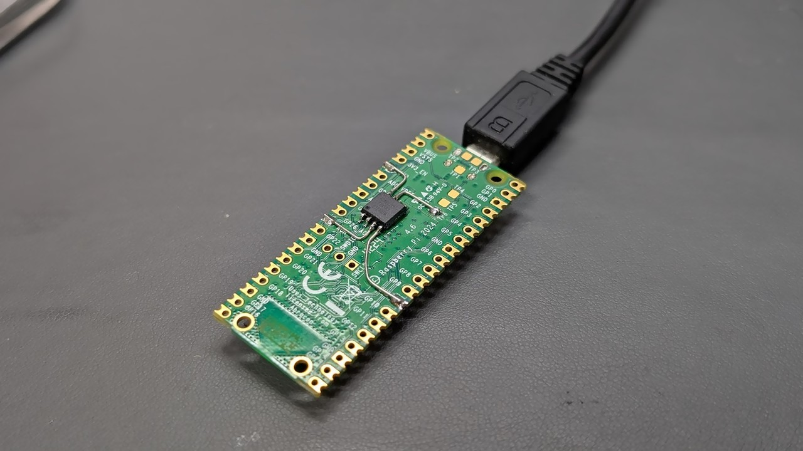

# BootSel2Reset: ラズピコの BOOTSEL をリセットと兼用にする

Raspberry Pi Pico に搭載されている BOOTSEL スイッチを使って
リセットを行えるようにする MOD チップ的なものを作ってみました。

## 動機

[「長押しで書き込みボタン」](../../2023/1017-raspico-longpush-button/)
を作って以降、ラズピコを購入したらまずこのボタンを追加するのが
個人的にルーチンワークになっています。

長押し書き込みボタンは便利なんですが、複数の部品を取り付ける作業がめんどいので
既存の BOOTSEL スイッチを使って同様の機能を実現する MOD チップ的なものを
作ってみることにしました。

## BOOTSEL スイッチ

BOOTSEL スイッチは QSPI Flash の CS 信号に接続されています。
リセット解除時にこのピンが Low にドライブされている場合、
ラズピコは USB マスストレージモードで起動するようになっています。

この信号は RP2040/RP2350 が Flash にアクセス時にも
Low にドライブされるので、BOOTSEL スイッチの押下と区別するには
パルス幅で判別する必要があります。

## リセットパルスの生成

以下のような仕様でリセットパルスを生成します。

- BOOTSEL の 100ms 未満のパルスは無視
- BOOTSEL の 100ms～tHOLD のパルスでは立ち上がりでリセットパルスを生成
- BOOTSEL の立ち下がりから tHOLD 経過したらリセットパルスを生成

これにより長押し書き込みボタンと同様に
「クリックでリセット」と「長押しで書き込みモード」を実現します。

## MOD チップの実装

使い慣れた AVR に実装することにしました。

コードは [pico-bootsel2reset](https://github.com/shapoco/pico-bootsel2reset) に公開しています。ATtiny10、ATtiny85、ATtiny402 に対応しています。

### AVR へ書き込み

MCU に合ったプログラマとツールを使って書き込みます。

- ATtiny10, ATtiny85: AVRasp, AVRISP mkII, Arduino など
- ATtiny402: UPDI 対応のプログラマ

> [!NOTE]
> ATtiny10 へ書き込むにはプログラマのファームウェアの更新が必要な場合があります。

筆者は AVRISP mkII と CH340E を使った自作の UPDI プログラマを使い、
ツールは avrdude を使用しました。

### 設定ピン

長押しのホールド時間 (tHOLD) はデフォルトでは 4 秒ですが、
TIMESEL ピンを GND に接続することで 500ms に変更できるようにしました。

一部の特殊なアプリケーション (PicoPad のブートローダ) で QSPI_SS が数百 ms の間 Low にドライブされることがあり、クリックと誤認されてリセットが実行されてしまうので、クリックについては NOCLICK ピンを GND に接続することで無効化できるようにしています。

## ラズピコへの取り付け

裏面に実装する場合は BOOTSEL は TP6 に繋ぐのが簡単です。
表面に実装する場合はちょっと狭いですが BOOTSEL スイッチの端子に直結します。

## 動作の様子

