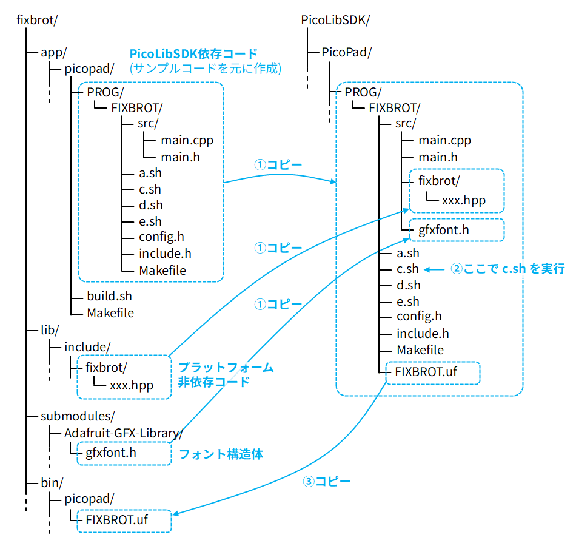

# PicoPad 用のアプリを WSL2 + VSCode で作ってみる

PicoPad 用のアプリを WSL2 と VSCode で作ってみました。

## 関連記事

- [通販で部品を集めて「PicoPad」の互換機を作る](../1126-picopad/)

## 作ったアプリ

今回作成したマンデルブロ集合ビューア「[FixBrot](https://github.com/shapoco/fixbrot)」です (PicoPad 以外にも対応しています)。

<iframe width="560" height="315" src="https://www.youtube.com/embed/vfgkUTCUK6k?si=giB6phdIJJTBplKt" title="YouTube video player" frameborder="0" allow="accelerometer; autoplay; clipboard-write; encrypted-media; gyroscope; picture-in-picture; web-share" referrerpolicy="strict-origin-when-cross-origin" allowfullscreen></iframe>

## PicoLibSDK

C/C++ での PicoPad 向けのアプリ開発では
[PicoLibSDK](https://github.com/Panda381/PicoLibSDK/)
の使用が想定されています。

PicoLibSDK は Miroslav Nemecek 氏による RP2040/RP2350 向けの SDK で、
Raspberry Pi 公式の
[Pico SDK](https://github.com/raspberrypi/pico-sdk)
とは独立に開発されています。

PicoLibSDK には PicoPad 用のブートローダーの実装も含まれており、
この SDK を使ってアプリケーションをビルドすればブートローダーも
一緒に組み込まれます。

ゲーム等の開発に必要な一通りの API とビルドツールが揃っていますが、
いくつか注意点があります。

### 開発環境のメインターゲットは Windows

基本的に Makefile とバッチファイルによるビルドシステムとなっていますが、
Linux 環境向けのシェルスクリプトも含まれていますので、今回はそれを使用します。

### C の標準ライブラリとの衝突を避ける

`int32_t` 等の基本的な型や数学、文字列、メモリ操作系の標準ライブラリ関数と
互換性のある関数が使用できますが、これらの宣言は PicoLibSDK の独自の
ヘッダファイルに含まれており、C 標準の `stdint.h` や `string.h` 等を
インクルードしようとすると衝突する場合があります。

他のプラットフォームとコードを共通化させたい場合は PicoPad のときだけ
標準ライブラリヘッダのインクルードを行わないように `#ifdef` で
切るなどの工夫が必要そうです。

### グローバルに定義されたマクロとの衝突を避ける

`WIDTH`、`HEIGHT`、`MIN`、`MAX` といったよく使われる識別子が PicoLibSDK 側で
マクロとして使用されているので、衝突しないように注意する必要があります。

## 公式ドキュメント

各種ツールと API の説明は PDF にまとめられていますので、
個々の詳細についてはそちらを参照してください。

- [PicoLibSDK.pdf](https://www.breatharian.eu/hw/picolibsdk/dwn/PicoLibSDK.pdf)

## WSL2 + VSCode での開発環境を構築してみる

### PicoLibSDK のセットアップ

PicoLibSDK のリポジトリにはビルド済みのバイナリ等も含まれておりストレージを
2 GB くらい消費するので、容量が気になる場合はどこか共通のディレクトリに
チェックアウトするのがいいと思います。

筆者の環境では `${HOME}/pico/` の配下に Pico SDK をインストールしてあるので、
そこに PicoLibSDK も置き、そのパスを環境変数 `PICOLIBSDK_PATH` に
設定することにしました。

アプリケーションのビルドには `elf2uf2` と `LoaderCrc` が必要なので、
ソースからビルドしておきます。

```sh
mkdir -p ${HOME}/pico
cd ${HOME}/pico/
git clone https://github.com/Panda381/PicoLibSDK

# 以下の行を .bashrc にも書いておく
export PICOLIBSDK_PATH=${HOME}/pico/PicoLibSDK

pushd ${PICOLIBSDK_PATH}/_tools/elf2uf2
  g++ -o elf2uf2 main.cpp
popd
pushd ${PICOLIBSDK_PATH}/_tools/PicoPadLoaderCrc
  g++ -o LoaderCrc LoaderCrc.cpp
popd
```

### アプリケーションプロジェクトのディレクトリ構成を検討

PicoLibSDK では、SDK 内のサブディレクトリにアプリケーションの
ソースコードを格納して、そこでビルドコマンドを叩くフローになっています。
ただ、オリジナルのアプリケーションを独立したリポジトリで
バージョン管理する場合は SDK のディレクトリとは別階層に
アプリケーションコードを置いておきたくなります。

そこで今回は、アプリケーション用のサブディレクトリ構造を
自分のリポジトリに切り出し、ビルド時は毎回 SDK 内へコピーして
ビルドを実行し、できたバイナリを抽出するフローを組むことにしました。

PicoPad 用のアプリケーションコードは
`PicoLibSDK/PicoPad/グループ名/アプリ名/`
に格納することになっています。
元々 PicoLibSDK には `PROG` グループにマンデルブロ集合の
サンプル `MANDEL` が含まれているので、今回はそれを参考にして、
グループ名を `PROG` 、アプリ名を `FIXBROT` としました。

自分のリポジトリでは PicoLibSDK に依存する PicoPad 専用コードは
`fixbrot/app/picopad/PROG/FIXBROT/` に配置し、
プラットフォームに依存しないコードは
`fixbrot/lib/include/` 配下に配置しました。
また、今回のアプリでは Adafruit-GFX-Library のフォント構造体定義を含む
`gfxfont.h` も使用します。



スクリプト類が少々とっちらかっている印象がありますが、
一応 PicoLibSDK の構成を踏襲することにしました。
Windows 用のバッチファイルは使用しないので除外しました。

### ビルドフロー

1. 前記のアプリケーションコードをまとめて PicoLibSDK の
    アプリケーション用ディレクトリにコピーします。
2. `c.sh` でコンパイルを実行します。
3. コンパイルが成功すると UF2 が生成されるので、
    それを自分のリポジトリに書き戻します (バージョン管理からは除外)。

上記のようなフローを [build.sh](https://github.com/shapoco/fixbrot/blob/main/app/picopad/build.sh) と [Makefile](https://github.com/shapoco/fixbrot/blob/main/app/picopad/Makefile) にまとめました。

`fixbrot/app/picopad/` で `make` を叩くと、
`fixbrot/bin/picopad20/` に UF2 が生成されます。

### ソースファイル

#### PicoLibSDK 依存コード

- [main.cpp](https://github.com/shapoco/fixbrot/blob/main/app/picopad/PROG/FIXBROT/src/main.cpp):<br>
    PicoLibSDK に依存するコードを集約しました。
    今回のアプリでは SDK 依存部分を極力減らしたのであまり物量はありません。
- [config.h](https://github.com/shapoco/fixbrot/blob/main/app/picopad/PROG/FIXBROT/config.h):<br>
    アプリケーション全体のコンフィグを行います。
    ほとんど PicoLibSDK のサンプルのままですが、
    以下のマクロ定義を追加しています。

    - `#define USE_FRAMEBUF 0`:<br>
        今回のアプリでは大きめの作業用配列が必要で、
        RAM を広く使えるように PicoLibSDK のフレームバッファを無効化します。
    - `#define DISP_SPI_BAUD 50000000`:<br>
        ディスプレイ更新速度を稼ぐために SPI 周波数を高めに設定しました。
    - `#define FIXBROT_NO_STDLIB`, `#define SHAPOFONT_NO_STDLIB`:<br>
        PicoPad 向けの場合のみ C 標準ライブラリを
        インクルードしないようにするためのスイッチです。

#### プラットフォーム非依存コード

アプリケーションロジックの大半は
[fixbrot/lib/include/fixbrot](https://github.com/shapoco/fixbrot/tree/main/lib/include/fixbrot)
の配下のソースに記述しました。

これらのコードは PicoLibSDK 以外でも使用できますが、
前述の通り PicoLibSDK は C 標準ライブラリと競合するので
PicoPad 向けコードの場合は C 標準ライブラリを
インクルードしないようになっています。

### VSCode の設定

C++ 用拡張機能を入れた上で、
[c_cpp_properties.json](https://github.com/shapoco/fixbrot/blob/main/.vscode/c_cpp_properties.json)
にインクルードパスとマクロを正しく設定すると、
Intellisense で PicoLibSDK の API やマクロの補完が効くようになります。

```json
{
    "configurations": [
        {
            "name": "PicoPad",
            "includePath": [
                "${PICOLIBSDK_PATH}",
                "${PICOLIBSDK_PATH}/_display",
                "${PICOLIBSDK_PATH}/_display/st7789",
                "${PICOLIBSDK_PATH}/_devices/picopad",
                "${PICOLIBSDK_PATH}/_sdk/inc",
                "${workspaceFolder}/app/picopad/グループ名/アプリ名",
                "${workspaceFolder}/app/picopad/グループ名/アプリ名/src",
                // (その他アプリ固有のインクルードパス ... )
            ],
            "defines": [
                "USE_PICOPAD=1",
                "PICO_ROOT_PATH=\"${PICOLIBSDK_PATH}\"",
                "PICOLIBSDK_DISPLAY_DIR=\"${PICOLIBSDK_DISPLAY_DIR}\"",
                "PICOLIBSDK_FONT_DIR=\"${PICOLIBSDK_FONT_DIR}\"",
                "PICOLIBSDK_LIB_DIR=\"${PICOLIBSDK_LIB_DIR}\"",
                "PICOLIBSDK_SDK_DIR=\"${PICOLIBSDK_SDK_DIR}\"",
                "INCLUDES_H=\"${PICOLIBSDK_PATH}/includes.h\"",
                "CONFIG_DEF_H=\"${PICOLIBSDK_PATH}/config_def.h\""
            ],
            "compilerPath": "/usr/bin/gcc",
            "cStandard": "c17",
            "cppStandard": "gnu++17",
            "intelliSenseMode": "linux-gcc-x64"
        }
    ],
    "version": 4
}
```

## 使用した API と Tips

### アプリケーションコードの基本構造

`main.cpp` の `main()` 関数がアプリのエントリポイントとなります。

ディスプレイや GPIO 等の初期化は既に終わった状態で起動するようなので、
複雑な初期化処理はなくいきなり描画やキーの取得を行うことができます。

### キー入力

キーの押下状態は `KeyPressed()` または `KeyPressedFast()` が使用できます。

引数に `KEY_LEFT`、`KEY_RIGHT`、`KEY_UP`、`KEY_DOWN`、
`KEY_A`、`KEY_B`、`KEY_X`、`KEY_Y` を指定すると、
そのキーの押下状態が返されます。

### 画面描画 (フレームバッファ無し)

今回はマンデルブロ集合演算のための作業用配列を多きくとるために
フレームバッファは無効化し、ディスプレイに直接表示内容を転送する
方式にしました。

描画は以下の手順で行います。

1. `DispStartImg()` でディスプレイのどの領域を更新するかを指定します。
2. ビットマップデータを `DispSendImg2()` で 1 ピクセルずつ転送します。
    ピクセルフォーマットは RGB565 です。
3. `DispStopImg()` で転送を終了します。

画面のサイズは `WIDTH`、`HEIGHT` にマクロ定義されています。

フレームバッファありの場合の使用方法は他のアプリを参考にしてください。

### LED 制御

`LedOn()` と `LedOff()` で LED を制御できます。
引数には `LED1` を与えます。

### マルチコア

`Core1Exec()` の引数に関数名を与えます。
Pico SDK の `multicore_launch_core1()` と同等です。

### オーバークロック

PicoPad ではデフォルトでは 125 MHz で動作するようですが、
Pico SDK と同名のクロック設定 API があり、
Pico SDK での開発時と同様に `vreg_set_voltage()` と
`set_sys_clock_khz()` でクロックを設定できます。

FixBrot では 250 MHz に設定しました。

### ブートメニューに戻る

`ResetToBootLoader()` を呼び出すと直ちにアプリケーションが終了し
ブートメニューに戻ります。

## PicoPad での実行

PicoPad にケーブルを接続してブートメニューを起動し、
X → B の順で押すと USB マスストレージモードになります。

※ [長押し書き込みボタン](../../2023/1017-raspico-longpush-button/)
を使う方法もあります。

ファイラを使って UF2 を書き込むこともできますが、
FixBrot の Makefile では `make PICO_DRIVE=ドライブ文字 flash` で
ターミナルから書き込みできるようになっています。
