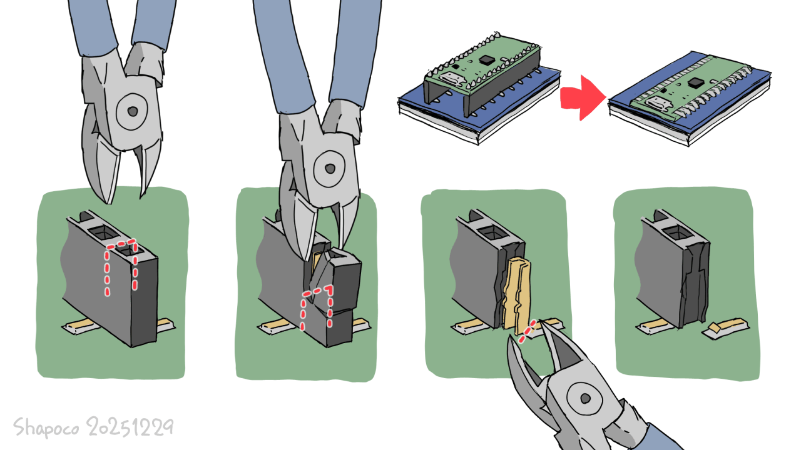
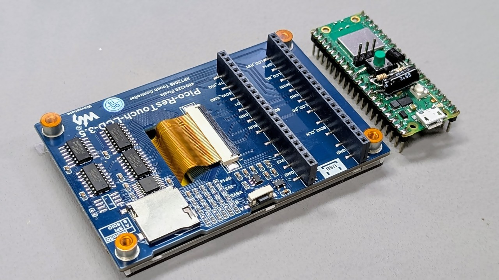
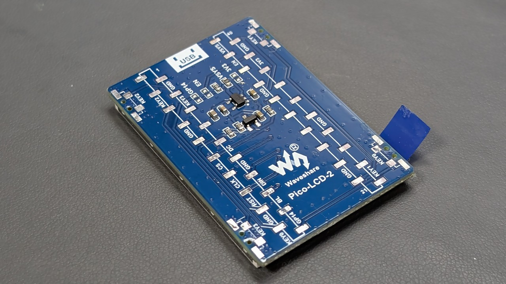

# Waveshare の LCD モジュールから表面実装ピンソケットをムリヤリ除去して薄くする

Waveshare のラズピコ用 LCD モジュールは入手しやすくて良いですが、
ピンソケットの高さの分厚くなるので除去して薄くしてみました。

スルーホールタイプのピンソケットであれば樹脂部分と基板の隙間に
ニッパーやドライバーを差し込んでこじれば樹脂部分だけ除去することが
できますが、表面実装タイプだとランドが剥がれてしまいます。

Waveshare のモジュールに使用されているピンソケットは樹脂が結構脆く、
ニッパー等で簡単に割ることができるので、1 ピンずつ破壊していけば
除去することができました。

ピンソケットの間が平らなモジュールであれば、Raspberry Pico を
直接実装することができます。

