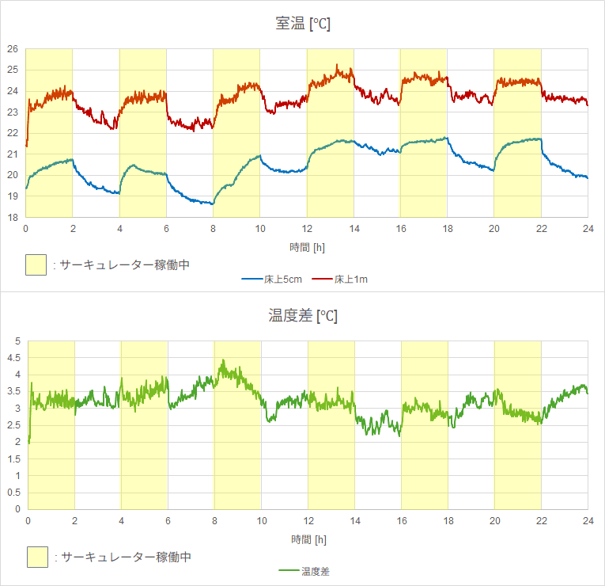
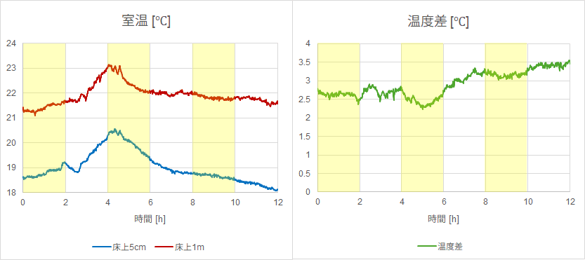
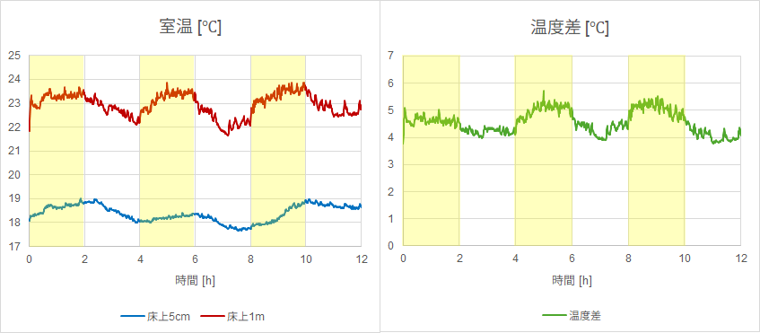

# 冬の足元の冷え (コールドドラフト) に対するサーキュレーターの効果を確認してみる

冬に窓際で冷やされた空気が床付近に溜まることで形成される
冷気の層「コールドドラフト」に対して、サーキュレーターの効果を
実際に温度をロギングして確認してみました。

## コールドドラフトとは

冷たい空気は重いので、窓で冷やされた空気は自然に床に降りてきて、
攪拌しないとそのまま床付近に留まります。
これを「コールドドラフト」と呼ぶそうです。

- [動画で見るコールドドラフト](https://www.ykkap.co.jp/consumer/satellite/products/articles/mado_textbook/insulation/#:~:text=%E5%8B%95%E7%94%BB%E3%81%A7%E8%A6%8B%E3%82%8B)

対策としては以下のようなものがあります。

- 窓や壁の断熱性を改善する
- 部屋の空気を攪拌する

このうちすぐにできる対策として、サーキュレーターを使って部屋の空気を
攪拌することがどの程度効果があるのか、実際に温度をロギングして
確認してみました。

## 実験環境

冷気は窓から降りてくるので、窓の近傍で上方向に空気を送って
攪拌するのが効果があると仮定し、サーキュレーターを窓際に置いて
真上に向けて動かすことにしました。

実際の住宅を使って実験する場合、室温が外気温や日照の影響を
受ける問題があります。
単にサーキュレーターを動かして前後の室温を測るだけだと、
室温の変化がサーキュレーターの効果によるものなのか、
外気温や日照の影響なのか分かりにくくなってしまいます。

そこで今回は、サーキュレーターを 2 時間毎に On/Off して 24 時間ロギングし、
On のときと Off のときの差が分かりやすくなるようにしてみました。
切り替えはタイマースイッチを使って自動で行います。

使用したサーキュレーターはアイリスオーヤマの
[PCF-MKM15N-B](https://www.irisplaza.co.jp/index.php?KB=SHOSAI&SID=H283227)
で、風量は 3 段階のうちの真ん中にしました。

この環境で、窓から 2 m ほど離れた場所に床上 5 cm と 1 m の 2 箇所に
温度センサを設置してロギングしました。

窓とカーテンは常に閉めて、ロギング中は開け閉めしません。

## 実験結果

### 暖房 OFF の場合

まずは暖房をつけていない場合の結果です。

グラフの通り、サーキュレーターの On/Off に伴って
床上 5 cm の温度が露骨に 1 ℃ 程度上下しています。
床上 1 m の温度とサーキュレーターの稼働状態との関係は不明瞭です。
上下の温度差も 1 ℃ 程度変化しています。

16 時間目のところで床上 1 m 付近の温度が急上昇しているのは
日照の影響です。

特に冷え性など足先の寒さを感じやすい人にとっては、
サーキュレーターを窓際に置いて稼働させるのは
寒さを感じにくくする効果があると言えるかもしれません。

### 暖房 ON の場合

次に暖房 (エアコン) をつけた場合です。温度設定は 24 ℃にしました。
エアコンは窓側、サーキュレーターの真上にあります。

暖房をつけていないときと同様に床上 5 cm の温度が上下しているのに加えて、
床上 1 m の温度も同じくらい変化しているのが分かります。

この日は 12～14 時間目あたりで日が照って
サーキュレーターの効果がやや不明瞭になっています。

サーキュレーターがコールドドラフトの改善だけでなく、
天井付近の暖かい空気も巻き込んで部屋全体の空気を
攪拌する効果があることがうかがえます。

### サーキュレーターを窓から離した場合

暖房 OFF のときの結果を
[X (Twitter) でシェア](https://x.com/shapoco/status/2005652548703965500)
したところ大きな反響を頂きましたが、その中で
「サーキュレーターを窓から離しても効果がある」という反応を
頂きましたので追加で確認してみました。

サーキュレーターは窓の反対側に置き、同じように 2 時間毎に On/Off しました。

まずは暖房 OFF の場合です (時間は 12 時間)。

4 時間目あたりに山があるのは日照の影響です。

残念ながら、床上 5 cm、1 m ともにサーキュレーターの稼働状態との関係が
よく分からないという結果になりました。
温度差をみても、サーキュレーターによって顕著に温度差が
縮まっているとは言いがたいです。

次に暖房 ON の場合です (時間は 12 時間)。

床上 1 m の位置の温度は顕著に上下していますが、
床上 5 cm の位置の温度変化は不明瞭になっています。
上下の温度差は最大 5 ℃に達し、今回の実験を通して最大になりました。

窓から離れた場所でサーキュレーターを動かすと
部屋全体の空気の攪拌には効果を発揮しますが、
コールドドラフトの改善に対しては効果が薄く、
むしろ温度差が大きくなる分、もしかすると冷え性の人には
余計に足元の冷えを感じやすくなるかもしれません。

## エアコンの消費電力への影響

X (Twitter) では節電効果に言及する人もいましたが、
エアコンの消費電力にどう影響するかはよく分かりません。

サーキュレーターを動かすことで天井付近の温度が下がると、
その分かえってエアコンが頑張ってしまい、むしろ消費電力が
増える可能性もあります。

寒さを感じにくくなる分エアコンの温度設定を下げられると考えれば
節電効果を期待できる可能性もありますが、このあたりは
部屋の断熱性、エアコンの性能、天候等にも左右されるので
一概に言うのは難しい気がします。

## まとめ

- サーキュレーターを窓際に置いて真上に向けて動かすと、
    コールドドラフトの改善に効果があるようです。
- 暖房使用時は、床付近だけでなく部屋全体の寒さを改善する
    効果があるようです。
- サーキュレーターは窓際に置くのが良く、
    窓から離すとコールドドラフトの改善効果は低くなるようです。
- 節電効果があるかどうかは状況によりそうです。

## SNS 投稿

- X (Twitter): [ブログ書いた](https://x.com/shapoco/status/2006558896182407661)
- Bluesky: [ブログ書いた](https://bsky.app/profile/shapoco.net/post/3mbdeu77h6s2g)
- Misskey.io: [ブログ書いた](https://misskey.io/notes/agyf09gwgkp70alv)