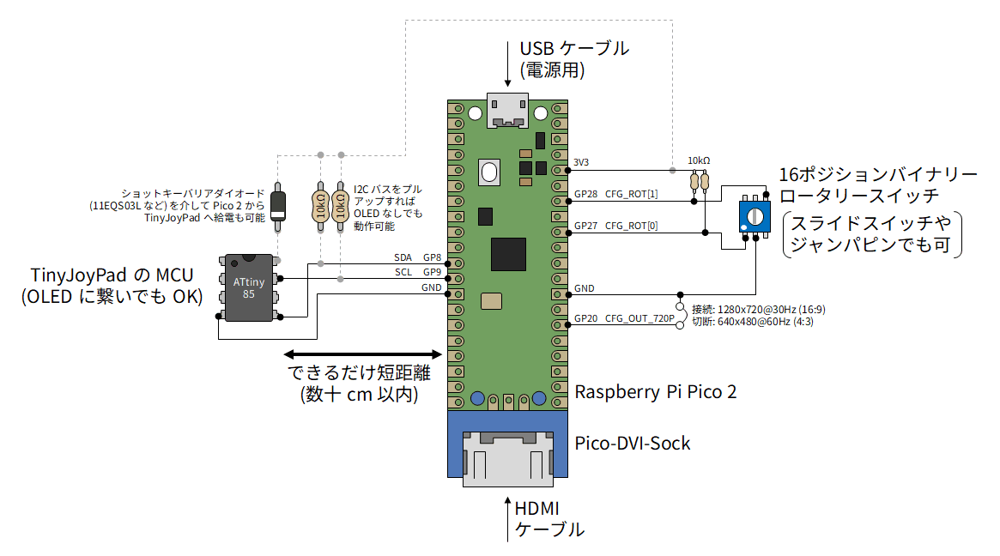
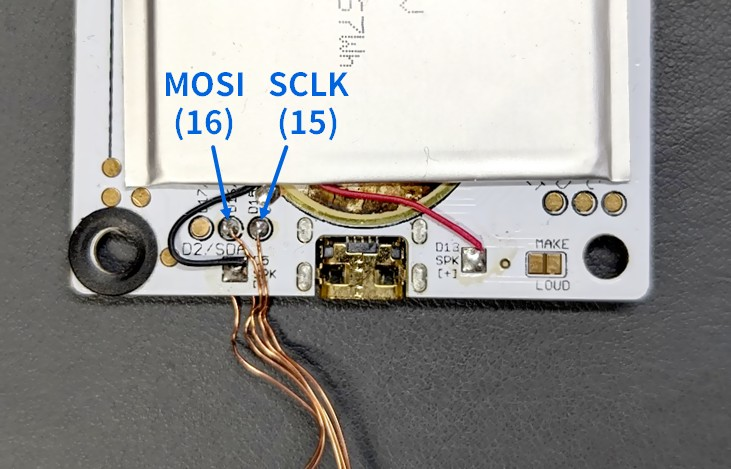
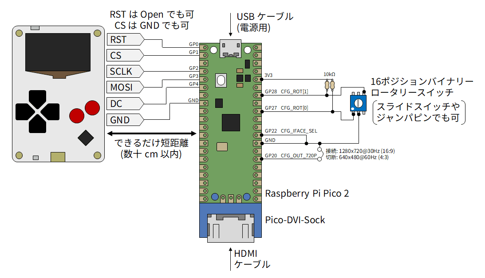

# LcdTap: TinyJoyPad や Arduboy を大画面で遊ぶ

TinyJoyPad や Arduboy など、SSD1306 ディスプレイを使った小型ゲームを
PC 用モニタやテレビなどの大画面で遊ぶ方法を紹介します。

映像出力用にコネクタのハンダ付けが必要ですが、ファームウェアに関してはコンパイル済みバイナリをドラッグ＆ドロップするだけなのでプログラミング不要です。

> [!NOTE]
> Arduboy の SPI 信号引き出しについて、当初基板のレジストを削って銅箔を露出させる手順を掲載していましたが、基板裏のバッテリーの下に TP があることを教えて頂きました (thx: [chamekan さん](https://x.com/chame/status/2056250472034627944))。

## TinyJoyPad とは

[TinyJoyPad](https://www.tinyjoypad.com/tinyjoypad_attiny85) は Daniel C 氏によって開発された携帯ゲーム機で、8 bit マイコンの ATtiny85 と SSD1306 OLED、5 つのスイッチ、スピーカーから構成されるシンプルな構成が特徴です。

## Arduboy とは

[Arduboy](https://www.arduboy.com/) は Kevin Bates 氏によって開発された携帯ゲーム機で、ATmega32u4 と SSD1306 OLED、6 つのスイッチ、スピーカーから構成されます。

## LcdTap とは

[LcdTap](https://shapoco.github.io/lcdtap/) は、Raspberry Pi Pico2 を使って、I2C 接続や SPI 接続の LCD モジュールの表示内容を DVI で出力して大きなディスプレイにミラー表示したりキャプチャしたりできるツールです。

## 用意する物

- TinyJoyPad

    - スイッチサイエンスで [キット](https://www.switch-science.com/products/9824) を購入できます。
    - 簡単な回路なので [自作](https://www.google.com/search?q=tinyjoypad+%E8%87%AA%E4%BD%9C) も可能です。
    - AVR にゲームを書き込むには ISP プログラマも必要です (これが一番の鬼門かも)。

- Arduboy

    - 公式版の価格は高騰していますが、クローンが Amazon や AliExpress で手に入ります。

- [Raspberry Pi Pico2](https://www.switch-science.com/products/9809)
- [Pico-DVI-Sock](https://www.switch-science.com/products/7431)
- [16 ポジション バイナリーロータリースイッチ](https://akizukidenshi.com/catalog/g/g102276/)

    - 画面の回転方向を切り替えるために使用します。普通のスライドスイッチやジャンパピンで代用も可。

- [抵抗 10kΩ](https://akizukidenshi.com/catalog/g/g116103/) x2
- ポリウレタン線などの細い導線 (Arduboy 用)
- ビニールテープやカプトンテープなどの絶縁用テープ (Arduboy 用)
- TypeA-MicroB USB ケーブル
- HDMI ケーブル
- 1280x720@30Hz または 640x480@60Hz の DVI-D 信号を入力可能なディスプレイ

    - PC 用モニタなら少なくともどちらかは大丈夫じゃないかと思いますが、保証はできません。

## 組み立て (TinyJoyPad)

Pico-DVI-Sock を Pico2 にハンダ付けし、その他の部品を下図のように接続します。

- Pico2 と TinyJoyPad の間はできるだけ短距離で配線してください。
- SDA/SCL は TinyJoyPad の OLED から引き出してもかまいません。
- Pico2 には GND 端子がいっぱいありますが、どれに繋いでもかまいません。
- Pico2 から出ている 3.3V で TinyJoyPad に給電することもできますが、その場合は TinyJoyPad の電源が Pico2 へ逆流しないよう、ショットキーバリアダイオード (例: [11EQS03L](https://akizukidenshi.com/catalog/g/g108997/)) を挿入してください。
- SDA/SCL を 10kΩ でプルアップすれば、TinyJoyPad 側の OLED を外しても動作します。

## 組み立て (Arduboy)

Pico-DVI-Sock を Pico2 にハンダ付けし、その他の部品を下図のように接続します。

- レベルシフト用の抵抗値 R は Arduboy の電源電圧に応じて決めます。Li-Po 電池の場合はレベルシフトせず直結してもそれなりに動きます。

    |Arduboy 電源|抵抗値|
    |:--|:--|
    |Li-Po 電池|100 Ω|
    |5 V|470 Ω|
    |3.3 V|(レベルシフト不要)|

- Pico2 と Arduboy の間はできるだけ短距離で配線してください。
- 各信号は Arduboy の基板裏のバッテリーを剥がしたところにあるテストポイントから引き出すことができます。
- Pico2 には GND 端子がいっぱいありますが、どれに繋いでもかまいません。
- RST は Open、CS は GND に接続することもできますが、この場合 Arduboy の電源 On/Off で画像が崩れることがあります。

> [!CAUTION]
> Arduboy の背面は Li-Po バッテリーの端子がむき出しになっているので、
> 金属の上に置いたりしてショートしないように注意してください。

> [!CAUTION]
> 追加した配線と Li-Po バッテリーの間がショートしないように
> ビニールテープやカプトンテープ等で絶縁することをお勧めします。

## ブレッドボードに組み立てた例

## Pico2 へのファームウェアの書き込み

1. [リリースページ](https://github.com/shapoco/lcdtap/releases/)からファームウェア (lcdtap_vYYYYMMDD.zip) をダウンロードします。
2. zip ファイルを展開して lcdtap_pico2_ssd1306.uf2 を取り出します。
3. Pico2 の BOOTSEL ボタンを押しながら USB ケーブルで PC に接続します (マスストレージデバイスとして認識されます)。
4. マスストレージデバイスに lcdtap_pico2_ssd1306.uf2 をコピーします。

書き込みが成功すると、Pico2 の LCD が点滅し、コネクタから DVI-D 信号が出力されます。

## 使用方法

1. 先に Pico2 の電源を入れる。
2. 次に TinyJoyPad / Arduboy の電源を入れる。
3. モニタに画像が表示されたら、ロータリースイッチで画面の向きを合わせる。

GP20 (CFG_OUT_720P) は DVI 映像出力の解像度 (アスペクト比) を指定します。もしモニタに映らない場合はここを切り替えて Pico2 をリセット (USB ケーブルを抜き差し) してみてください。

- 接続時: 1280x720@30Hz (16:9)
- 切断時: 640x480@60Hz (4:3)

## 動作の様子

## 関連リンク

- SNS 投稿

    - [X (Twitter)](https://x.com/shapoco/status/2054587734527037561)
    - [Bluesky](https://bsky.app/profile/shapoco.net/post/3mlqnkefkxs2j)
    - [Misskey.io](https://misskey.io/notes/am7sr4tpwesl062s)