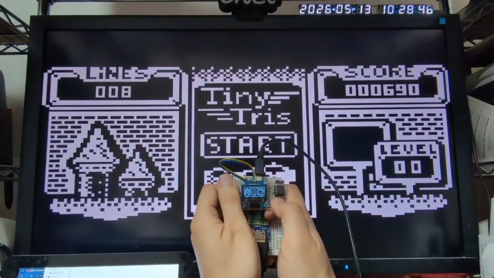
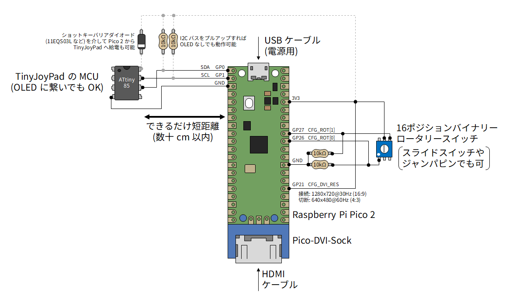
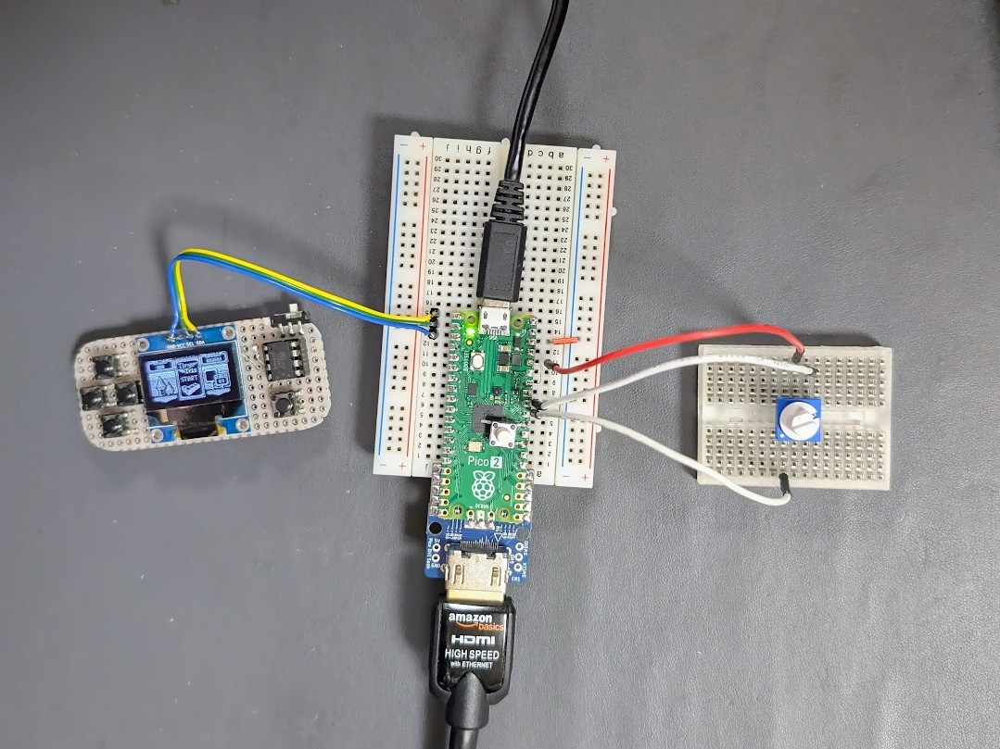

# LcdTap: TinyJoyPad や Arduboy を大画面で遊ぶ

TinyJoyPad や Arduboy など、SSD1306 ディスプレイを使った小型ゲームを
PC 用モニタやテレビなどの大画面で遊ぶ方法を紹介します。

## TinyJoyPad

[TinyJoyPad](https://www.tinyjoypad.com/tinyjoypad_attiny85) は、Daniel C 氏によって開発された携帯ゲーム機で、8 bit マイコンの ATtiny85 と SSD1306 OLED、5 つのスイッチ、スピーカーから構成されるシンプルな構成が特徴です。

## LcdTap

[LcdTap](https://github.com/shapoco/lcdtap) は、Raspberry Pi Pico2 を使って、I2C 接続や SPI 接続の LCD モジュールの表示内容を DVI で出力して大きなディスプレイにミラー表示したりキャプチャしたりできるライブラリです。

## 用意する物

- TinyJoyPad

    - スイッチサイエンスで [キット](https://www.switch-science.com/products/9824) を購入できます。
    - 簡単な回路なので [自作](https://www.google.com/search?q=tinyjoypad+%E8%87%AA%E4%BD%9C) も可能です。
    - AVR にゲームを書き込むには ISP プログラマも必要です (これが一番の鬼門かも)。

- [Raspberry Pi Pico2](https://www.switch-science.com/products/9809)
- [Pico-DVI-Sock](https://www.switch-science.com/products/7431)
- [16 ポジション バイナリーロータリースイッチ](https://akizukidenshi.com/catalog/g/g102276/)

    - 画面の回転方向を切り替えるために使用します。普通のスライドスイッチやジャンパピンで代用も可。

- [抵抗 10kΩ](https://akizukidenshi.com/catalog/g/g116103/) x2
- TypeA-MicroB USB ケーブル
- HDMI ケーブル
- 1280x720@30Hz または 640x480@60Hz の DVI-D 信号を入力可能なディスプレイ

    - PC 用モニタなら少なくともどちらかは大丈夫じゃないかと思いますが、保証はできません。

## 組み立て

Pico-DVI-Sock を Pico2 にハンダ付けし、その他の部品を下図のように接続します。

- Pico2 と TinyJoyPad の間はできるだけ短距離で配線してください。
- SDA/SCL は TinyJoyPad の OLED から引き出してもかまいません。
- Pico2 には GND 端子がいっぱいありますが、どれに繋いでもかまいません。
- Pico2 から出ている 3.3V で TinyJoyPad に給電することもできますが、その場合は TinyJoyPad の電源が Pico2 へ逆流しないよう、ショットキーバリアダイオード (例: [11EQS03L](https://akizukidenshi.com/catalog/g/g108997/)) を挿入してください。
- SDA/SCL を 10kΩ でプルアップすれば、TinyJoyPad 側の OLED を外しても動作します。
- GP21 (CFG_DVI_RES) は DVI 映像出力の解像度 (アスペクト比) を指定します。もしモニタに映らない場合はここを切り替えて Pico2 をリセット (USB ケーブルを抜き差し) してみてください。

    - 接続時: 1280x720@30Hz (16:9)
    - 切断時: 640x480@60Hz (4:3)

## ブレッドボードに組み立てた例

## Pico2 へのファームウェアの書き込み

1. [リリースページ](https://github.com/shapoco/lcdtap/releases/)からファームウェア (lcdtap_vYYYYMMDD.zip) をダウンロードします。
2. zip ファイルを展開して lcdtap_ssd1306.uf2 を取り出します。
3. Pico2 の BOOTSEL ボタンを押しながら USB ケーブルで PC に接続します (マスストレージデバイスとして認識されます)。
4. マスストレージデバイスに lcdtap_ssd1306.uf2 をコピーします。

書き込みが成功すると、Pico2 の LCD が 1 秒周期で点滅し、
コネクタから DVI-D 信号が出力されます。

## 使用方法

1. 先に Pico2 の電源を入れる。
2. TinyJoyPad の電源を入れる。
3. モニタに画像が表示されたら、ロータリースイッチで画面の向きを合わせる。

## 動作の様子

## 関連リンク

- SNS 投稿

    - [X (Twitter)](https://x.com/shapoco/status/2054587734527037561)
    - [Bluesky](https://bsky.app/profile/shapoco.net/post/3mlqnkefkxs2j)
    - [Misskey.io](https://misskey.io/notes/am7sr4tpwesl062s)