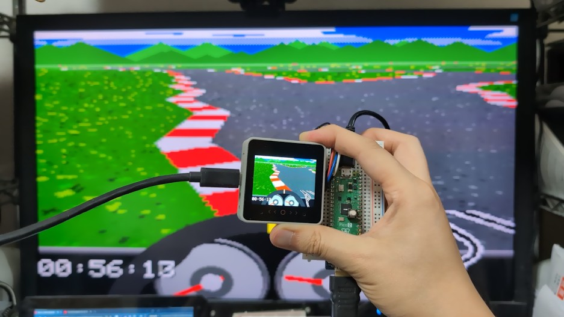
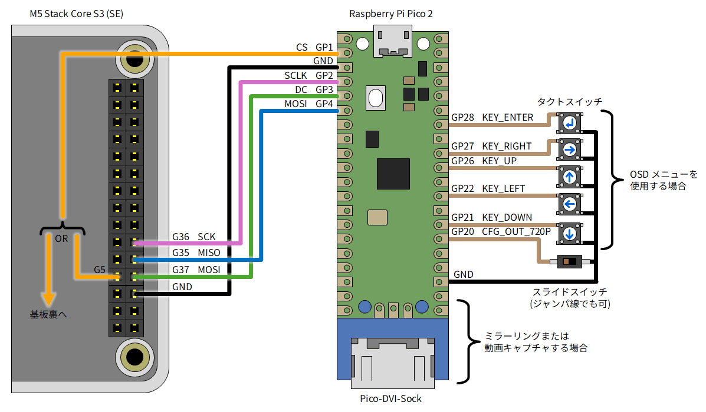
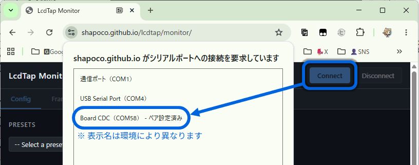
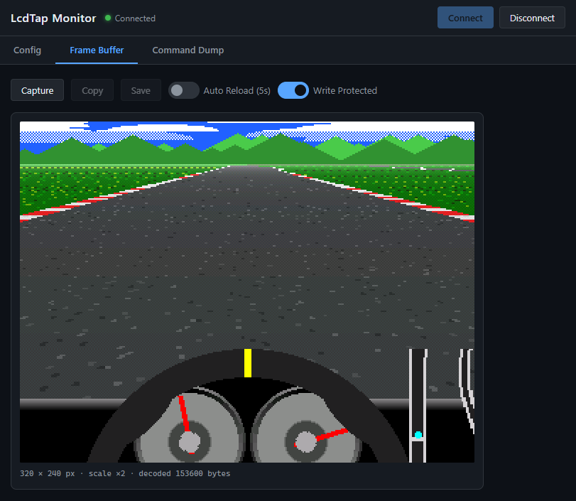

# LcdTap: M5Stack CoreS3 の画面をミラーリング/キャプチャする

「LcdTap」を使用して M5Stack CoreS3 の画面をモニターにミラーリングしたり、キャプチャする方法を紹介します。



## LcdTap

[LcdTap](https://github.com/shapoco/lcdtap) は、Raspberry Pi Pico2 を使って、I2C 接続や SPI 接続の LCD モジュールの表示内容を DVI で出力して大きなディスプレイにミラー表示したりキャプチャしたりできるツールです。

## 用意する物

- M5Stack CoreS3 (SE)
- [Raspberry Pi Pico 2](https://www.switch-science.com/products/9809) ([ピンヘッダ付き](https://www.switch-science.com/products/10257))
- USB ケーブル (TypeA-MicroB)
- モニターへのミラーリングや動画キャプチャを行う場合

    - [Pico-DVI-Sock](https://www.switch-science.com/products/7431)
    - HDMI ケーブル
    - 640x480@60Hz または 1280x720@30Hz の DVI-D 信号を入力可能なディスプレイ

- 設定に OSD メニューを使用する場合

    - [タクトスイッチ](https://www.switch-science.com/products/38) x5

- CoreS3 を改造して CS 信号を取り出す場合:

    - 六角ドライバー
    - 導線 (ビーニル線等)

- 480p / 720p 切り替え式にする場合:

    - スライドスイッチ、DIP スイッチ等

## CS 信号の引き出し

LcdTap は SPI バスの信号を見て画面の内容を再構築します。
SPI バスのうち SCLK、MOSI、DC は CoreS3 の M-Bus コネクタから引き出すことができますが、
CS 信号は基板上にしか無いので、どうにかして引き出す必要があります。

### 方法1: M5GFX の改造 (ハンダ付け不要・再コンパイル必要)

M5GFX ライブラリに手を加えてディスプレイモジュールに繋がっている CS 信号と同じものを
M-Bus コネクタの GPIO 端子に出すことができます。

Windows + Arduino IDE の場合、ソースコードは `D:\Users\(ユーザ名)\Documents\Arduino\libraries\M5GFX\src\M5GFX.cpp` にあります。

念のため M5GFX.cpp のバックアップを取った上で、`cs_control` 関数に以下の変更を加えてください。

```diff
  void cs_control(bool flg) override
  {
    lgfx::Panel_ILI9342::cs_control(flg);
      
+   // GPIO5 を CS ピンに連動させる
+   lgfx::pinMode(GPIO_NUM_5, lgfx::pin_mode_t::output);
+   if (flg) {
+     lgfx::gpio_hi(GPIO_NUM_5);
+   } else {
+     lgfx::gpio_lo(GPIO_NUM_5);
+   }
      
    // CS操作時にGPIO35の役割を切り替える (MISO or D/C);

    // FSPIQ_IN_IDX==FSPI MISO / SIG_GPIO_OUT_IDX==GPIO OUT
    // *(volatile uint32_t*)GPIO_FUNC35_OUT_SEL_CFG_REG = flg ? FSPIQ_OUT_IDX : SIG_GPIO_OUT_IDX;

    // CS HIGHの場合はGPIO出力を無効化し、MISO入力として機能させる。
    // CS LOW の場合はGPIO出力を有効化し、D/Cとして機能させる。
    *(volatile uint32_t*)( flg
                           ? GPIO_ENABLE1_W1TC_REG
                           : GPIO_ENABLE1_W1TS_REG
                         ) = 1u << (GPIO_NUM_35 & 31);
  }
```

### 方法2: CoreS3 の基板から直接 CS 信号を引き出す (ハンダ付け必要・再コンパイル不要)

> [!WARNING]
> 今回引き出す信号はディスプレイの制御信号であり、CoreS3 の無線通信機能には何ら影響を与えませんが、
> 電波法上はこの状態で Wi-Fi や Bluetooth を使用することは厳密には違法と見なされる可能性があります。
> この方法は無線機能を使用しないアプリケーションに限定することをお勧めします。

1. CoreS3 の背面のスピーカーを取り外し、スピーカーがあったスペースへ向かって基板をスライドさせて持ち上げると、基板を外すことができます。

    - 基板とディスプレイモジュールがフレキシブルケーブルで繋がっているので、傷つけないようにご注意ください。

2. M-Bus コネクタの近くに CS 信号をプルアップしている抵抗があるので、そこに導線をハンダ付けします。ブラブラしないように接着剤等で固定することをお勧めします。

    

3. 導線を基板と筐体の隙間から外へ引き出します。

## CoreS3 と Pico2 の接続

図のように接続してください。CoreS3 ではディスプレイ制御時は MISO が DC として使用されますので、CoreS3 の MISO を Pico2 の DC に接続します。

- ミラーリングや動画キャプチャを行う場合は Pico-DVI-Sock をハンダ付けします。
- CS ピンは M5GFX を改造した場合は GPIO5 に、基板から引き出した場合はそれを接続します。
- OSD メニューを使用して設定を行う場合は Pico2 の GPIO21～28 にタクトスイッチを接続します。
- 480p@60Hz / 720p@30Hz 切り替え式にする場合は GPIO20 に DIP スイッチやスライドスイッチを接続します (接続しない場合は 480p@60Hz になります)。



## Pico2 へのファームウェアの書き込み

1. [LcdTap のリリースページ](https://github.com/shapoco/lcdtap/releases) から zip ファイルをダウンロードし、展開して `lcdtap_pico2_universal.uf2` を取り出します。
2. Pico2 の BOOTSEL ボタンを押しながら USB ケーブルで PC に接続します (マスストレージデバイスとして認識されます)。
3. マスストレージデバイスに `lcdtap_pico2_universal.uf2` をコピーします。

書き込みが成功すると、Pico2 の LCD が点滅します。

## 設定

CoreS3 の電源を入れる前に設定を行って下さい。設定は Pico2 のオンボード Flash ROM に保存されるので、初回だけで OK です。

### ブラウザを使用する場合 (PC 必要、タクトスイッチ不要)

1. ファームウェアを書き込んだ Pico2 を PC に接続します (シリアルポートとして認識されます)。
2. Web Serial API に対応したブラウザ (Chrome、Edge、Firefox 等) で [LcdTap Monitor](https://shapoco.github.io/lcdtap/monitor/) にアクセスします。
3. Connect ボタンを押してシリアルポートを選択します。

    

4. Config タブで以下のように設定します。

    |Parameter|Value|
    |:---------|:-----|
    |Controller Type|ST7789|
    |Interface Type|4-Line SPI|
    |LCD Width|320 px|
    |LCD Height|240 px|
    |Inverted|On|
    |Swap R/B|On|
    |Output Rotation|0 deg|
    |Force Power On|Off|

5. Apply を押します。

### OSD メニューを使用する場合 (PC 不要、タクトスイッチ必要)

1. Pico2 を USB ケーブルで充電器や PC に接続します。
2. Pico-DVI-Sock とモニターを HDMI ケーブルで接続します。
3. Enter キーを押すと OSD メニューが表示されるので、左右上下キーを使って以下のように設定してください。

    |Parameter|Value|
    |:---------|:-----|
    |Interface|4Line SPI|
    |Controller Type|ST7789|
    |LCD Width|320 px|
    |LCD Height|240 px|
    |Inversion|On|
    |Swap Red/Blue|On|
    |Output Rotation|0 deg|
    |Force Power On|Off|

4. Apply を選択して Enter キーを押します。

## モニターへのミラーリングや動画キャプチャ

セットアップ完了後、CoreS3 の電源を入れると CoreS3 の画面がモニターに表示されます。
DVI-D 入力に対応した HDMI キャプチャを使用して録画することもできます。


## ブラウザからの静止画キャプチャ

LcdTap Monitor の Frame Buffer タブで Capture ボタンを押すことで、
フレームバッファの内容を読み出すことができます。
画像が崩れる場合は「Write Protected」スイッチを切り替えてみてください。



## 関連リンク

- 関連記事

    - [LcdTap: TinyJoyPad や Arduboy を大画面で遊ぶ](../0514-tinyjoypad-with-large-monitor/article.md)

- SNS 投稿

    - [X (Twitter)](https://x.com/shapoco/status/2058483284070592621)
    - [Bluesky](https://bsky.app/profile/shapoco.net/post/3mmlopjnyp22q)
    - [Misskey.io](https://misskey.io/notes/amn5rqn77flm08gy)