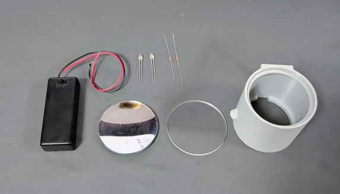
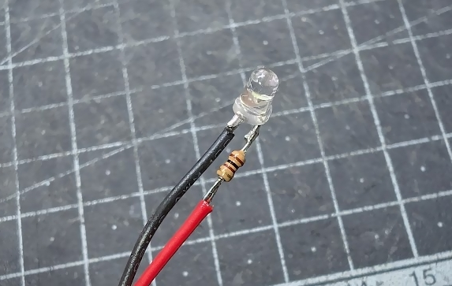
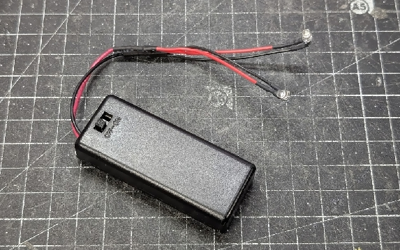
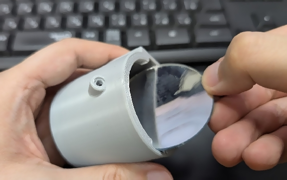
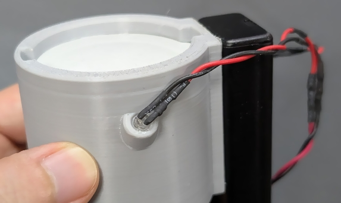

# チップ LED 手ハンダ用極性スコープ

極性マークが底面にしかついていないチップ LED を上から見下ろしながら正しい向きでつまめるようにするツールを作りました。

## 構造

アクリルのステージの上にチップ LED を置くと底面の極性マークが照明用 LED によって照らされ、上からステージを覗き込むと底部の凹面鏡に極性マークが反射して大きく見えるようになっています。

ステージは凹面鏡の焦点距離より低い高さに設置されているので、像の向きは普通の鏡と同じです (左右が逆に見えたりはしません)。

照明用の LED は無くても一応見えはしますが、照らした方が圧倒的に見やすいです。

## 部品

- [3D プリントされたボディ](https://github.com/shapoco/jigs/tree/main/electronics/smd-led-orientation-scope)

    - モデルは CadQuery で作成しており、寸法はパラメタライズされているので、使用するステージや鏡に合わせて調整することができます。

- ステージ: [光(Hikari) アクリル板 50丸×2mm KA-500 透明](https://www.amazon.co.jp/dp/B00E84KOKU/)
- 凹面鏡: [PATIKIL 光学レンズ1セット 5個 両凸レンズ 両凹レンズ プリズムレンズ 凸面鏡 凹面鏡 物理実験教育用 クリア](https://www.amazon.co.jp/dp/B0CPPS94G9/)

    - 今回はこのセットに入っていた凹面鏡を使用しました。今回の用途では特に問題になりませんが、鏡の品質はあまり良くないようです (汚れていたり、外周部の歪みが大きかったり)。

- 照明用 LED: [OSW54K3131A](https://akizukidenshi.com/catalog/g/g106410/) x2 個
- 抵抗: [1/6W100Ω](https://akizukidenshi.com/catalog/g/g116101/) x2 個
- 電池ボックス: [電池ボックス 単4×2本 リード線・フタ・スイッチ付](https://akizukidenshi.com/catalog/g/g100348/)
- 乾電池 単4 x2
- 熱収縮チューブ

## 組み立て

1. LED と抵抗を直列に接続したものを並列接続して電池ボックスに接続します。接続部は熱収縮チューブで絶縁します。

    
    
    

2. 鏡の表面をよく清掃し、ボディの底部から挿入して接着剤で固定します。

    

3. LED をボディの側面の穴に挿入して接着剤で固定します。

    

4. ボディの側面の平面部分に電池ボックスを両面テープ等で固定します。
5. ステージの汚れを拭き取り、ホコリ等が入らないように注意しながらボディの上部にセットします。緩ければ接着剤で固定してください。

## 動画

## 関連リンク

- SNS 投稿

    - [X (Twitter)](https://x.com/shapoco/status/2064319720736895288)
    - [Misskey.io](https://misskey.io/notes/ana64yjaxw39002e)
    - [Bluesky](https://bsky.app/profile/shapoco.net/post/3mnu6i3m4dc2u)

