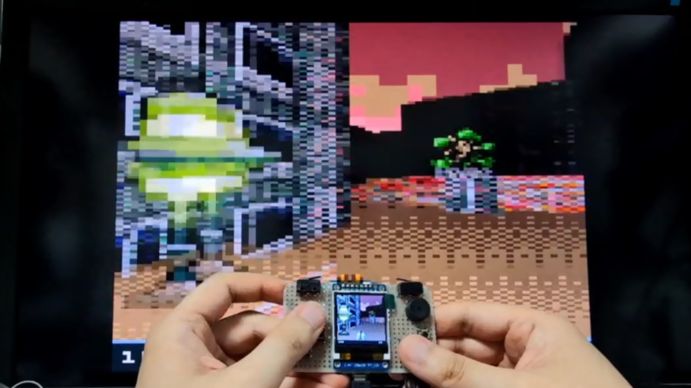
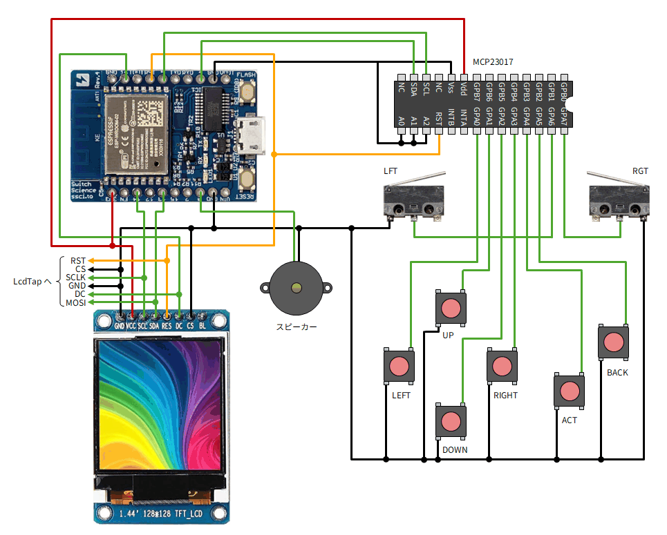
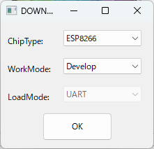
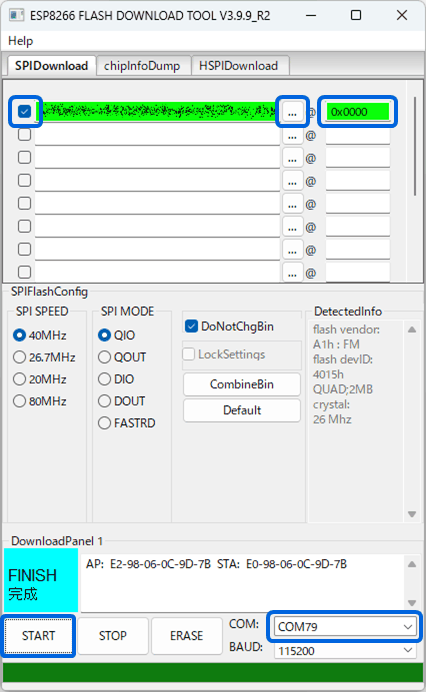
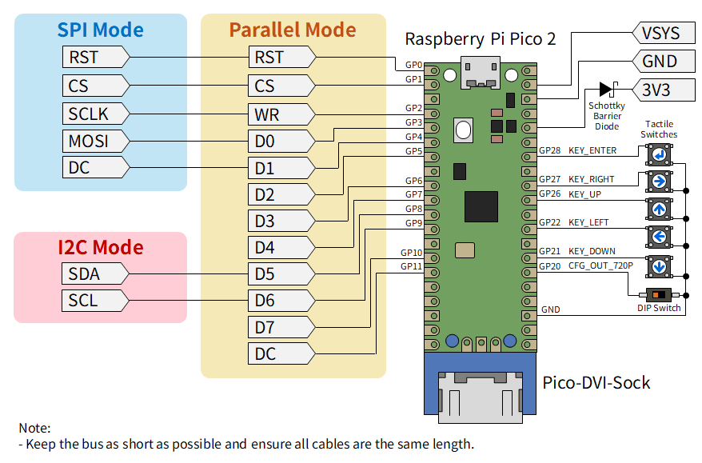

# LcdTap: ESPboy を大きなモニターで遊ぶ

「LcdTap」を使用して ESPboy の画面をモニターにミラーリングしたり、キャプチャする方法を紹介します。

## ESPboy とは

[ESPboy](https://www.espboy.com/) は ESP8266 をコアとしたオープンソースの携帯ゲーム機です。
128x128 ピクセルのカラー液晶、8 つの入力ボタン、スピーカー、RGB LED を備えています。
WiFi 機能を利用してインターネット経由でゲームをダウンロードすることもできます。

## LcdTap とは

[LcdTap](https://shapoco.github.io/lcdtap/) は、Raspberry Pi Pico2 を使って、I2C 接続や SPI 接続の LCD モジュールの表示内容を DVI で出力して大きなディスプレイにミラー表示したりキャプチャしたりできるツールです。

## ESPboy の製作

今回はスイッチサイエンスのボードをコアとして、ESPboy を製作しました。

> [!CAUTION]
> ESPboy には本来 4MB 以上の Flash ROM を搭載した ESP8266 ボードが必要です。
> 今回使用した ESP-WROOM-02 は 4MB 品と 2MB 品が混在しているそうです (ほとんどは 2MB 品？)。
> 2MB 品の場合、恐らく ESPboy 公式の書き込みツールは使用できません。
>
> 4MB 品の ESP8266 ボードも流通していますが、そのほとんど (全部？) は技適がありません。
> それらを日本国内で使用することには法的な問題が伴います。
>
> 今回は LcdTap を使用したミラーリング/キャプチャを実現することが目的なので、
> とりあえず Espressif の
> [Flash Download Tool](https://docs.espressif.com/projects/esp-test-tools/en/latest/esp32/production_stage/tools/flash_download_tool.html)
> を使用して 2MB 品の ESP-WROOM-02 に無理矢理書き込むことで動作させています。

### 部品

[公式サイト](https://www.espboy.com/) の「Breadboard DIY」のところに回路図があります。
圧電スピーカーと RGB LED は無くても動きます。今回は LED は省略しました。

- [ESPr Developer (ESP-WROOM-02開発ボード)](https://www.switch-science.com/products/2500)
- [1.44インチTFT LCD 65Kカラー128×128](https://www.amazon.co.jp/dp/B07QC62SJX/)
- [16bit I2C I/Oエキスパンダー MCP23017](https://akizukidenshi.com/catalog/g/g109486/)
- [タクトスイッチ](https://www.switch-science.com/products/2834) x6
- レバー付きマイクロスイッチ x2 (今回は近所の部品屋で買った [D2F-L-D](https://www.monotaro.com/p/3903/6304/) を使用)
- [圧電スピーカー](https://akizukidenshi.com/catalog/c/cpiezospe/)
- 他、ユニバーサル基板、線材等

### 配線

以下のように配線します。

### ゲームの書き込み (2MB 品の ESP-WROOM-02 の場合)

既に ESPboy をお持ちの方や 4MB 品の ESP-WROOM-02 を使用する場合は、
通常通り [WebAppStore](https://espboy.m1cr0lab.com/demo/appstore/) や WiFiAppStore で
ゲームを書き込んでください。

2MB 品の ESP-WROOM-02 の場合、ESPboy 公式の書き込みツールは使用できませんので、
Espressif の Flash Download Tool を使用してゲームを書き込みます。

1. [Flash Download Tool](https://docs.espressif.com/projects/esp-test-tools/en/latest/esp32/production_stage/tools/flash_download_tool.html) をダウンロードしてインストールします。
2. [WiFi App Navigator](https://espboy-edu.github.io/WiFiAppStore_Navigator/) からゲームのバイナリ (*.bin) をダウンロードしておきます。
3. ESPboy を USB ケーブルで PC に接続します (COM ポートとして認識されます)。
4. Flash Download Tool を起動し、ChipType に ESP8266 を選択して OK をクリックします。

    

5. 下部のプルダウンメニューで ESPboy の COM ポート番号を指定します。
6. 上部のバイナリファイルのリストの「…」をクリックしてゲームのバイナリを選択し、チェックボックスにチェックします。
7. 同じ行の @ の右に書き込み先のアドレスとして「0x0000」と入力します。
8. 「START」をクリックして書き込みを開始します。

    

書き込み完了後に ESPboy をリセットすると、ゲームが起動するはずです。

## LcdTap でミラーリング/キャプチャする

LcdTap を使用すると、ESPboy を PC 用の大きなモニターにミラーリングして遊んだり、
HDMI キャプチャを使用してキャプチャしたりできます。

### LcdTap-Pico2 Universal の部品

- [Raspberry Pi Pico2](https://www.switch-science.com/products/9809)
- [Pico-DVI-Sock](https://www.switch-science.com/products/7431)
- [タクトスイッチ](https://www.switch-science.com/products/2834) x5
- スライドスイッチ、DIPスイッチ等 x1
- 他、ユニバーサル基板、線材等

### LcdTap-Pico2 Universal の製作

詳細は [公式サイト](https://shapoco.github.io/lcdtap/) をご覧下さい。
今回使用するインタフェースは SPI Mode の部分だけです。

### ESPboy との接続

ESPboy の LCD 制御信号と LcdTap の SPI インタフェースを次のような対応で接続します。

|ESPboy|LcdTap|
|:--|:--|
|GND|GND, CS|
|RESET|RST|
|SCLK (14)|SCLK|
|MOSI (13)|MOSI|
|DC (16)|DC|

### コンフィグレーション

ESPboy で使用される LCD は 128x128 ピクセルですが、その左上の論理的な座標は (X, Y) = (0, 0) ではなく (6, 5) のオフセットを持ちます。そして画面は 180° 回転しており、赤と青の色が入れ替わっています。

LcdTap-Pico2 Universal のファームウェア v202606261033 以降には ESPboy 用のプリセットが
用意されていますのでそれを使用します。

1. ESPboy、LcdTap、モニターを接続した状態で LcdTap を起動します。
2. Enter キーを押して OSD メニューを開き、Load Preset を選んで Enter キーを押します。
3. 上下キーで ESPboy を選択して Enter キーを押します。
4. Enter キーを押して設定を適用 (Apply) します。
5. ESPboy を起動 (リセット) します。

私の環境だけかもしれませんが、LcdTap を接続した状態で ESPboy を起動すると
画面が正しく初期化されないことが多々ありました。
その場合は ESPboy をリセットしてみてください。

## 動作の様子

## 関連リンク

- 関連記事

    - [LcdTap: TinyJoyPad や Arduboy を大画面で遊ぶ](../0514-tinyjoypad-with-large-monitor/article.md)
    - [LcdTap: M5Stack CoreS3 の画面をミラーリング/キャプチャする](../0520-m5stack-with-large-monitor/article.md)
    - [LcdTap: Tab5 をでっかい SSD1306 として使う](../0717-tab5-as-ssd1306/article.md)

- SNS 投稿

    - [X (Twitter)](https://x.com/shapoco/status/2070037620688900595)
    - [Bluesky](https://bsky.app/profile/shapoco.net/post/3mp3ugygr4k2k)
    - [Misskey.io](https://misskey.io/notes/anwpz6v8wmrv05ka)
