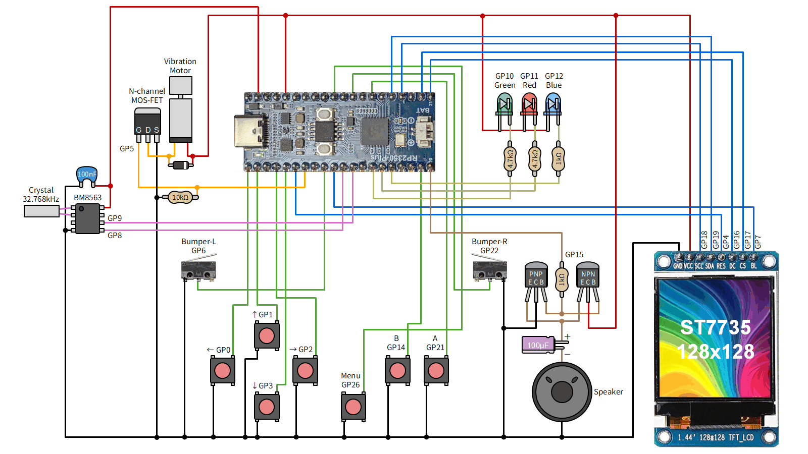
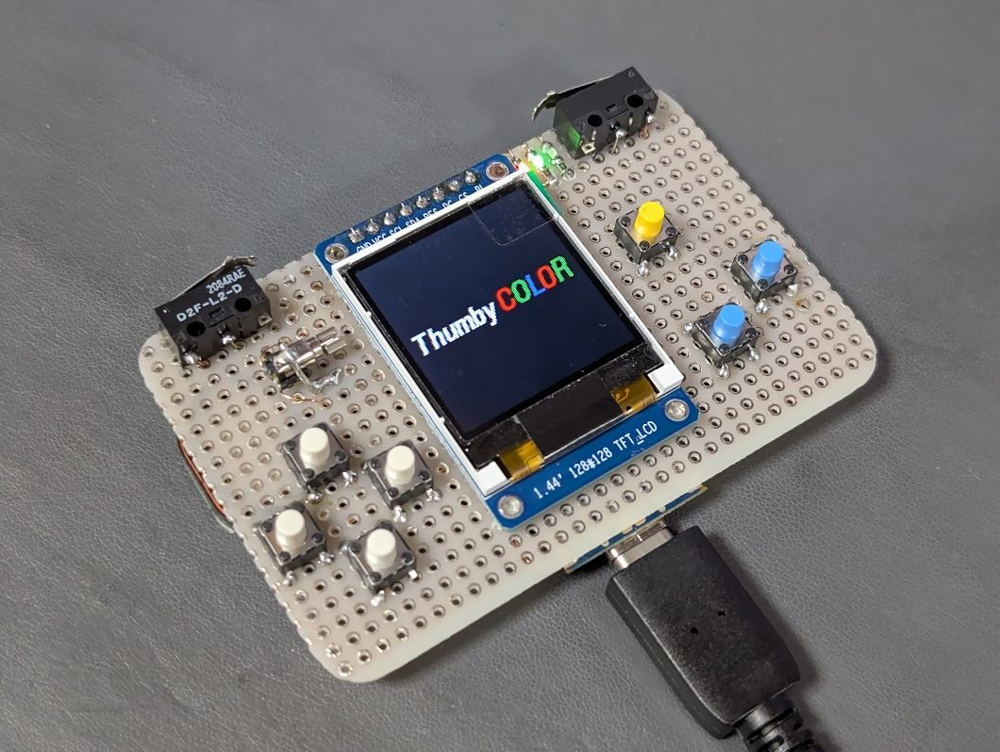
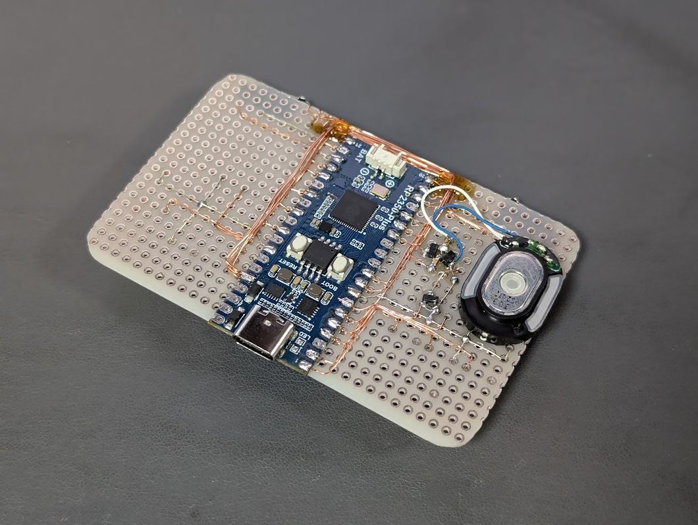
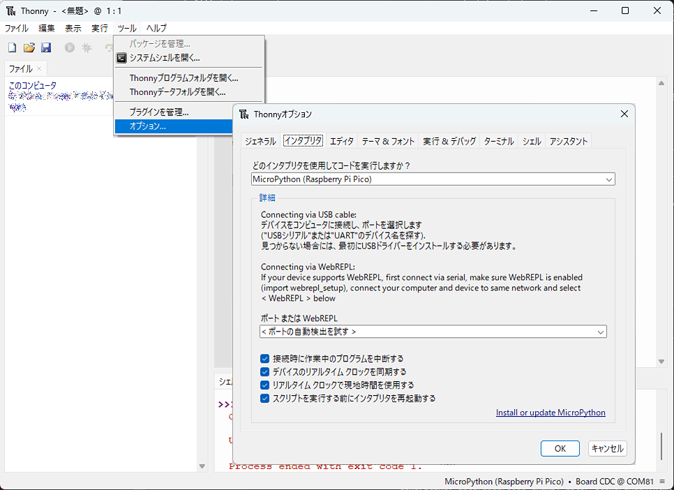
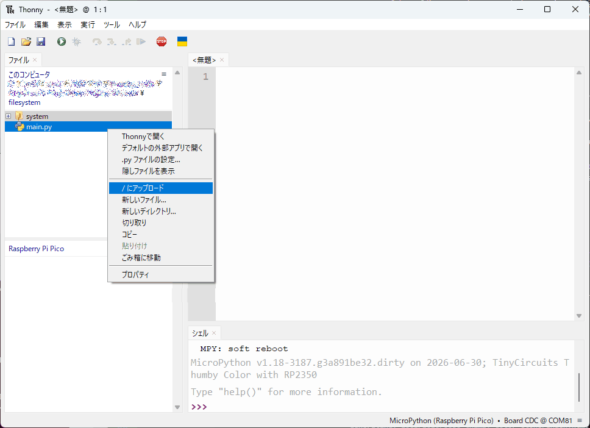
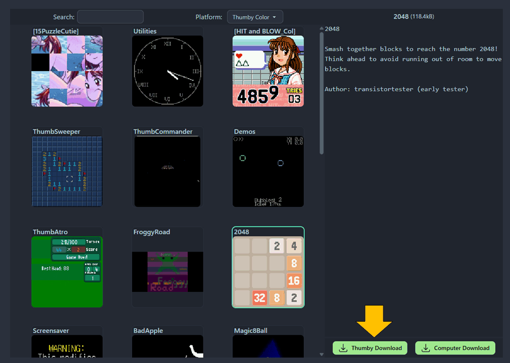

# Thumby Color のクローンを Waveshare RP2350-Plus で作る

Waveshare RP2350-Plus と ST7735 液晶を使って Thumby Color のクローンを作ってみました。

## Thumby Color とは

[Thumby Color](https://color.thumby.us/) は、TinyCircuits 社が販売している小型ゲーム機です。
親指の先ほどの極小のゲーム機 [Thumby](https://thumby.us/) の後継で、
RP2350 と 0.85 インチカラー液晶 (GC9107)、スピーカー、振動モーター、RGB LED、RTC を搭載しています。

## ポチったけど…

[公式のショップ](https://tinycircuits.com/products/thumby-color) で購入できるのですが、
USPS による日本への配送はかなり時間がかかるようです。
[LcdTap](https://shapoco.github.io/lcdtap/) が使えるかどうか確認するために
1 ヶ月くらい前に注文したのですが、6/30 現在まだ輸送中になっています。

大きさと搭載デバイスからしてそんなに大した回路ではなかろいうということで、
クローンを作ってみることにしました。

## 検討

クローンの製作に使用する部品とファームウェアの変更を検討します。「なんでもいいから作り方を教えてくれ」という人は「組み立て」に進んでください。

### ピン割り当て

回路図は探しても見つかりませんでしたが、ファームウェアのソースコードは
[GitHub に公開](https://github.com/TinyCircuits/TinyCircuits-Tiny-Game-Engine) されており、
[ヘッダファイル](https://github.com/TinyCircuits/TinyCircuits-Tiny-Game-Engine/blob/main/src/io/engine_io_rp3.h) やその他のソースからピン割り当てを推定することができます。

オリジナルのピン割り当ては次の通りです。

|RP2350|接続先|負論理|Pico2 との衝突|
|:--:|:--|:--:|:--:|
|GP0|←|yes||
|GP1|↑|yes||
|GP2|→|yes||
|GP3|↓|yes||
|GP4|LCD RST|yes||
|GP5|振動モーター (PWM2 B)|||
|GP6|左バンパー|yes||
|GP7|LCD バックライト (PIO)|||
|GP8|RTC SDA|||
|GP9|RTC SCL|||
|GP10|RGB LED 緑 (PWM5 A)|yes||
|GP11|RGB LED 赤 (PWM5 B)|yes||
|GP12|RGB LED 青 (PWM6 A)|yes||
|GP13|(未使用)|||
|GP14|(未使用)|||
|GP15|(未使用)|||
|GP16|LCD DC|||
|GP17|LCD CS|yes||
|GP18|LCD SCK|||
|GP19|LCD MOSI|||
|GP20|オーディオイネーブル|||
|GP21|A ボタン|yes||
|GP22|右バンパー|yes||
|GP23|オーディオ PWM (PWM3 B)||yes|
|GP24|充電ステータス|?|yes|
|GP25|B ボタン|yes|yes|
|GP26|メニューボタン|yes||
|GP27|(未使用)|||
|GP28|(未使用)|||
|GP29|バッテリーモニタリング ADC||?|

ヘッダファイルでは GP7 は PWM と書かれていますが、
PWM3 ペリフェラルが GP23 と衝突するため、ここだけ PIO で実装されているようです。

Raspberry Pi Pico 2 やその互換ボードでは GP23～GP25 が別の用途で
使用されているため、Pico2 でクローンを作るためには
どうにかして衝突を回避する必要があります。

パターンカットとジャンパ線で対処できなくもないのですが、
真似できる人がかなり限られそうなので、今回はファームウェアを変更して
次のように割り当てを変えることにしました。

|信号|変更前|変更後|
|:--|:--|:--|
|オーディオ PWM|GP23 (PWM3 B)|GP15 (PWM7 B)|
|充電ステータス|GP24|GP13|
|B ボタン|GP25|GP14|

ヘッダファイルは次のように変更します。

```diff
- #define GPIO_BUTTON_B               25
- #define GPIO_CHARGE_STAT            24
- #define AUDIO_PWM_PIN 23                // PWM3 B
+ #define GPIO_BUTTON_B               14
+ #define GPIO_CHARGE_STAT            13
+ #define AUDIO_PWM_PIN 15                // PWM7 B
```

この変更により PWM7 B がオーディオのために占有されますが、
元々 PWM7 はバッテリーの監視タイミングの生成のために使用されていたため
それを PWM1 に変更しました。

```diff
- #define PWM_BATTERY_MONITOR_TIMER_SLICE_NUM 7
+ #define PWM_BATTERY_MONITOR_TIMER_SLICE_NUM 1
```

### Flash 容量

Thumby Color は 16 MB の Flash ROM を搭載しています。
ファームウェアもこの容量を前提に実装されているため、
16 MB 以上の Flash ROM を搭載したボードが必要です。

Raspberry Pi Pico 2 は 4 MB しか搭載していないので使用できません。
16 MB の Flash ROM を搭載した
[Waveshare RP2350-Plus](https://www.switch-science.com/products/10130)
を使うことにします。

### 液晶

液晶は GC9107 なので
[スイッチサイエンスにある液晶](https://www.switch-science.com/products/9438)
がそのまま使えそうですが、これを使って作っても
「小さい画面の割に図体のデカい劣化版」ができてしまうだけなので、
[1.44 インチの ST7735 液晶](https://www.amazon.co.jp/dp/B07QC62SJX/) を
使うことにしました。

これらは描画系のコマンドはほとんど同じですが、
ピクセル割り当てが少しズレているので
[ディスプレイドライバ](https://github.com/TinyCircuits/TinyCircuits-Tiny-Game-Engine/blob/main/src/display/engine_display_driver_rp2_gc9107.c)
を修正して対応します。

```diff
- const uint16_t WINDOW_ADDR_X1 = 0;
- const uint16_t WINDOW_ADDR_X2 = SCREEN_WIDTH_MINUS_1;
- const uint16_t WINDOW_ADDR_Y1 = 0;
- const uint16_t WINDOW_ADDR_Y2 = SCREEN_HEIGHT_MINUS_1;
+ const uint16_t WINDOW_ADDR_X1 = 2;
+ const uint16_t WINDOW_ADDR_X2 = SCREEN_WIDTH_MINUS_1 + 2;
+ const uint16_t WINDOW_ADDR_Y1 = 3;
+ const uint16_t WINDOW_ADDR_Y2 = SCREEN_HEIGHT_MINUS_1 + 3;
```

また、画像の表示方向を 180° 回転させ、赤と青のチャネルを入れ替えます。

```diff
- gc9107_write_cmd(0x36, (uint8_t[]){ 0x00 }, 1);
+ gc9107_write_cmd(0x36, (uint8_t[]){ 0xC8 }, 1);
```

### RTC

Thumby Color は RTC を搭載していますが、無くても動くようなので今回は省略しました。

## 組み立て

### 部品

- [Waveshare RP2350-Plus](https://www.switch-science.com/products/10130)
- [1.44 インチ ST7735 液晶](https://www.amazon.co.jp/dp/B07QC62SJX/)
- RTC BM8563: 今回は使用しませんでした。[スイッチサイエンスにあるモジュール](https://www.switch-science.com/products/7170) などが使えそうです。
- 7x [適当なタクトスイッチ](https://akizukidenshi.com/catalog/goods/search.aspx?search=x&keyword=%E3%82%BF%E3%82%AF%E3%83%88%E3%82%B9%E3%82%A4%E3%83%83%E3%83%81&search=search)
- 2x レバー付きマイクロスイッチ (今回は近所の部品屋で買った [D2F-L-D](https://www.monotaro.com/p/3903/6304/) を使用)
- [ダイナミックスピーカー](https://akizukidenshi.com/catalog/g/g112495/)
- [適当な LED (赤、緑、青)](https://akizukidenshi.com/catalog/c/cled/)
- [適当な振動モーター](https://akizukidenshi.com/catalog/g/g106784/)
- 適当な Nch MOS-FET (今回は [IRLML6344TRPBFTR](https://akizukidenshi.com/catalog/g/g106049/) を使用)
- 適当な NPN/PNP トランジスタ (今回は [2SC2712-GR](https://akizukidenshi.com/catalog/g/g100761/) と [2SA1162-GR](https://akizukidenshi.com/catalog/g/g102702/) を使用)
- [適当なスイッチングダイオード](https://akizukidenshi.com/catalog/c/cswdiode/)
- [抵抗](https://akizukidenshi.com/catalog/c/cregister/)

    - 2x 1kΩ
    - 2x 4.7kΩ
    - 1x 10kΩ

- [コンデンサ](https://akizukidenshi.com/catalog/c/ccapacitr/)

    - 1x 電解コンデンサ 100uF
    - 1x セラミックコンデンサ 100nF (0.1uF)

- その他、ユニバーサル基板、線材等

### 回路

下図のように接続します。前述の通り、今回は RTC は省略しています。
部品のピンアサインは使用する部品に合わせて読み替えてください。







### ファームウェアのビルド (Ubuntu または WSL2)

[公式のインストラクション](https://github.com/TinyCircuits/TinyCircuits-Tiny-Game-Engine/tree/main#building-on-linux-for-rp2350) をベースに
ビルドの手順をスクリプト化しました。Ubuntu または WSL2 上で実行してください。

```bash
#!/bin/bash

set -eux

sudo apt update
sudo apt install git python3 cmake gcc-arm-none-eabi libnewlib-arm-none-eabi build-essential g++ libstdc++-arm-none-eabi-newlib

if [ ! -e mp-thumby ]; then
  git clone https://github.com/TinyCircuits/micropython.git mp-thumby
fi

pushd mp-thumby
  set +e
  git checkout engine
  git submodule update --init --recursive
  set -e
  pushd mpy-cross
    make -j8
  popd
  pushd ports/rp2
    make submodules
    make clean
  popd
  pushd TinyCircuits-Tiny-Game-Engine
    SRC_FILE=src/display/engine_display_driver_rp2_gc9107.c
    git reset ${SRC_FILE}
    git checkout ${SRC_FILE}
    sed -i 's/WINDOW_ADDR_X1\s*=\s*0;/WINDOW_ADDR_X1 = 2;/g' ${SRC_FILE}
    sed -i 's/WINDOW_ADDR_X2\s*=\s*SCREEN_WIDTH_MINUS_1;/WINDOW_ADDR_X2 = SCREEN_WIDTH_MINUS_1 + 2;/g' ${SRC_FILE}
    sed -i 's/WINDOW_ADDR_Y1\s*=\s*0;/WINDOW_ADDR_Y1 = 3;/g' ${SRC_FILE}
    sed -i 's/WINDOW_ADDR_Y2\s*=\s*SCREEN_HEIGHT_MINUS_1;/WINDOW_ADDR_Y2 = SCREEN_HEIGHT_MINUS_1 + 3;/g' ${SRC_FILE}
    sed -i 's/gc9107_write_cmd(0x36,\s*(uint8_t\[\]){\s*0x00\s*},\s*1);/gc9107_write_cmd(0x36, (uint8_t[]){ 0xC8 }, 1);/g' ${SRC_FILE}
    SRC_FILE=src/io/engine_io_rp3.h
    git reset ${SRC_FILE}
    git checkout ${SRC_FILE}
    sed -i 's/#define\s*GPIO_BUTTON_B\s*25/#define GPIO_BUTTON_B 14/g' ${SRC_FILE}
    sed -i 's/#define\s*GPIO_CHARGE_STAT\s*24/#define GPIO_CHARGE_STAT 13/g' ${SRC_FILE}
    sed -i 's/#define\s*AUDIO_PWM_PIN\s*23/#define AUDIO_PWM_PIN 15/g' ${SRC_FILE}
    sed -i 's/#define\s*PWM_BATTERY_MONITOR_TIMER_SLICE_NUM\s*7/#define PWM_BATTERY_MONITOR_TIMER_SLICE_NUM 1/g' ${SRC_FILE}
    python3 build_and_upload.py no_upload
  popd
popd

cp -f mp-thumby/ports/rp2/build-THUMBY_COLOR/firmware_*.uf2 ./firmware_st7735.uf2

rm -rf ./filesystem
cp -r mp-thumby/TinyCircuits-Tiny-Game-Engine/filesystem .
```

実行すると、カレントディレクトリに以下のファイルが作成されます。

- `firmware_st7735.uf2`: ファームウェア
- `filesystem`: システムファイル

### Thonny のインストール

「システムファイル」の転送に「Thonny」が必要なのでインストールしておきます。

1. [Thonny](https://thonny.org/) をインストールします。
2. Thonny を起動し、メニューの「ツール」→「オプション」→「インタプリタ」で「Raspberry Pi Pico」を選択します。

    

### ファームウェアと「システムファイル」の書き込み

1. RP2350-Plus の BOOT ボタンを押しながら USB ケーブルで PC に接続します (USB ドライブとして認識されます)。
2. `firmware_st7735.uf2` を USB ドライブにコピーします (RP2350-Plus がシリアルポートとして認識されます)。
3. Thonny を起動し、「ファイル」ペインでファームウェアビルド時にできた「filesystem」フォルダを開きます。
4. ツールバーの STOP ボタンを押すと、左下に「Raspberry Pi Pico」ペインが現れます。
5. Shift キーを押しながらファイルペインから「system」フォルダと「main.py」を選択して、右クリック →「/ にアップロード」します。

    

6. RP2350-Plus をリセットして、Thumby Color のロゴが表示されれば成功です (まだゲームを入れていない状態ではそのあとすぐに「Something went wrong」のエラーになりますが、異常ではありません)。

### ゲームの書き込み

[公式のサイト](https://color.thumby.us/code/arcade/) から Web Serial を通じてゲームを書き込むことができます (Chrome や Edge など Web Serial 対応ブラウザが必要です)。



ただ、本家 Thumby Color でもそうなのか、環境依存なのか分かりませんが、
容量の大きなゲームはブラウザからの書き込みがしばしば失敗するようです。
Computer Download ボタンをクリックしてゲームを PC に保存し、
Thonny を使って転送するとうまくいきます。

RP2350-Plus をリセットすると、メニューにゲームが表示されます。

## 動作の様子


## 関連リンク

- SNS 投稿

    - [X (Twitter)](https://x.com/shapoco/status/2071839004086177887)
    - [Bluesky](https://bsky.app/profile/shapoco.net/post/3mpieptbpfc22)
    - [Misskey.io](https://misskey.io/notes/ao3totsotdt40b1c)
