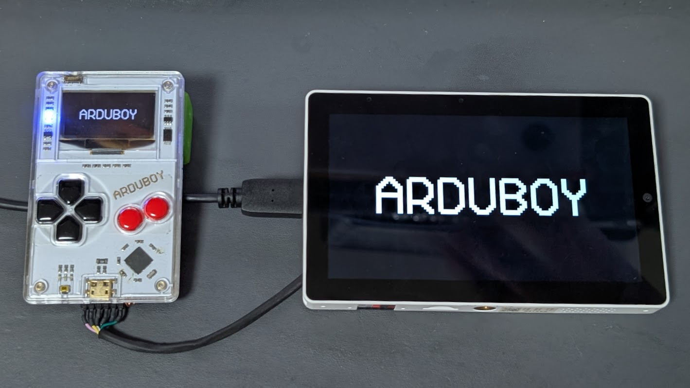
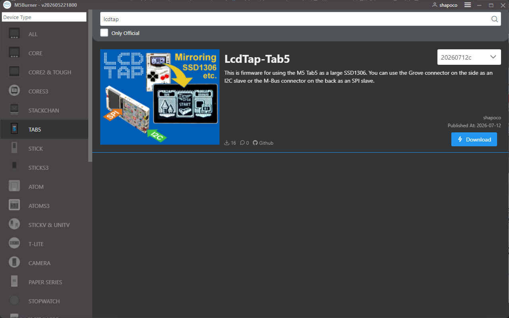
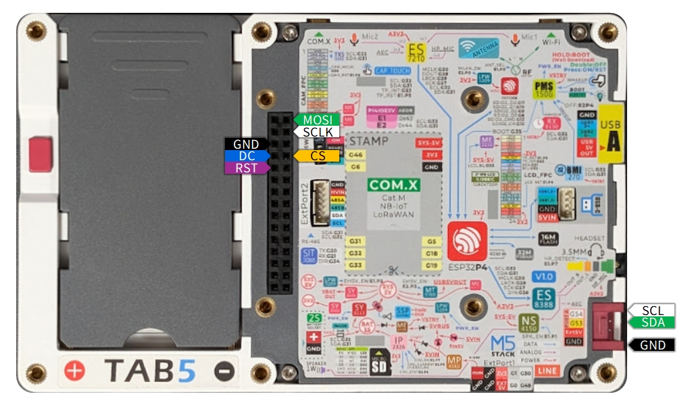

# LcdTap: Tab5 をでっかい SSD1306 として使う

[LcdTap](https://shapoco.github.io/lcdtap/) を M5 Tab5 に組み込んで
Tab5 を巨大な SSD1306 として使えるようにしてみました。

## LcdTap とは

[LcdTap](https://shapoco.github.io/lcdtap/) は、
SSD1306、ST7789、ILI9342 などの LCD コントローラや OLED コントローラの動作を
エミュレーションして、大きなディスプレイにミラーリングしたり、
キャプチャしたりできるようにするライブラリです。

## ファームウェア

ファームウェアは [M5Burner](https://docs.m5stack.com/ja/uiflow/m5burner/intro)
でダウンロード・書き込みできます。

ソースコードは
[GitHub リポジトリ](https://github.com/shapoco/lcdtap/tree/main/example/m5tab5)
にあります。

## ピンアサイン

I2C インタフェースと 4-Line SPI に対応しています。

| Signal | GPIO | コネクタ | 備考 |
|:---|---|---|:---|
| SPI SCK | G17 | M-Bus ||
| SPI MOSI | G16 | M-Bus ||
| SPI D/C | G18 | M-Bus | |
| SPI CS | G45 | M-Bus | 負論理・内部プルアップ |
| RST | G19 | M-Bus | 負論理・内部プルアップ・SPI/I2C 共用 |
| (reserved) | G52 | M-Bus | 接続禁止 |
| (reserved) | G51 | M-Bus | 接続禁止 |
| I2C SDA | G53 | Grove | 外部プルアップ推奨 |
| I2C SCL | G54 | Grove | 外部プルアップ推奨 |

## インタフェースの切り替え

初回起動時は I2C インタフェースが選択されています。インタフェースを切り替えるには次のようにします。

1. Tab5 の画面をタップしてキーパッドを表示します。
2. Enter キーのアイコン (↵) をタップして OSD メニューを表示します。
3. 上下キーで「Interface」を選択して「I2C」または「4-Line SPI」を選択します (8bit-Parallel と 3-Line SPI は未対応です)。
4. 「Apply」を選択して Enter キーをタップします。

設定は Tab5 本体に保存されます。

## SSD1306 以外のエミュレーション

OSD メニューの「Presets」から SSD1306 以外のコントローラも選択できますが、
Tab5 での動作は不安定なものが多かったです。

## 関連リンク

- 関連記事

    - [LcdTap: TinyJoyPad や Arduboy を大画面で遊ぶ](../0514-tinyjoypad-with-large-monitor/article.md)
    - [LcdTap: M5Stack CoreS3 の画面をミラーリング/キャプチャする](../0520-m5stack-with-large-monitor/article.md)
    - [LcdTap: ESPboy を大きなモニターで遊ぶ](../0626-espboy-with-large-monitor/article.md)
    
- SNS 投稿

    - [X (Twitter)](https://x.com/shapoco/status/2078098084610109602)
    - [Bluesky](https://bsky.app/profile/shapoco.net/post/3mqtroporkk2f)
    - [Misskey.io](https://misskey.io/notes/aoshu5rkc1te08a7)
