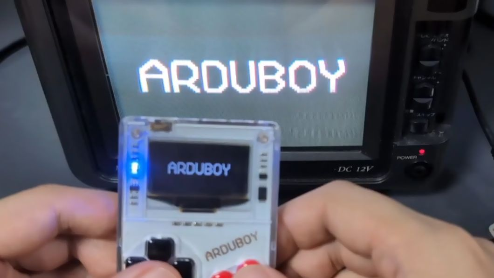
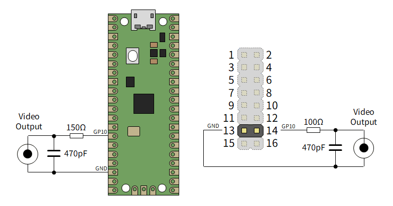
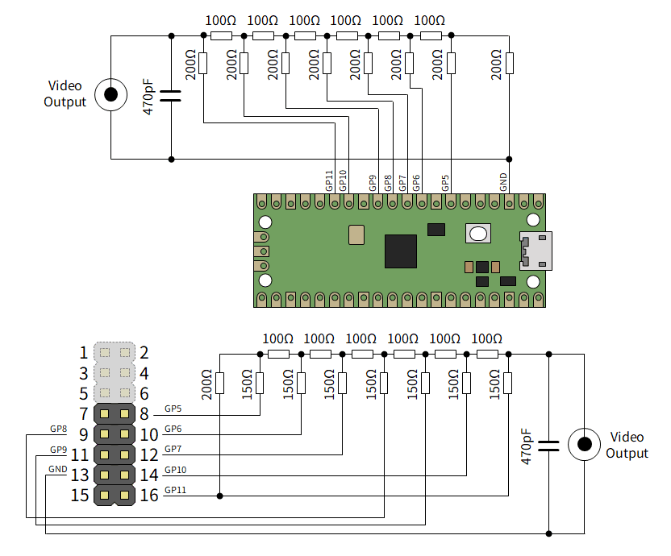
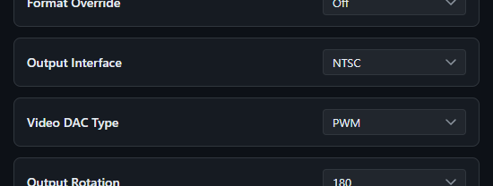

# LcdTap: アナログテレビを I2C/SPI ディスプレイとして使う

LcdTap のファームウェアを更新し、空き端子を使って NTSC/PAL 信号を出力できるようにしました。アナログテレビを I2C/SPI ディスプレイとして使うことができます。

## LcdTap とは

[LcdTap](https://shapoco.github.io/lcdtap/) は、
SSD1306、ST7789、ILI9342 などの LCD コントローラや OLED コントローラの動作を
エミュレーションして、大きなディスプレイにミラーリングしたり、
キャプチャしたりできるようにするライブラリです。

## コンポジットビデオ出力機能の追加

LcdTap のユースケースとしてレトロ (っぽい) デバイスのディスプレイを
大きなモニタにミラーリングするというのがあるので、
ブラウン管テレビのようなアナログディスプレイに出力するニーズもあるかも
ということで、コンポジットビデオ出力機能を追加しました。

v202607270853 以降のファームウェアで利用可能です。

[リリースページ](https://github.com/shapoco/lcdtap/releases)

## 接続

LcdTap には 12 本の入力端子がありますが、SPI/I2C モードで使用されない
残りの端子にコンポジットビデオ出力端子を割り当てました。
2 つのモードがありますが、いずれもモニタ側に 75Ω の終端抵抗を期待します。

### PWM モード

[らびやん氏の rp2040_pwm_ntsc.ino](https://gist.github.com/lovyan03/b50333fa917371bd92b4b5f2e7a67e89) を
ベースにした PWM 出力モードは、後述の R-2R モードと比べるとやや低品質ですが、
抵抗とコンデンサを 1 つずつ追加するだけで NTSC/PAL 信号を出力できます。

BOOTH で販売中の基板を用いる場合は、各 GPIO に直列に挿入されている
ダンピング抵抗 47Ω の分を差し引いて 150Ω → 100Ω にします。

### R-2R モード

R-2R モードはより多くのピンと部品を使用しますが、PWM モードよりも
高品質で安定した映像を得られます。
R-2R モードは I2C モードと同時に使用することはできません (端子が重複するため)。

BOOTH で販売中の基板を用いる場合は、各 GPIO に直列に挿入されている
ダンピング抵抗 47Ω の分を差し引いて 200Ω → 150Ω にします。

## コンポジット出力への切り替え

コンフィグレーションで Output Interface を NTSC に切り替えます。
Video DAC Type は外部回路に応じて PWM または R-2R を選択します。

OSD でも切り替え可能ですが、出力がうまくいかないと画面が見えず
操作できなくなってしまうので、
[ブラウザからの切り替え](https://shapoco.github.io/lcdtap/monitor/)を
お勧めします。

## 動作の様子

PWM モードでの動作の様子です (Arduboy、Xiamocon、PicoPad、M5Stack CoreS3)。

## SNS 投稿

- [X (Twitter)](https://x.com/shapoco/status/2082291134982951305)
- [Misskey.io](https://misskey.io/notes/ap910ahrpwwg099s)
- [Bluesky](https://bsky.app/profile/shapoco.net/post/3mrquoqoxos26)

