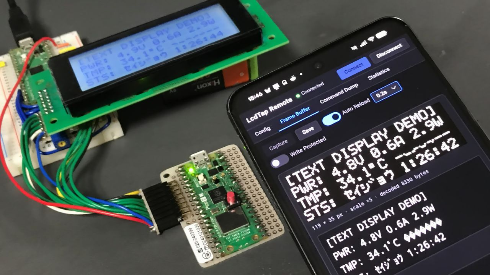
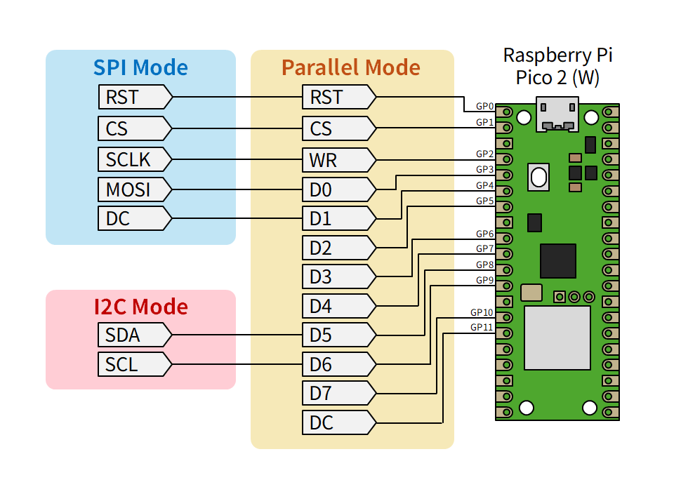
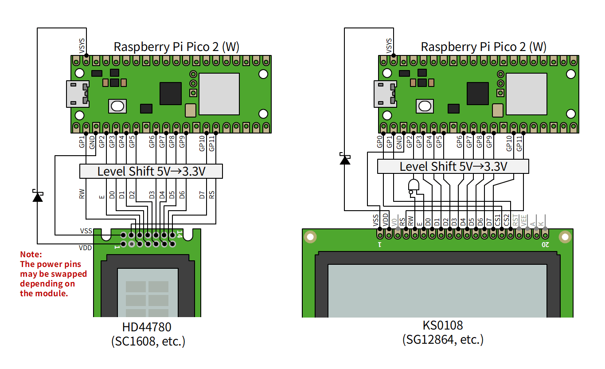
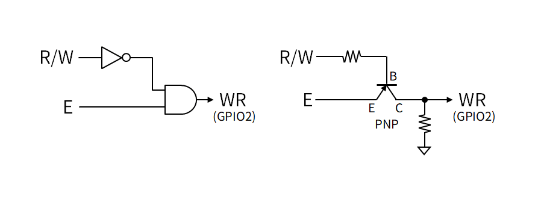
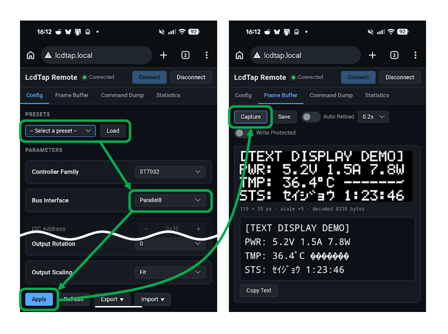

# LcdTap: キャラクタ液晶やグラフィック液晶の表示内容を WiFi 経由でモニターする

Raspberry Pi Pico 2 W を使って、通信機能の無い機器の液晶画面を
WiFi 経由で監視できるようにする方法を紹介します。

## LcdTap とは

[LcdTap](https://shapoco.github.io/lcdtap/) は、
SSD1306、ST7789、HD44780、KS0108 などの LCD コントローラや OLED コントローラの動作を
エミュレーションして、大きなディスプレイにミラーリングしたり、
キャプチャしたりできるようにするライブラリおよびアプリケーションです。

ラズピコ 2 で自作することも、
[BOOTH](https://booth.pm/ja/search/LcdTap) で基板を購入することもできます。

## LcdTap Pico2W-Remote

[LcdTap Pico2W-Remote](https://github.com/shapoco/lcdtap/tree/main/example/pico2w_remote) は
従来の LcdTap Pico2-Universal から映像主力機能を削除する代わりに通信機能を追加したもので、
LCD の表示内容をスマホや PC のブラウザから WiFi 経由で監視できるようになります。
対象の装置自体の回路やソフトウェアを変更する必要がありません。

Pico2W-Remote は映像出力やスイッチ類を持たないので、最低限必要なのは Pico2W の基板だけです
(場合によってはレベルシフタやロジック IC が必要なことがあります)。

### 接続

ディスプレイ I/F のピンアサイン Pico2-Universal と同じです。
具体的な接続例は [LcdTap のイントロダクションページ](https://shapoco.github.io/lcdtap/#cases) に掲載しています。

### レガシーな LCD との接続

HD44780 互換デバイス (SC1608、SC2004 など) や、KS0108 互換デバイス (SG12864 など) のような
レガシーな LCD については、以下のように接続します。
LCD 側が 5V I/F の場合はレベルシフタを挿入する必要があります。

**SC1608 系のデバイスは、モノによって電源ピンのアサインが逆のことがあるので注意して下さい。**

HD44780 互換デバイスの場合は、R/W 信号を CS 信号として使用することにより、
書き込みアクセスのみを LcdTap に認識させ、読み出しアクセスは無視します。

KS0108 互換デバイスの場合は、CS1 信号を GPIO0 (RST)、CS2 信号を GPIO1 (CS) に接続し、
R/W 信号の反転と E 信号の AND をとって GPIO2 (WR) に接続します。
R/W 信号が Low 固定 (読み出しアクセスが無い) の場合は
単に E 信号を WR に接続するだけで OK です。
実装面積を減らしたい場合は PNP トランジスタを使うこともできます。
抵抗値は適当に決めて下さい。1k ～ 4.7kΩ くらいにすれば動く気がします。

### ファームウェアの書き込みと WiFi 接続設定

ファームウェアはビルド済みのものをファイラを使ってドラッグ＆ドロップするだけで書き込めます。

1. [リリースページ](https://github.com/shapoco/lcdtap/releases) から v202608130949 以降の zip をダウンロードして展開します。
2. Pico2W の BOOTSEL ボタンを押しながら USB ケーブルで PC に接続します。
3. USB ドライブとして認識されるので、展開された `lcdtap_pico2w_remote.uf2` をドラッグ＆ドロップします。
4. 書き込みが完了すると Pico2W がシリアルポートとして認識されます。
5. [LcdTap Remote Setup](https://shapoco.github.io/lcdtap/remote/) にアクセスして、SSID と Passphrase (パスワード) を入力し、「Apply & Reboot」をクリックします。

Pico2W の LED が点滅から点灯に変われば WiFi 設定は完了です。
設定はボード上の Flash ROM に保存されます。

### 使用方法

ターゲットの装置を起動する前に設定を済ませて下さい。

1. 同じネットワーク内の端末から `http://lcdtap.local/` にアクセスすると、Pico2W-Remote の Web I/F が表示されます。
2. Config タブを開き、Presets からモニタする LCD の種類に近いものを選択して「Load」をクリックします。
3. Bus Interface のほか、必要に応じてパラメータをカスタマイズします。
4. 「Apply」をクリックして設定が成功すると、Frame Buffer タブに移動します。
5. ターゲットの装置を起動し、「Capture」をクリックして画像を取得できることを確認します。

Auto Reload を有効にすると、定期的に画像が更新されます。