# M5Stack CoreS3 で 2D リグアニメーション

「ShapoGFX」を使い、DragonBones で作成した 2D リグアニメーションを
M5Stack CoreS3 上で動かす手順を紹介します。

## 2D リグアニメーションとは

2D リグアニメーションとは、キャラクターの頭、胴体、手足などの各部位を
独立して動かすことができるアニメーション手法です。
全身の絵をパラパラ漫画方式で動かすアニメーションよりも、
少ない労力とリソースで滑らかなアニメーションを実現できます。

## ShapoGFX とは

[ShapoGFX](https://github.com/shapoco/shapo-gfx) は組み込み向けに開発した
2D/3D グラフィックスライブラリです。
特定のプラットフォームには依存せず、幅広い組み込み環境で利用可能です。
ShapoGFX 自身はディスプレイドライバ機能は持たないため、
画面の転送には LovyanGFX などと組み合わせたり、
プラットフォームの DMA や SPI の API を直接使用します。

## 頑張ればこれくらいできます

髪や布などの揺れものは苦手ではありますが、
頑張ってパーツを分割すればこれくらいはできます。


[ブラウザ上で動作するデモ](https://shapoco.github.io/shapo-gfx/example/demorig/)

## できないこと

ShapoGFX v1.5 の 2D リグアニメーション機能は剛体アフィン変形のみをサポートします。
メッシュ変形やボーンのスキニングなどの高度な変形はサポートしていません。
柔らかくなびく長い髪やスカートのような表現は難しいのでご注意ください。

## 今回作るもの

M5Stack CoreS3 の画面上で猫の 2D リグアニメーションを動かします。
「待機モーション」と「鳴きモーション」の 2 種類のアニメーションを作成し、
画面をタップすると鳴きモーションを再生し、フキダシで「Meow」と表示されるようにします。

描画処理は全て ShapoGFX で行い、画面への転送には M5GFX を使用します。


## 大まかな作業の流れ

1. ペイントツール等を使用して絵を用意する
2. DragonBones でリグを作成し、アニメーションを設定し、エクスポートする
3. ShapoGFX の付属ツール dbones2cpp を使用して、C++ コードに変換する
4. M5Stack CoreS3 アプリケーションに組み込み、ビルドして実機で実行する

3 と 4 はコマンド実行とコード編集の作業なので、コーディングエージェントに任せることができます。

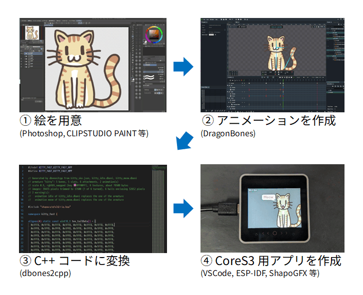

## 必要なもの

### ペイントツール

Adobe Photoshop、または Photoshop 形式 (*.psd) でエクスポート可能なペイントツールを用意します。今回は筆者の使い慣れた CLIP STUDIO PAINT を使用しました。

### DragonBones Pro

DragonBones Pro は既に配布が終了していますが、Windows 版は Internet Archive から入手できます。変なサイトからダウンロードするとマルウェアがついてくる可能性があるので注意してください。

[https://archive.org/details/dragon-bones-pro-v-5.6.3_202410](https://archive.org/details/dragon-bones-pro-v-5.6.3_202410)

macOS 版は Claude によると下記サイトから入手できるそうですが、安全性はご自身で確認してください。

[https://macdownload.informer.com/dragonbonespro/](https://macdownload.informer.com/dragonbonespro/)

> [!CAUTION]
> DragonBones Pro が日本語のファイルパスに対応しているかどうか確認できていません。日本語環境でうまく動作しない場合は、C ドライブ直下などに作業ディレクトリを作成してそこにプロジェクトを作成してください。

### M5Stack CoreS3 開発環境 + ShapoGFX

- M5Stack CoreS3 本体
- コマンドライン環境 (Linux、Ubuntu on WSL2 等)
- Python3、pip、git
- [ESP-IDF 5.5](https://github.com/espressif/esp-idf) : `idf.py` を叩ける状態にしてください。
- [ShapoGFX](https://github.com/shapoco/shapo-gfx) : リポジトリを clone して `SHAPOGFX_PATH` 環境変数を設定してください。

### Linux コマンドライン環境と C/C++ に関する基礎知識

コマンドや C/C++ コードの詳細な説明は割愛します。

## 1. 絵を用意する

まずはキャラクターの絵を用意します。

2D リグアニメーションでは各部位を別々に動かすので、絵も部品毎に必要です。
細かく部品を分ければそれだけ豊かな表現ができますが、
アニメーション作業の手間が増え、描画処理も重くなります。

AI 生成で絵を作成することもできますが、その場合でも部品毎に分ける必要があります。

今回は次の 7 つの部品を作ります。

- 胴体 (`body`)
- 頭 + 目 (`head`)
- 閉じている口 (`mouth_close`)
- 開いている口 (`mouth_open`)
- ヒゲ (`whiskers`)
- しっぽ (`tail`)

後述しますがヒゲも動かすなら左右の部品に分けた方が動かしやすいと思います。

部品毎に別々にファイルを用意してもよいですが、
DragonBones は PSD 形式のインポートに対応しているので、
簡単なリグであれば 1 ファイルに描いてしまった方が後の作業は楽です。

### 【重要】 キャンバスサイズ

画像は C++ コードへの変換時にスケーリングすることができるので
どんなサイズで描いても使用することは可能ですが、
大きく描きすぎると細い線が潰れたりジャギが目立ったりします。
実際の表示サイズの 1～2 倍のキャンバスサイズで描くことをお勧めします。

**実際の表示サイズのちょうど 2 倍のサイズで描くのがお勧めです**。

今回は実機で 200px の高さで表示することにして、400px の高さのキャンバスに描きました (CoreS3 の画面は 320x240px です)。

### 【重要】 レイヤー構成

- **1 部品 1 レイヤー**: DragonBones にインポートする時点では部品毎にレイヤーを統合して 1 レイヤーにする必要があります。
- **ファイル名・レイヤー名は半角英数 + アンダースコア**: レイヤーの名前がそのまま DragonBones の部品名として使用されますので、`body` や `head` のような分かりやすい名前をつけておきます。

ペイント作業用のファイルとインポート用のファイルに分けるのがお勧めですが、取り違えないように注意が必要です。

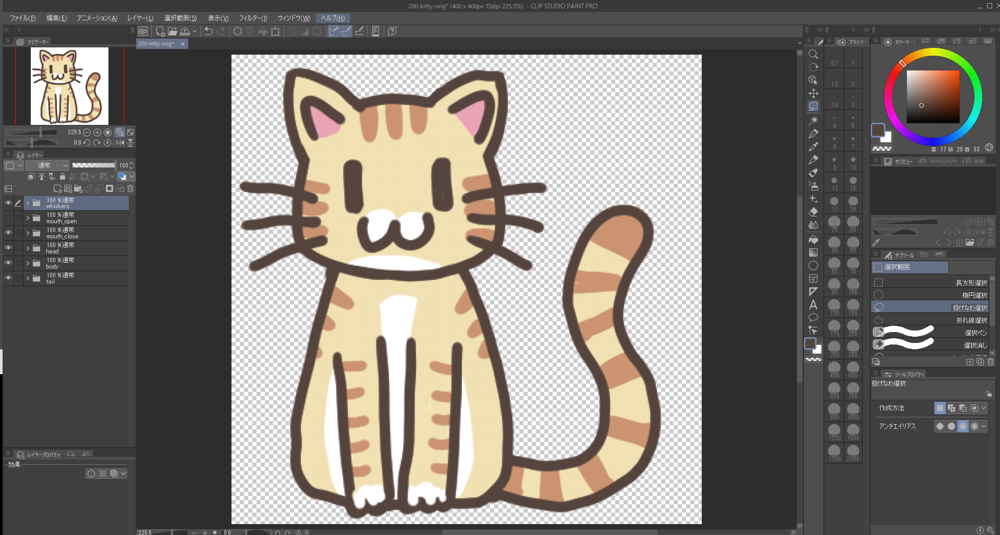

描き終わったら PSD 形式にエクスポートします。

## 2. アニメーションを作成する

### 2.1 プロジェクト作成

DragonBones Pro を起動し、新規プロジェクトを作成します。

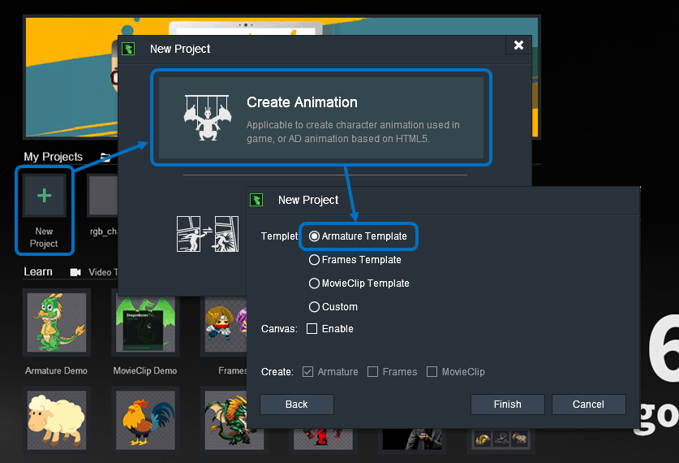

### 2.2 PSD ファイルのインポート

PSD ファイルを DragonBones Pro にドラッグ＆ドロップしてインポートします。`Import PSD` のダイアログが出るので、`Import to new armature` を選択してインポートします。

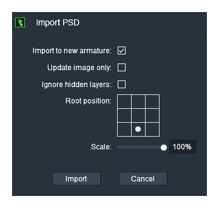

以下のような状態になります。

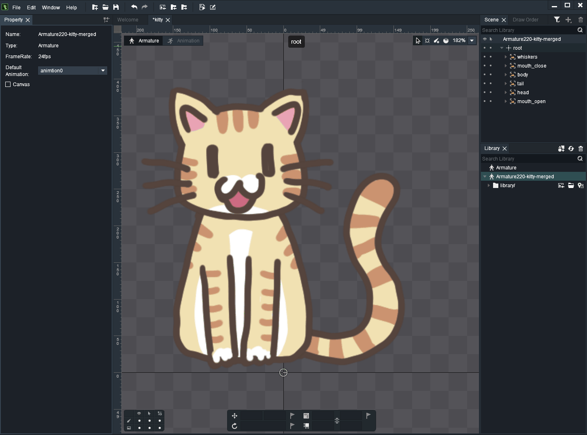

右上の Scene タブに取り込まれた部品が並んでいるので、
この時点で名前が間違いないか、全角文字が混入していないか確認しておいてください。

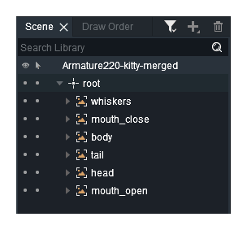

### 2.3 【重要】 空の骨格の削除とリネーム

PSD を取り込んだ直後の状態では、プロジェクト新規作成時の空の骨格 (アーマチュア) が
残っているので、右下の Library タブから削除しておきます
(プロジェクトが複数の骨格を含む場合、C++ コードへの変換時にどれを変換するか
明示する必要があります)。

ついでに、インポートした骨格を分かりやすい名前 (今回は `kitty`) に変えておきます。

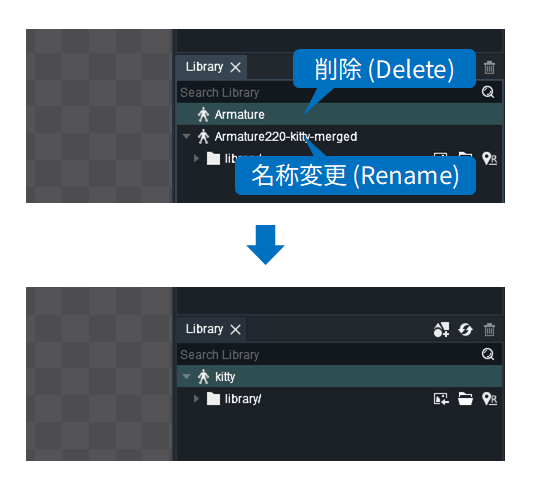

### 2.4 原点の調整

取り込んだ直後の状態では、骨格の原点が適当に設定されています。
今回は画面下端にキャラクターを座らせたいので、基準点はキャラクターの
足元に設定されていた方が好都合です。

`Ctrl + A` で全ての部品を選択してドラッグし、
キャラクターの足元が原点に一致するように移動させます。

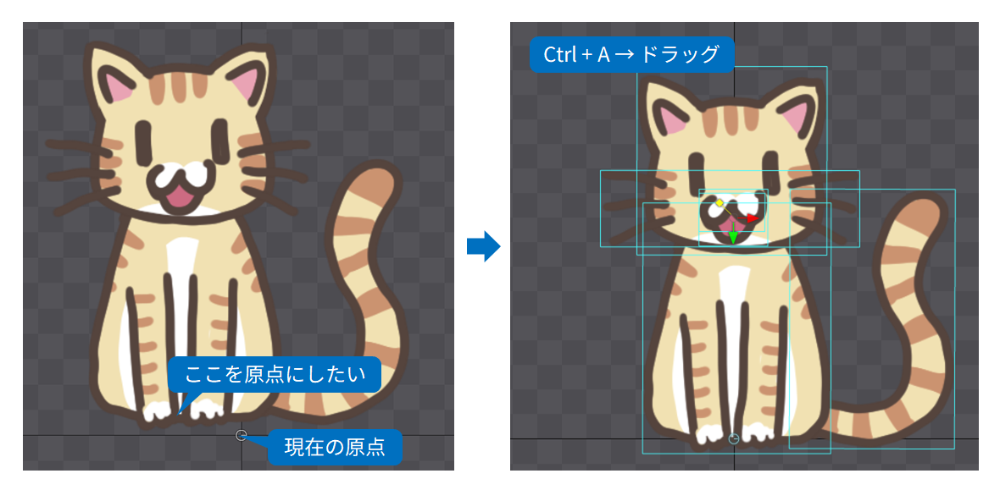

### 2.5 ボーンの作成

骨格に骨組み (ボーン) を設定していきます。

まずは胴体のボーンを作成します。胴体の部品を選択し、`E` を押して
Create Bone モードに切り替え、足元から首へ向かってドラッグします。

**重要なのはボーンの根元をどこに置くかです。**
ボーンの根元が部品の回転中心になるので、ここがズレると不自然な動きになってしまいます。ボーンの方向や長さはアニメーションに影響しないので適当でよいですが、
何となく見た目に分かりやすいようにしておくと作業しやすいです。

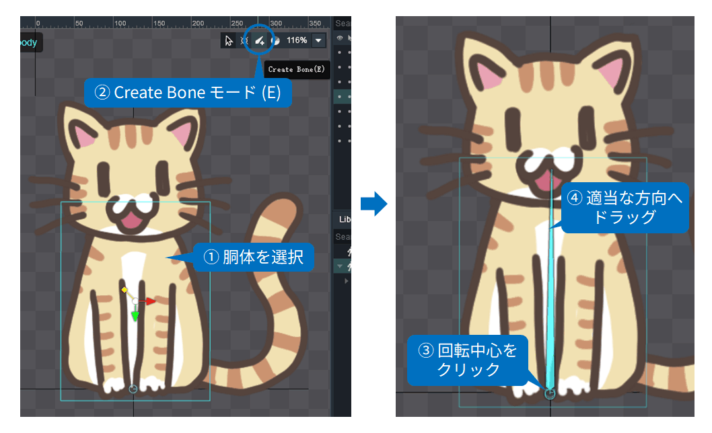

Scene タブで、今作ったボーンの配下に胴体の部品が配置されたことを確認します。

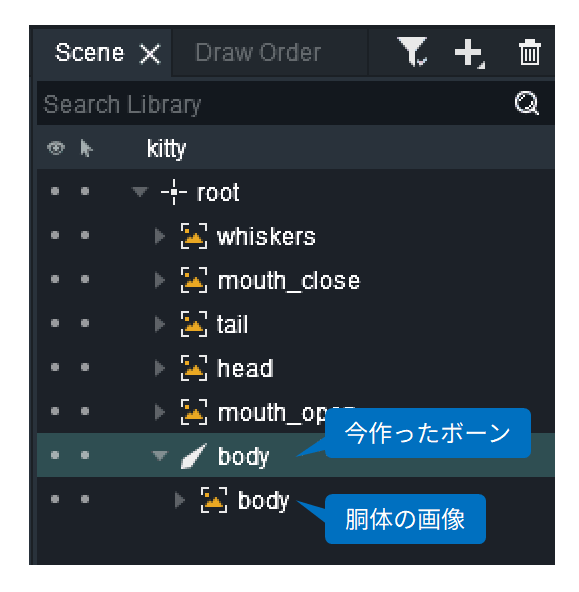

もし期待通りに入れ子になっていなければ、`Ctrl + Z` してやり直すか、胴体の画像をボーンの配下にドラッグして配置してください。

続けて猫の首から頭頂部に向かってドラッグすると、胴体のボーンの配下に頭のボーンが作成されます。

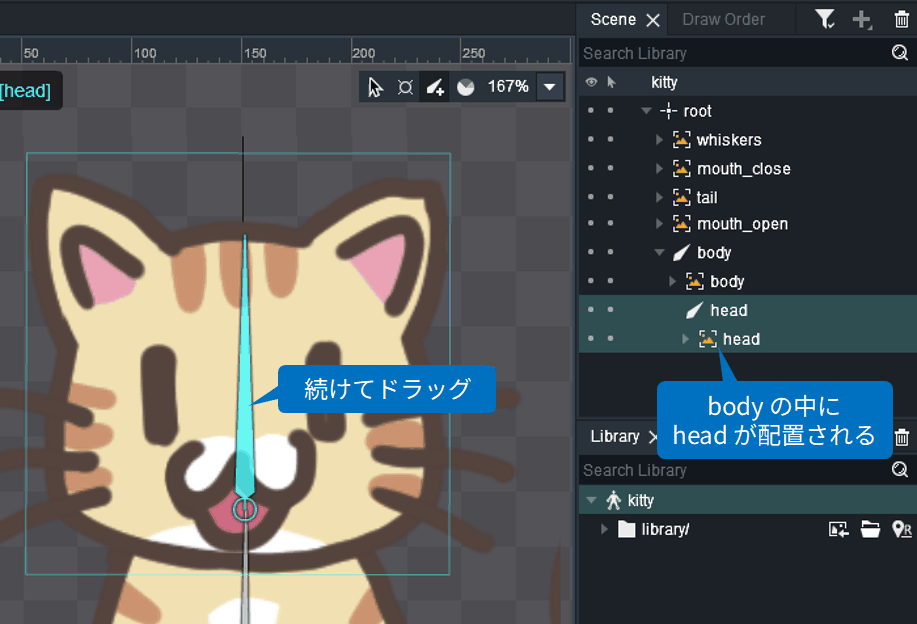

ヒゲと口は頭に付属するものなので、Library タブで Ctrl を押しながらヒゲと口の画像を選択し、頭のボーンの配下にドラッグして配置します。

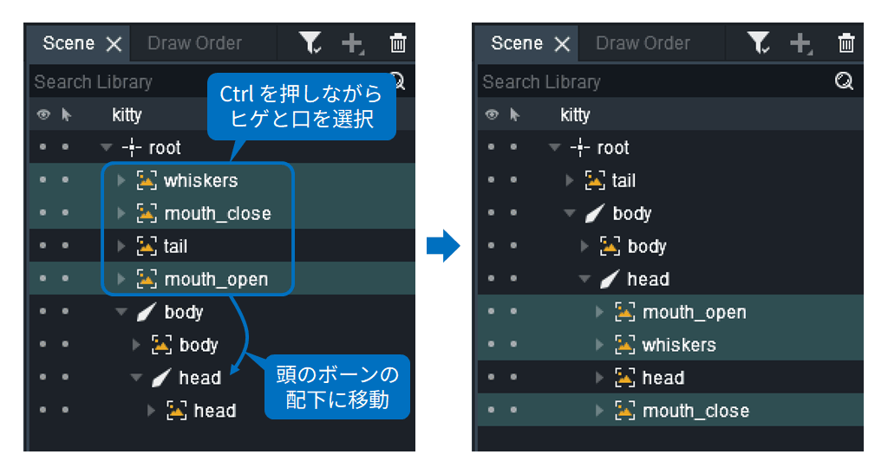

`Q` を押すと再び部品を選択できる状態 (Select モード) に戻ります。
`Q` → 部品選択 → `E` → ボーン作成 を繰り返して、必要なボーンを作成します。

最終的に次のようになりました。

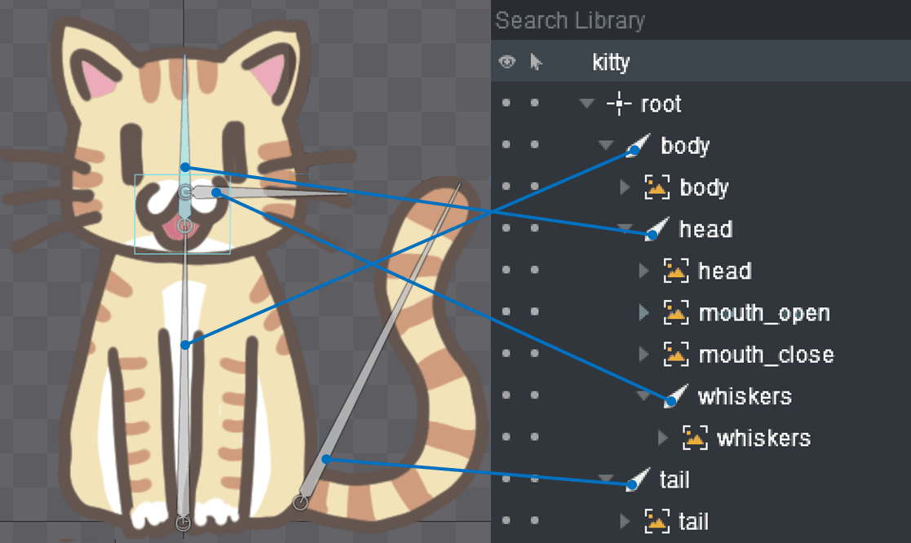

ヒゲも部品を分けてボーンを設定しましたが、
今回はほとんど動かさなかったのであまり意味がありませんでした。
動かすなら左右のヒゲに分けて別々にボーンを設定した方がいいと思います。

### 2.6 口パクの準備

今回、口の開閉はボーンではなく画像の切り替えで行います。その準備のため、次のようにします。

1. スロット `mouth_open` をダブルクリックして `mouth` にリネーム
2. スロット `mouth_close` の中に入っている画像をスロット `mouth` に移動
3. 空になったスロット `mouth_close` を削除

こうすると、スロット `mouth` の中に入れた画像のうち
チェックが入っている方だけが表示されるようになります。
アニメーション中にチェックを切り替えることで口パクができます。

今回は閉じた口をデフォルトにするので、閉じた方にチェックを入れておきます。

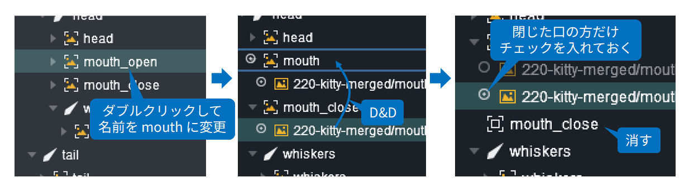

### 2.7 待機モーションの作成

キャンバスの左上の `Animation` をクリックすると、アニメーションの編集モードになります。キャンバスの下にタイムラインが表示されます。

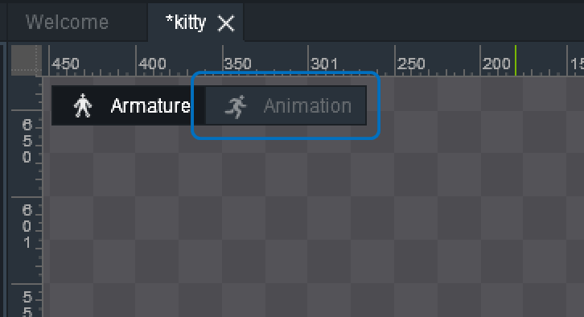

タイムラインの右上にフレームレートを設定する欄があります。
デフォルトは 24FPS になっていますが、特に変える必要はありません。
ShapoGFX でレンダリングする時は、時刻 (秒) を指定してフレーム間を補間できるからです。

待機モーションでは猫が上半身としっぽを 2 秒周期で左右に往復させるアニメーションを作成することにします。

そのためには、体を左に傾けた状態と右に傾けた状態の 2 種類の「キーフレーム」を作成します。
そしてタイムライン上に左→右→左の順でキーフレームを配置してループ再生することによって、キーフレーム間が補間され、猫が左右に揺れる動きが出来上がります。

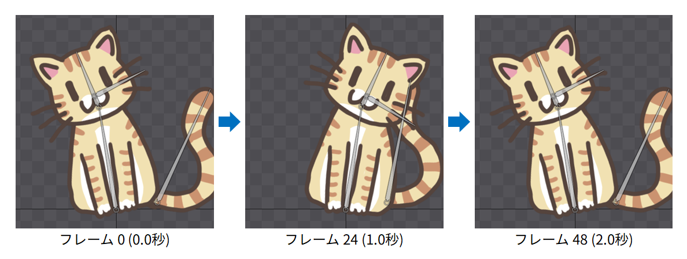

まず最初のキーフレームを作成します。

1. 胴体のボーンを選択
2. `X` キーで Rotate モードに切り替え
3. `Auto Key` にチェック
4. タイムラインでフレーム 0 を選択

この状態で胴体のボーンをドラッグして左に傾けると、フレーム 0 に左に傾いた状態のキーフレームが自動的に作成されます。

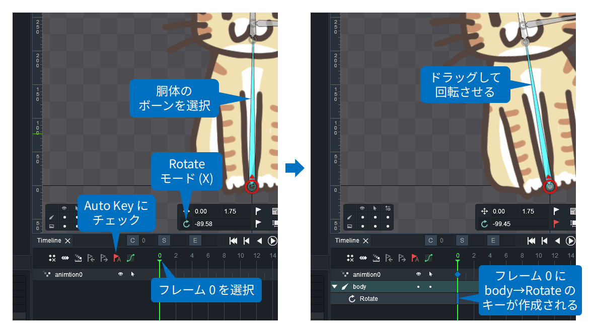

同様に、ボーンを選択→ドラッグで回転 を繰り返して、フレーム 0 のポーズを作成します。

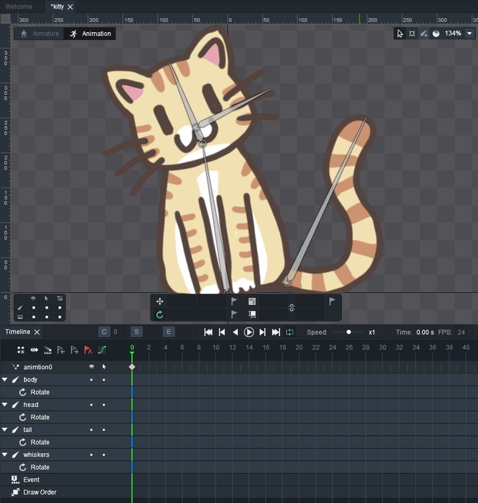

次に、作成したキーをフレーム 24 とフレーム 48 にコピーします。

1. 全てのボーンを選択した状態にする
2. タイムラインでフレーム 0 を選択して `Ctrl + C`
3. タイムラインでフレーム 24 を選択して `Ctrl + V`
4. タイムラインでフレーム 48 を選択して `Ctrl + V`

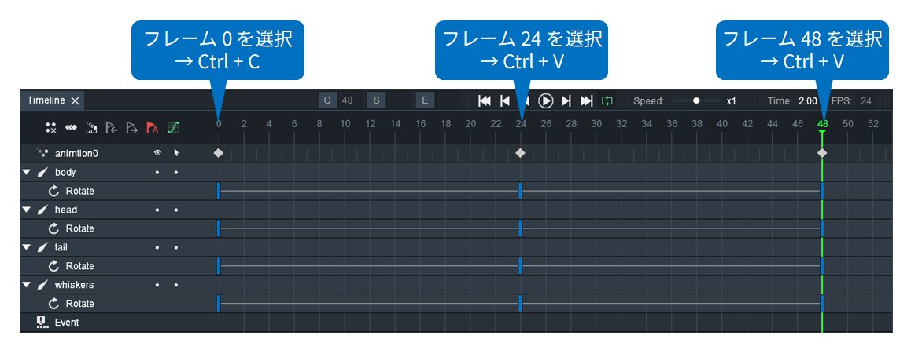

タイムラインでフレーム 24 を選択し、ボーンを回転させ、右に傾いたポーズを作成します。

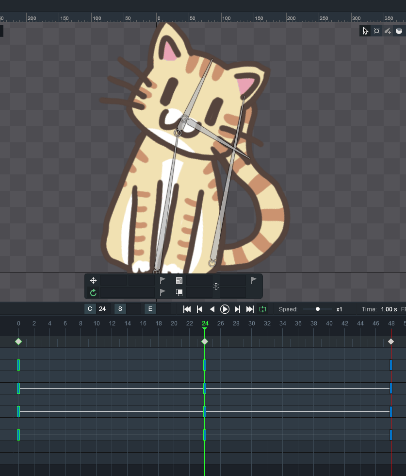

この状態で再生ボタンを押すと、次のようになります。

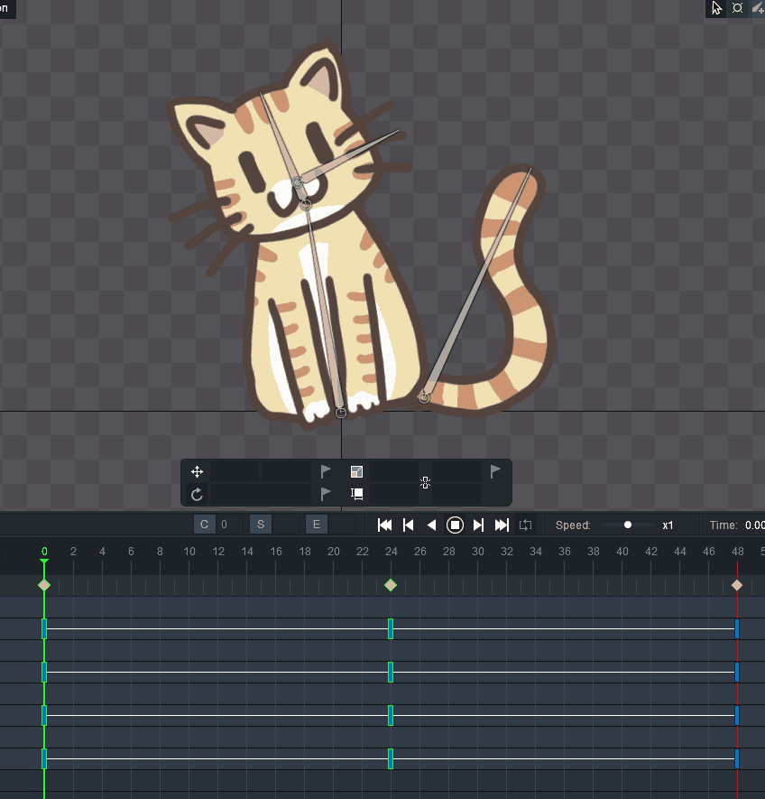

これでも一応アニメーションとして成立はしますが、
フレーム補間が線形補間のため機械的な硬い動きになっています。

そこで、フレーム 0 とフレーム 24 のキーを Ctrl を押しながら全て選択し、
Curve Editor を開いて Ease Both をクリックして補間を滑らかにします。

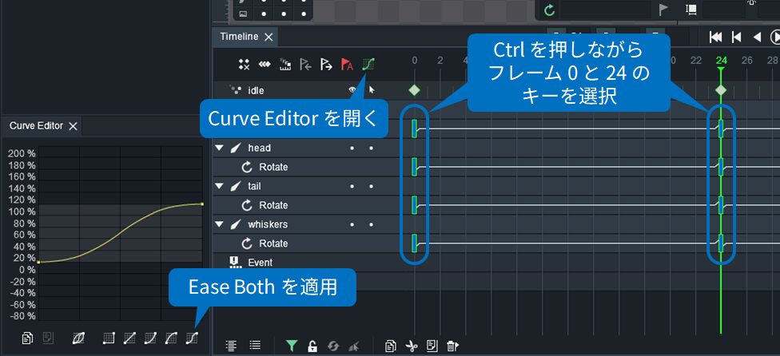

これで動き始めはゆっくり加速、動き終わりはゆっくり減速するようになり、
全体として滑らかに揺れ動くようになります。


これで待機モーションは完成です。

右下の Animation タブでアニメーションの名前を「idle」に変更し、
新しいアニメーション「meow」を作成します。

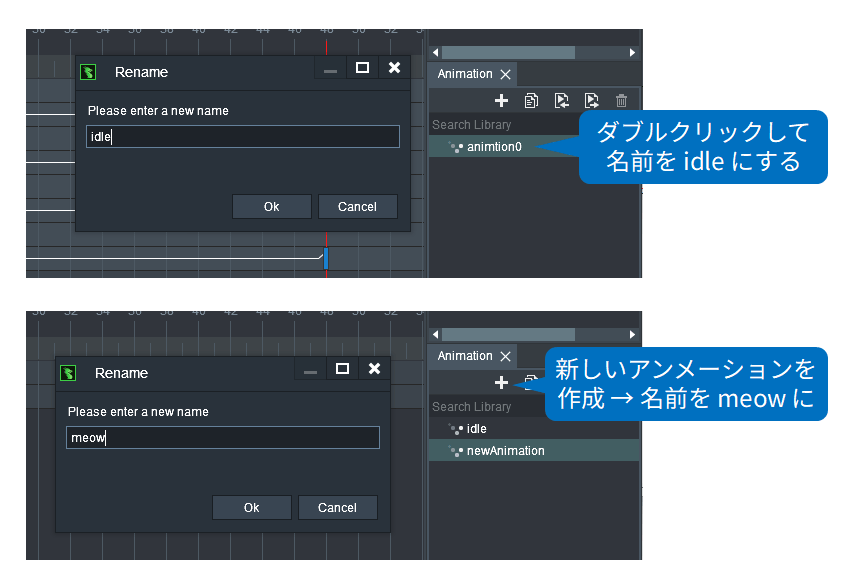

### 2.8 鳴きモーションの作成

鳴きモーションでは、猫が少し背伸びしながら口を開けて鳴く動きを作成します。

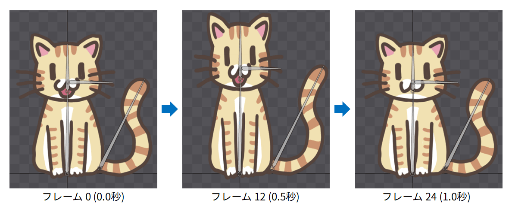

まずフレーム 0 で口を開けた状態にします。

1. タイムラインでフレーム 0 を選択
2. 口の画像を含むボーン (今回は頭) を選択
3. Auto Key にチェックが入った状態で、口の画像を開いた状態に切り替える

これでフレーム 0 に口を開けた状態のキーフレームが作成されます。

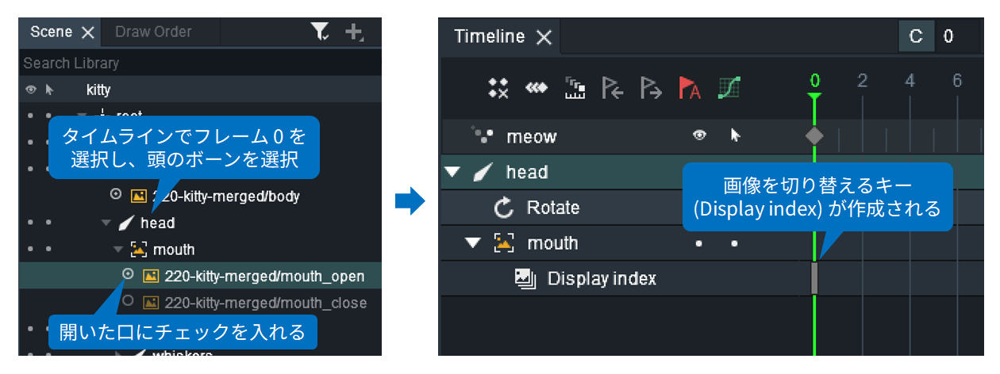

同様にタイムラインでフレーム 24 (1.0 秒) を選択し、閉じた口に切り替えることで、フレーム 24 に閉じた口のキーフレームが作成されます。

背伸びするアニメーションには、スケーリングを使用します。

1. 胴体のボーンを選択します。
2. フレーム 0、12、24 でスケーリング UI の横の旗のアイコンをクリックしてキーを作成します。
4. `C` を押してスケーリングモードに切り替えます。
5. フレーム 12 を選択します。
6. ボーンのハンドルを操作して猫の体を縦に細長くします。

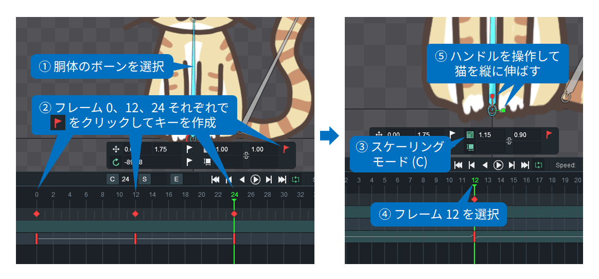

同様にしてしっぽにもスケーリングのキーを作成します。

この状態で再生すると次のようになります。

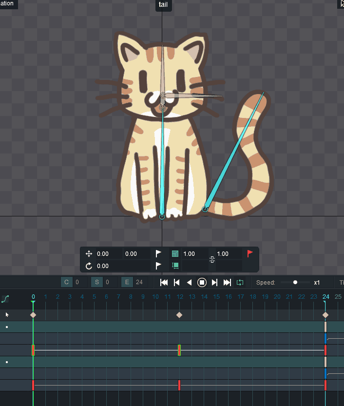

これもこのままでも一応使えますが、ちょっと硬いので次のようにしてアレンジしました。

- Curve Editor でカーブを調整
- フレーム 22 (0.92 秒) の位置に溜め (?) のキーフレームを挿入
- 鳴きモーション終了から待機モーションへの移行を滑らかにするために、待機モーションの最初のキーフレームをコピーして鳴きモーションのフレーム 48 に貼り付け

その結果次のようになりました。

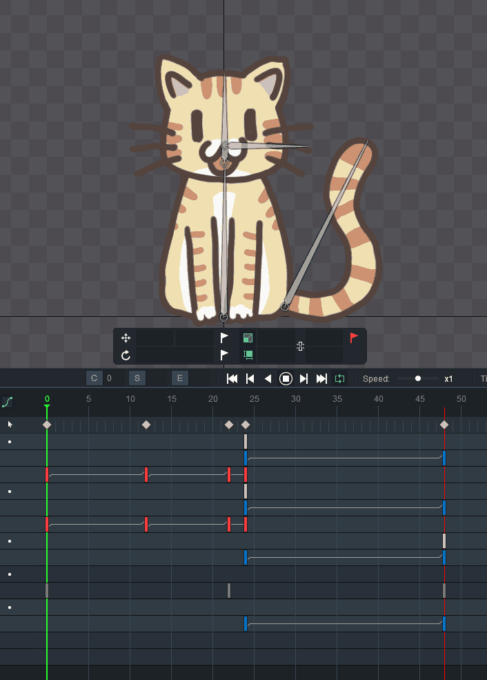

これでアニメーションは一通り完成です。

### 2.9 エクスポート

File → Export から次の設定で骨格とアニメーションをエクスポートします。

- Type: DragonBones JSON
- Data Version: **5.0** (私の環境では 5.5 ではエクスポートできませんでした)
- Image Type: Images
- Output Scale: 100%
- Generated Files: Data と Texture にチェック

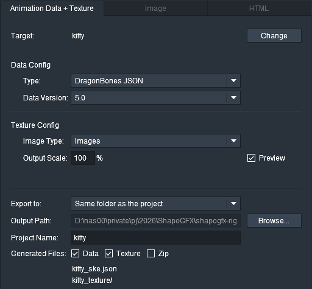

エクスポートされた `<プロジェクト名>_ske.json` と `<プロジェクト名>_texture/` から C++ コードが生成されます。

ここから先、ファイル名は `kitty_ske.json` と `kitty_texture/` という前提で説明します。

----

> [!NOTE]
> ここから先はコーディングエージェントに任せることも可能です。

## 3. C++ コードの生成

`dbones2cpp` は `Pillow` と `numpy` を必要とするので、入っていない場合は導入します。
システムを汚したくない場合は venv を使用するなどしてください。

```bash
python3 -m pip install -r ${SHAPOGFX_PATH}/bin/requirements.txt
```

`kitty_ske.json` と `kitty_texture/` が置いてあるディレクトリに移動し、次のコマンドで C++ コードを生成します。

```bash
python3 ${SHAPOGFX_PATH}/bin/dbones2cpp --scale 0.5 kitty_ske.json kitty.hpp
```

デフォルトでは `kitty` 名前空間の配下にデータ構造が生成されます。
明示したい場合は `--namespace` オプションを使用して名前空間を指定します。

## 4. CoreS3 用アプリの作成

### 4.1 プロジェクトの作成

ESP-IDF に ESP32-S3 用のコンポーネントがインストールされていない場合はインストールしておきます。

```bash
cd /path/to/esp-idf/
./install.sh esp32s3
```

ESP-IDF の環境変数を設定します。
ここから先の作業はこの環境変数を設定したシェル上で行います。

```bash
source /path/to/esp-idf/export.sh
```

新しいプロジェクトを作成して中に移動します。
デフォルトで生成される meow.c は消しておきます。

```bash
idf.py create-project meow
cd meow
rm main/meow.c
```

M5Unified / M5GFX への依存を追加します。

```bash
idf.py add-dependency "m5stack/m5unified^0.2.18"
idf.py add-dependency "m5stack/m5gfx^0.2.25"
```

ShapoGFX をコンポーネントとして登録します。

```bash
echo '  shapo-gfx:' >> main/idf_component.yml
echo '    path: ${SHAPOGFX_PATH}' >> main/idf_component.yml
```

`main/CMakeLists.txt` を次の内容に書き換えます。

```cmake
idf_component_register(
    SRCS "main.cpp"
    INCLUDE_DIRS "."
    REQUIRES m5unified m5gfx shapo-gfx esp_timer
)

target_compile_options(${COMPONENT_LIB} PRIVATE -Wall -Wextra)
```

プロジェクト直下に次の内容で `sdkconfig.defaults` を作ります。

```cmake
CONFIG_IDF_TARGET="esp32s3"
CONFIG_ESP_DEFAULT_CPU_FREQ_MHZ_240=y
CONFIG_ESPTOOLPY_FLASHSIZE_16MB=y
CONFIG_ESP_CONSOLE_USB_SERIAL_JTAG=y

# kitty のテクスチャは Flash からデータキャッシュ経由で読まれる。
# いちばん大きなキャッシュにしておく。
CONFIG_ESP32S3_DATA_CACHE_64KB=y
CONFIG_ESP32S3_DATA_CACHE_LINE_64B=y

# 描画時間の大半は ShapoGFX と M5GFX の中なので、ツリー全体を速度優先で最適化する
CONFIG_COMPILER_OPTIMIZATION_PERF=y

CONFIG_FREERTOS_HZ=1000

# フレームループはメインタスクから呼ぶ
CONFIG_ESP_MAIN_TASK_STACK_SIZE=16384

# フレームループは休まず回り続けるので、アイドルタスクを監視するウォッチドッグは止める
CONFIG_ESP_TASK_WDT_INIT=n

# kitty のデータ (最大 133 KB) と M5Unified で、既定の 1 MB のアプリ領域では足りない
CONFIG_PARTITION_TABLE_SINGLE_APP_LARGE=y
```

### 4.2 リグとアニメーションの取り込み

`kitty.hpp` を `main/` 配下に配置します。

```bash
cp path/to/kitty.hpp main/.
```

### 4.3 実装

`main/main.cpp` を次のように実装します。

```cpp
#include <M5Unified.h>
#include <esp_heap_caps.h>
#include <esp_timer.h>

#include "shapoco/gfx2d/graphics2d.hpp"
#include "shapoco/gfx2d/fonts.hpp"
#include "kitty.hpp"

namespace g2d = shapoco::gfx2d;
namespace rig = shapoco::gfx2d::rig;

// Graphics2D の作業領域
constexpr size_t ARENA_BYTES = 4096;
alignas(8) uint8_t arena[ARENA_BYTES];

// Graphics2D インスタンス
g2d::Graphics2D g;

// フレームバッファ
uint16_t *frameBuffer;

// リグ用のキャッシュ領域
alignas(4) uint8_t rigCache[512];
rig::Instance rigInst;

// アニメーション
const rig::Animation &animMeow = kitty::anim_meow;
const rig::Animation &animIdle = kitty::anim_idle;

// 鳴いているかどうかのフラグ
bool meowing = false;

// アニメーションの再生時間
float tStart = 0.0f;

extern "C" void app_main(void) {
  // M5Unified 初期化
  auto cfg = M5.config();
  cfg.internal_spk = false;
  cfg.internal_mic = false;
  cfg.internal_imu = false;
  cfg.internal_rtc = false;
  M5.begin(cfg);
  M5.Display.setRotation(1);
  M5.Display.fillScreen(TFT_BLACK);
  
  // 画面サイズ取得
  int screenW = M5.Display.width();
  int screenH = M5.Display.height();
  
  // フレームバッファを SRAM に確保
  // PSRAM は DMA に使用できないので SRAM に確保する必要がある
  frameBuffer = (uint16_t *)heap_caps_malloc(
    sizeof(uint16_t) * (screenW * screenH),
    MALLOC_CAP_DMA | MALLOC_CAP_INTERNAL);
  
  g2d::Surface target = {
    g2d::PixelFormat::RGB565_SWAPPED,
    (int16_t)screenW, (int16_t)screenH,
    (uint32_t)(screenW * sizeof(uint16_t)), frameBuffer
  };
  
  // Graphics2D 初期化
  g.init(arena, ARENA_BYTES);
  g.setTarget(target);
                   
  // リグのインスタンスを初期化
  rigInst.init(kitty::armature, rigCache, sizeof(rigCache));
  
  // 鳴きモーションの長さを計算
  const float MEOW_DURATION =
    (float)animMeow.duration / (float)animMeow.frameRate;
  
  // 待機モーション開始
  meowing = false;
  tStart = esp_timer_get_time() * 1e-6f;
  
  for (;;) {
    M5.update();
    
    // アニメーションタイムライン上の時刻
    float t = esp_timer_get_time() * 1e-6f;
    float elapsed = t - tStart;
  
    if (M5.Touch.getCount() > 0 && M5.Touch.getDetail(0).wasPressed()) {
      // 画面がタップされたら鳴きモーションを開始
      meowing = true;
      tStart = t;
      elapsed = 0.0f;
    }
    else if (meowing && elapsed >= MEOW_DURATION) {
      // 鳴きモーションが終わったら待機モーションに移行
      meowing = false;
      tStart = t;
      elapsed = 0.0f;
    }
  
    // アニメーションからリグへ姿勢を反映
    if (meowing) {
      // 鳴きモーション (loop = false)
      float f = rig::frameAt(animMeow, elapsed, false);
      rigInst.pose(animMeow, f);
    }
    else {
      // 待機モーション (loop = true)
      float f = rig::frameAt(animIdle, elapsed, true);
      rigInst.pose(animIdle, f);
    }
    
    // 背景の塗りつぶし
    g.clear(g2d::makeColor(128, 128, 128));
    
    // リグの描画位置
    const int x0 = screenW * 2 / 3;
    const int y0 = screenH;
    
    // リグの描画
    g.pushState();          // 変換行列の保存
    g.translate(x0, y0);    // 平行移動
    rigInst.draw(g);        // 描画
    g.popState();           // 変換行列の復元
    
    if (meowing && elapsed < 1.0f) {
      // 鳴きモーションの先頭 1 秒間だけフキダシを表示
      
      // フキダシの寸法計算
      g.setFont(&g2d::ShapoSansP_s27c22a01w04);
      const char* text = "Meow";
      const g2d::TextMetrics tm = g.textMetrics(text);
      const int tw = tm.width, th = tm.height;      // 文字列のサイズ
      const int br = 10;                            // フキダシの丸み
      const int bx = x0 - 60, by = y0 - 120;        // フキダシのトゲの先端の位置
      const int bw = tw + br * 2, bh = th + br * 2; // フキダシのサイズ
      const int a = 20;                             // フキダシのトゲの長さ
      
      g.fillRoundRect(bx - a - bw, by - bh / 2, bw, bh, br, g2d::Colors::WHITE);
      g.fillTriangle(bx, by, bx - a, by - a / 4, bx - a, by + a / 4, g2d::Colors::WHITE);
      g.setTextColor(g2d::makeColor(255, 0, 128));
      g.drawString(bx - a - tw - br, by - br, text);
    }
    
    // フレームバッファをディスプレイに転送
    M5.Display.startWrite();
    M5.Display.setWindow(0, 0, screenW - 1, screenH - 1);
    M5.Display.writePixelsDMA(frameBuffer, (int32_t)screenW * screenH, false);
    M5.Display.endWrite();
  }
}
```

ポイントだけ書いておきます。

- **ピクセルフォーマットは RGB565_SWAPPED**: 画像を SPI で転送する際は RGB565 の上位バイトから先に送信します。これをバイトスワップを伴うことなく DMA で転送するため、M5GFX では予めバイトスワップされた状態で画像をメモリ上に保持します。これに合わせて ShapoGFX でも RGB565_SWAPPED で画像を扱います。
- **フレームバッファは SRAM に確保する**: PSRAM は DMA 転送に使用できないため。
- **アリーナ (arena)**: ShapoGFX は内部でヒープを取得しません。その代わり必要な作業領域はユーザ側で確保して `init()` に渡します。詳細は [Graphics2D の説明](https://shapoco.github.io/shapo-gfx/ref/gfx2d/graphics2d.html) を参照。
- **リグのインスタンス**: リグのデザイン情報は全て Flash に置いたままにできますが、姿勢の情報をキャッシュするためのメモリを確保して `init()` に渡す必要があります。必要なサイズは `Instance::bytes()` で取得できます。詳細は [2D リグアニメーションの説明](https://shapoco.github.io/shapo-gfx/ref/gfx2d/rig.html) を参照。
- **pose() で姿勢を決定、draw() で描画**: `pose()` にアニメーションとフレーム番号を渡すことによってリグの各ボーンの姿勢が算出されてインスタンスにキャッシュされます。`draw()` を呼ぶことでその姿勢に基づいてリグが描画されます。
- **pushState() / popState()**: リグは ShapoGFX が保持しているアフィン変換行列に基づいて描画位置が決定されるので、`translate()` を使用して位置を指定していますが、これだけだとその後の描画にも影響を与えます。`pushState()`/`popState()` で囲むことで、`translate()` の効果をリグの描画だけに限定しています。

### 4.4 ビルド

ターゲットを ESP32-S3 に設定し、ビルドを実行します。

```bash
idf.py set-target esp32s3
idf.py build
```

### 4.5 実行

CoreS3 を USB で PC に接続します。

WSL 上で実行する場合は USB デバイスを WSL にアタッチしてください。
[WSL USB Manager](https://github.com/nickbeth/wsl-usb-manager) を使うのが簡単です。

シリアルポートが認識されたら、次のコマンドで CoreS3 にプログラムを書き込みます。

```bash
idf.py flash
```

この記事冒頭の動画のように動作すれば成功です。

## 高速化のポイント

前述の `main.cpp` は分かりやすさを優先して書かれているので
パフォーマンス観点では改善の余地があります。

### dbones2cpp のオプション

リグが複雑になるとそれだけ描画も重くなります。

- テクスチャサイズが大きくなることで Flash アクセスのペナルティがかさむ
- 描画する要素が多くなる

`dbones2cpp` のオプションで負荷をいくらか軽減することができます。

|オプション|説明|
|:---|:---|
|`--scale <factor>`|リグとテクスチャをスケーリングします。画像は粗くなりますが、キャッシュに載りやすくなります|
|`--atlas-width 0`|テクスチャを 1 枚の画像 (アトラス) に統合せず、バラバラなまま保持します。統合によって生じるテクスチャ間の隙間が無くなることでキャッシュに載せやすくなります|
|`--fit-rotate`|個々のテクスチャの透明部分を切り捨ててサイズを最小化できるように画像を回転させます。回転により画像の劣化が発生しますが、キャッシュが効きやすくなります|
|`--out-format rgb565_swapped`|`ARGB4444` のアルファチャンネルによる透過を `RGB565_SWAPPED` + カラーキーによる透過に変換することで描画負荷を軽減します。`auto` にすると、半透明ピクセルが主体のパーツだけ `ARGB4444` のままになります|

詳細は [dbones2cpp の説明](https://shapoco.github.io/shapo-gfx/ref/tools/dbones2cpp.html) を参照してください。

### ダブルバッファリング

前述の `main.cpp` では描画とディスプレイへの転送を直列に実施しています。

描画用のバッファと DMA 転送用のバッファの 2 枚に分けて描画と転送を同時に行うことで
フレームレートを大幅に向上させるのは、こうしたアプリケーションでは一般的なテクニックです。

ただし ESP32-S3 では画面 2 面分のバッファを SRAM に確保することは
本格的なアプリケーションでは容量的に難しくなります。
メモリを節約するなら、画面を上下に 2 本や 4 本の「帯」に分割し、
前の帯をディスプレイに転送している間に次の帯を描画する、という方法で
少ないメモリ消費でダブルバッファリングを実現できます。

### マルチコア描画

`Instance::draw()` は複数コアから同時に呼び出すことができます。
描画領域を複数の小領域に分けて、小領域毎に別々のコアから
`draw()` を実行することで複数コアで同時に描画を行うことができます。

この場合、`Graphics2D` のインスタンスとアリーナもコア毎に必要です。
また、`draw()` の実行中にインスタンスが変更されてはいけません。

## 本記事で使用した DragonBones プロジェクト

ダウンロード: [20260930-dbones-kitty.zip](https://www.shapoco.net/media/2026/20260930-dbones-kitty.zip)

